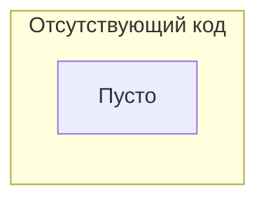

# Анализ кода голосового помощника ChatGPT - Telegram

## <input code>

```
### Голосовой помощник chatgpt - telegram
```

## <algorithm>

К сожалению, предоставленный код пуст.  Отсутствует любая функциональная реализация.  Поэтому построить блок-схему и описать алгоритм работы невозможно.  Отсутствие кода не позволяет проследить перемещение данных и взаимодействие между функциями/классами.


## <mermaid>



## <explanation>

В предоставленном коде нет никакой информации о коде, следовательно, невозможно проанализировать импорты, классы, функции, переменные и т.д.  Для анализа необходим сам код.

Отсутствие кода также не позволяет установить связи с другими частями проекта (`src.`) и определить потенциальные ошибки или области для улучшения.

**Вывод:**  Для анализа кода необходим сам код.  Данный код пуст и не содержит никакой полезной информации.