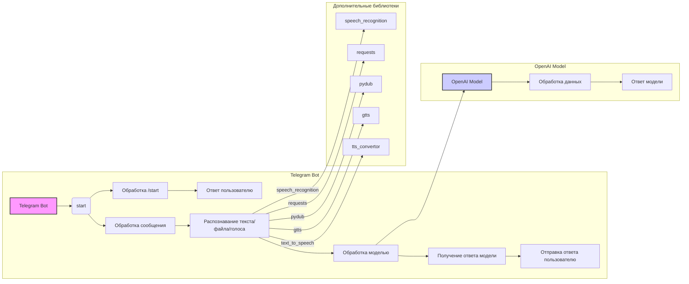

# <input code>

```python
## \file hypotez/src/bots/openai_bots/telegram_bot_trainger.py
# -*- coding: utf-8 -*-\
#! venv/Scripts/python.exe
#! venv/bin/python/python3.12

"""
.. module: src.bots.openai_bots 
	:platform: Windows, Unix
	:synopsis:

"""
MODE = 'dev'


"""
	:platform: Windows, Unix
	:synopsis:

"""


"""
	:platform: Windows, Unix
	:synopsis:

"""


"""
  :platform: Windows, Unix

"""
"""
  :platform: Windows, Unix
  :platform: Windows, Unix
  :synopsis:
"""MODE = 'dev'
  
""" module: src.bots.openai_bots """


""" This script creates a simple Telegram bot using the python-telegram-bot library."""

from pathlib import Path
import tempfile
import asyncio
from telegram import Update
from telegram.ext import Application, CommandHandler, MessageHandler, filters, CallbackContext

import header
from src import gs
from src.ai.openai.model.training import Model
from src.utils import j_loads, j_loads_ns, j_dumps
from src.logger import logger
import speech_recognition as sr  # Библиотека для распознавания речи
import requests  # Для скачивания файлов
from pydub import AudioSegment  # Библиотека для конвертации аудио
from gtts import gTTS  # Библиотека для текстового воспроизведения
from src.utils.convertors.tts import recognizer, text_to_speech

model = Model()

# Replace 'YOUR_TOKEN_HERE' with your actual bot token
TELEGRAM_TOKEN = gs.credentials.telegram.bot_token

async def start(update: Update, context: CallbackContext) -> None:
    """ Handle the /start command."""
    await update.message.reply_text('Hello! I am your simple bot. Type /help to see available commands.')

async def help_command(update: Update, context: CallbackContext) -> None:
    """ Handle the /help command."""
    await update.message.reply_text('Available commands:\n/start - Start the bot\n/help - Show this help message')
    
async def handle_document(update: Update, context: CallbackContext):
    # Получаем файл
    file = await update.message.document.get_file()
    #tmp_file_path = f"{tempfile.gettempdir()}/received.txt"
    tmp_file_path = await file.download_to_drive()  # Сохраняем файл локально

    # Читаем содержимое файла
    with open(tmp_file_path, 'r') as f:
        file_content = f.read()

    response = model.send_message(f"Обучение модели на следующем содержимом:{file_content}")
    await update.message.reply_text(response)
    #tts_file_path = await text_to_speech (response)
    #await update.message.reply_audio(audio=open(tts_file_path, 'rb'))
    
async def handle_message(update: Update, context: CallbackContext) -> None:
    """ Handle any text message."""
    text_received = update.message.text
    response = model.send_message(text_received)
    await update.message.reply_text(response)
    #tts_file_path = await text_to_speech (response)
    #await update.message.reply_audio(audio=open(tts_file_path, 'rb'))
   
async def handle_voice(update: Update, context: CallbackContext) -> None:
    """ Handle voice messages."""
    voice_file = await update.message.voice.get_file()
    message = recognizer(audio_url=voice_file.file_path)
    response = model.send_message(message)
    await update.message.reply_text(response)
    tts_file_path = await text_to_speech (response)
    await update.message.reply_audio(audio=open(tts_file_path, 'rb'))

def main() -> None:
    """ Start the bot."""
    application = Application.builder().token(TELEGRAM_TOKEN).build()

    # Register command handlers
    application.add_handler(CommandHandler('start', start))
    application.add_handler(CommandHandler('help', help_command))

    # Register message handlers
    application.add_handler(MessageHandler(filters.TEXT & ~filters.COMMAND, handle_message))
    application.add_handler(MessageHandler(filters.VOICE, handle_voice))
    application.add_handler(MessageHandler(filters.Document.ALL, handle_document))
    # Start the bot
    application.run_polling()

if __name__ == '__main__':
    main()
```

# <algorithm>

**Блок-схема:**

```mermaid
graph TD
    A[Пользователь отправляет команду /start] --> B{Обработка команды /start};
    B --> C[Отправить сообщение "Hello!"];
    
    D[Пользователь отправляет файл] --> E{Обработка файла};
    E --> F[Загрузка файла];
    F --> G[Чтение файла];
    G --> H[Обработка файла моделью];
    H --> I[Отправка ответа в Telegram];
    
    J[Пользователь отправляет текст] --> K{Обработка текста};
    K --> L[Обработка текста моделью];
    L --> M[Отправка ответа в Telegram];
    
    N[Пользователь отправляет аудиосообщение] --> O{Обработка аудио};
    O --> P[Распознавание речи];
    P --> Q[Обработка текста моделью];
    Q --> R[Отправка ответа в Telegram];
    R --> S[Генерация аудио ответа];
    S --> T[Отправка аудио ответа в Telegram];

    
    subgraph "Обработка моделью"
        H --> H1[model.send_message()];
        H1 --> H2[Получение ответа от модели];
        H2 --> I;
        L --> L1[model.send_message()];
        L1 --> L2[Получение ответа от модели];
        L2 --> M;
        Q --> Q1[model.send_message()];
        Q1 --> Q2[Получение ответа от модели];
        Q2 --> R;
    end
```

**Примеры:**

* Если пользователь вводит `/start`, бот отправляет приветствие.
* Если пользователь отправляет документ, бот загружает, считывает содержимое, отправляет его в модель, получает ответ и отправляет его пользователю.
* Если пользователь отправляет текст, бот отправляет текст в модель, получает ответ и отправляет его пользователю.
* Если пользователь отправляет аудио, бот распознает речь, отправляет распознанный текст в модель, получает ответ, генерирует аудиоответ и отправляет его.

**Передача данных:**

Данные передаются между функциями и классами через аргументы функций и атрибуты классов.  Например, `update` и `context` передаются в обработчики команд и сообщений, чтобы иметь доступ к информации о пользователе и чате.  Результат обработки моделью передается в функцию отправки ответа.


# <mermaid>



**Объяснение:**

Диаграмма показывает основные компоненты системы: Telegram бот, модель OpenAI и используемые библиотеки. Telegram бот взаимодействует с пользователем, получает данные, обрабатывает их и передает на OpenAI модель. Модель обрабатывает данные и возвращает результат. Telegram бот получает результат и отправляет пользователю.  Дополнительные библиотеки (speech_recognition, requests и т.д.) используются для обработки и преобразования данных.


# <explanation>

**Импорты:**

* `from pathlib import Path`:  Используется для работы с путями к файлам.
* `import tempfile`: Используется для создания временных файлов.
* `import asyncio`:  Поддержка асинхронного программирования, необходимо для корректной работы с Telegram API, который асинхронный.
* `from telegram import Update, MessageEntity, InlineKeyboardMarkup`:  Используются для работы с Telegram API, определяют типы данных для общения с ботом.
* `from telegram.ext import Application, CommandHandler, MessageHandler, filters, CallbackContext`: Необходимые классы для создания Telegram бота.
* `import header`:  Скорее всего содержит конфигурацию или общие функции. Непонятно, из чего он состоит без доступа к этому файлу.
* `from src import gs`: Подключение к файлу `gs.py`, в котором, видимо, хранится конфигурация.
* `from src.ai.openai.model.training import Model`: Импортирует класс `Model` из модуля для работы с моделью OpenAI.
* `from src.utils import j_loads, j_loads_ns, j_dumps`: Скорее всего, инструменты для работы с JSON.
* `from src.logger import logger`: Импортирует класс для логирования.
* `import speech_recognition as sr`: Библиотека для распознавания речи.
* `import requests`: Библиотека для отправки HTTP-запросов, вероятно, используется для скачивания дополнительных файлов.
* `from pydub import AudioSegment`: Библиотека для работы с аудиофайлами (конвертация).
* `from gtts import gTTS`: Библиотека для синтеза речи.
* `from src.utils.convertors.tts import recognizer, text_to_speech`: Модули для распознавания и синтеза речи.


**Классы:**

* `Model()`: Класс, который, видимо, отвечает за взаимодействие с моделью OpenAI.  Подробности его реализации не видны.


**Функции:**

* `start(update, context)`: Обрабатывает команду `/start`, отправляя приветственное сообщение.
* `help_command(update, context)`: Обрабатывает команду `/help`, отправляя справку.
* `handle_document(update, context)`: Обрабатывает полученный документ, извлекает содержимое и отправляет его в `model.send_message()` для обработки.
* `handle_message(update, context)`: Обрабатывает текстовые сообщения.
* `handle_voice(update, context)`: Обрабатывает голосовые сообщения, распознает их и отправляет текст в модель.
* `main()`: Точка входа в программу, создаёт бота, регистрирует обработчики команд и сообщений, запускает бота.


**Переменные:**

* `TELEGRAM_TOKEN`: Токен Telegram бота, необходимый для авторизации.  Получается из переменной `gs.credentials.telegram.bot_token`.
* `MODE`: Переменная, вероятно, для настройки режима работы (например, `dev` или `prod`).
* `model`: Экземпляр класса `Model`, для работы с OpenAI.


**Возможные ошибки/улучшения:**

* Отсутствует обработка ошибок (например, если файл не загрузился или модель вернула ошибку).
* Непонятно, как работает `await file.download_to_drive()`. Похоже, эта функция возвращает временный путь, нужно убедиться, что файл закрывается.
* Неправильно обработан код, возможно, из-за использования `await`, `asyncio` и других асинхронных функций.
* Возможно, не хватает логирования.
* Отсутствует обработка пустых сообщений или недопустимых форматов.
* Отсутствие обработки ошибок, связанных с распознаванием речи (`recognizer`) и синтезом речи (`text_to_speech`).
* Временные файлы не удаляются после использования (tmp_file_path). Необходимо добавлять очистку временных файлов, когда они больше не нужны, чтобы избежать проблем с диском.
* Переменная `tts_file_path` нигде не используется и её назначение неясно.


**Взаимосвязь с другими частями проекта:**

Код взаимодействует с `gs` (вероятно, конфигурационный файл), `src.ai.openai.model.training.Model` (модель OpenAI),  `src.utils.convertors.tts` (преобразование текста в речь и обратно).  Отсутствие доступа к другим частям проекта затрудняет полное понимание.