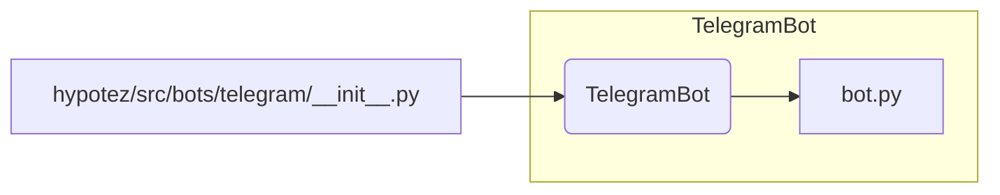

# <input code>

```python
## \file hypotez/src/bots/telegram/__init__.py
# -*- coding: utf-8 -*-
#! venv/Scripts/python.exe
#! venv/bin/python/python3.12

"""
.. module: src.bots.telegram 
	:platform: Windows, Unix
	:synopsis:

"""
MODE = 'dev'

from .bot import TelegramBot
```

# <algorithm>

Этот код представляет собой инициализационный модуль для подсистемы ботов Telegram.  Он импортирует класс `TelegramBot` из модуля `bot.py`, который, предположительно, содержит реализацию логики взаимодействия с Telegram-ботом.

**Шаг 1:** Импорт `TelegramBot`.
 - Код импортирует класс `TelegramBot` из подпапки `bot`. Это подразумевает, что существует файл `bot.py` в папке `hypotez/src/bots/telegram`.

**Пример:**
Если `bot.py` содержит класс `TelegramBot`:
```python
class TelegramBot:
    def __init__(self, token):
        self.token = token
```

**Пример данных, передаваемых между шагами**: Не происходит передачи данных, это просто инициализационный шаг.


# <mermaid>



**Объяснение диаграммы:**

Модуль `hypotez/src/bots/telegram/__init__.py` импортирует класс `TelegramBot` из модуля `bot.py`, который находится внутри того же пакета `hypotez/src/bots/telegram`.  Это типичная структура для модулей, где `__init__.py` служит точкой входа, импортируя необходимые компоненты.


# <explanation>

**Импорты:**

- `from .bot import TelegramBot`: Импортирует класс `TelegramBot` из файла `bot.py` внутри текущей директории `hypotez/src/bots/telegram`.  Используется относительный импорт `.` для поиска файла в текущей папке. Это стандартная практика в Python для организации модулей.

**Классы:**

- `TelegramBot`:  Предполагается, что этот класс содержит всю логику взаимодействия с Telegram-ботом.  Этот класс будет содержать методы для обработки сообщений, отправки ответов, выполнения команд и т.п.


**Функции:**

- Нет функций в данном файле.  Все функциональность заключена в классе `TelegramBot`, который, как предполагается, имеет собственные методы.


**Переменные:**

- `MODE = 'dev'`: Переменная, вероятно, задает режим работы (например, 'dev' - режим разработки, 'prod' - режим производства). Она не используется непосредственно в данном `__init__.py`, но может быть использована в других частях проекта для управления конфигурацией.

**Возможные ошибки или улучшения:**

- Отсутствие документации для переменной `MODE`. Добавьте строку документации для лучшего понимания её назначения.
- Неявный импорт: Импорт `TelegramBot` происходит из `bot.py`. Если в проекте несколько папок `bots` или `telegram`, то нужно быть уверенными, что относительный путь корректный.
- Нет явной инициализации `TelegramBot`. Файл лишь импортирует класс, но не создаёт экземпляр класса.  В коде, использующем этот модуль, должен быть код типа `my_bot = TelegramBot(token)`, где `token` - токен доступа к Telegram-боту.

**Взаимосвязи с другими частями проекта:**

- Этот модуль является частью более крупной архитектуры, которая, скорее всего, включает в себя:
    - Модуль для работы с базами данных (если бот хранит информацию).
    - Модули для обработки входящих сообщений и создания ответов.
    - Модули для обработки различных команд и событий.
- `TelegramBot`  предполагается, что будет взаимодействовать с API Telegram.
- Для запуска бота необходима дополнительная логика, которая будет создавать экземпляры класса `TelegramBot` и запускать механизм обработки событий.