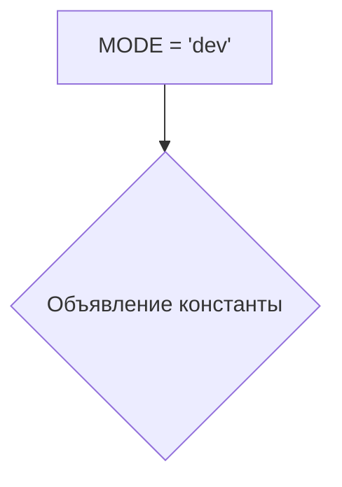
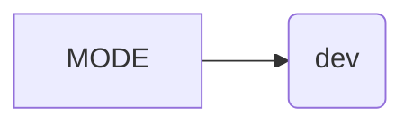

```MD
# <input code>

```python
## \file hypotez/src/bots/telegram/logger.py
# -*- coding: utf-8 -*-
#! venv/Scripts/python.exe
#! venv/bin/python/python3.12

"""
.. module: src.bots.telegram.logger 
	:platform: Windows, Unix
	:synopsis: Модуль логгирования телеграм ботов

"""
MODE = 'dev'
```

# <algorithm>

Этот код представляет собой просто объявление константы `MODE` с значением 'dev'.  Блок-схема очень простая:



В этом случае нет циклов или сложных вычислений.  Данные не перемещаются между функциями или классами, т.к. это просто декларативное объявление.


# <mermaid>



# <explanation>

**Импорты:**  В коде нет импортов.  Это означает, что модуль не использует какие-либо внешние библиотеки или модули.


**Классы:** Нет объявленных классов.


**Функции:** Нет функций.


**Переменные:** Единственная переменная — `MODE`. Она является константой, имеющей строковое значение 'dev'.  Это, скорее всего, конфигурационная переменная, определяющая режим работы логгера (например, "dev", "prod").  Это значение может быть использовано другими частями кода, например, для выбора уровня логгирования или пути для сохранения логов.


**Возможные ошибки или области для улучшений:**

* **Недостаток контекста:** Без других файлов проекта сложно сказать, для чего используется эта константа.  Было бы полезно определить, как эта константа используется в других частях проекта.
* **Отсутствие документации:**  Хоть и есть документационная строка (`"""Docstring"""`),  она краткая и неполная.  Желательно добавить более подробное описание роли этой константы в контексте проекта.  Например, объяснить, как значение константы влияет на поведение логгера.


**Взаимосвязи с другими частями проекта:**

Без доступа к остальным файлам, невозможно построить полную картину взаимосвязей.  Но можно предположить, что эта константа используется в других частях проекта (например, в `config.py`, `logger.py`, или в телеграм боте) для настройки режима работы логгера и, следовательно, поведения программы.  Например, в режиме "dev" логгер может записывать более подробные данные, а в режиме "prod" — упрощенные.