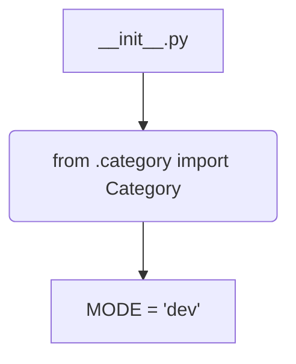
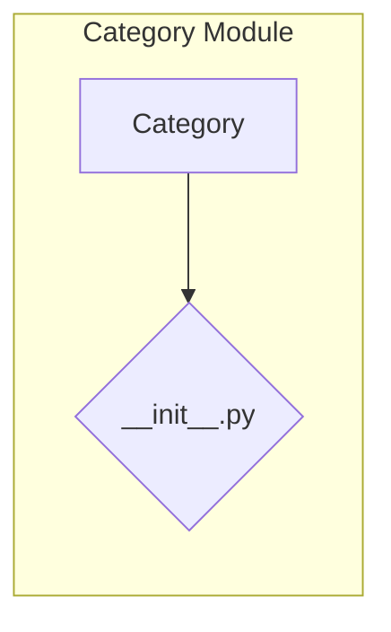

# <input code>

```python
## \file hypotez/src/category/__init__.py
# -*- coding: utf-8 -*-
#! venv/Scripts/python.exe
#! venv/bin/python/python3.12

"""
.. module: src.category 
	:platform: Windows, Unix
	:synopsis:

"""
MODE = 'dev'

from .category import Category
```

# <algorithm>

Этот код представляет собой инициализационный файл для модуля `category` в пакете `hypotez/src`.  Он импортирует класс `Category` из подпапки `category`.  Блок-схема здесь тривиальна:



**Пример:**  Файл `__init__.py` используется для инициализации модуля.  В нём определяется глобальная переменная `MODE` со значением `'dev'`.  После этого происходит импорт класса `Category` из файла `category.py` внутри папки `category`.

# <mermaid>



**Объяснение для диаграммы:**

Диаграмма показывает простую зависимость. Модуль `Category` содержит класс `Category`, который импортируется в файл `__init__.py` того же каталога.  Связь между `__init__.py` и `Category` является импортом.  В данном случае,  `__init__.py` инициализирует модуль `category` и предоставляет доступ к классу `Category` для других частей проекта.

# <explanation>

* **Импорты:** `from .category import Category` импортирует класс `Category` из подмодуля `category` в текущем пакете.  Символ `.` перед именем `category` указывает на поиск в папке `hypotez/src/category`. Это стандартная Python практика для импорта модулей из подпапок.  Без этой строки в других частях кода не удалось бы обратиться к классу `Category`.  Связь: этот импорт устанавливает зависимость между `__init__.py` и модулем `category.py`.

* **Классы:** В файле `category.py` (который *не* показан в примере) должен быть определён класс `Category`.  Описание его функций, методов и атрибутов содержится в этом файле.  В `__init__.py` просто предоставляется доступ к `Category`.  Взаимодействие: `__init__.py` просто "выставляет" `Category` для использования, а конкретная логика и реализация класса находится в `category.py`.

* **Функции:** Нет функций в данном файле.

* **Переменные:** `MODE = 'dev'` — глобальная переменная, определяющая режим работы приложения (в данном случае, режим разработки).  Это может быть использовано для конфигурации поведения приложения.  Тип: строка.

* **Возможные ошибки/улучшения:**

    * Отсутствие файла `category.py`: Код не скомпилируется, если файл `category.py` в `hypotez/src/category` отсутствует или в нём отсутствует класс `Category`.
    * Неясная роль переменной `MODE`: Необходимо прояснить, как эта переменная используется в других частях проекта.  Какие действия будут различаться в разных режимах (`dev` и другие)?
    * Недостаток документации: Документация в виде docstrings (`"""..."""`) в модуле и классе `Category` в файле `category.py` улучшит понимание назначения и поведения.

* **Взаимосвязь с другими частями проекта:**  Этот `__init__.py` является частью пакета `hypotez/src/category`.  Для использования `Category`, другая часть проекта должна импортировать его через `import hypotez.src.category`.


**Вывод:** Код представляет собой стандартный `__init__.py` файл для пакета Python, который делает доступным класс `Category` для импорта извне.  Ключевая часть - импорт класса `Category` - показывает, что эта инициализация подготавливает модуль `category` к использованию.  Для полноценного анализа, необходимо ознакомиться с содержанием файла `hypotez/src/category/category.py`.