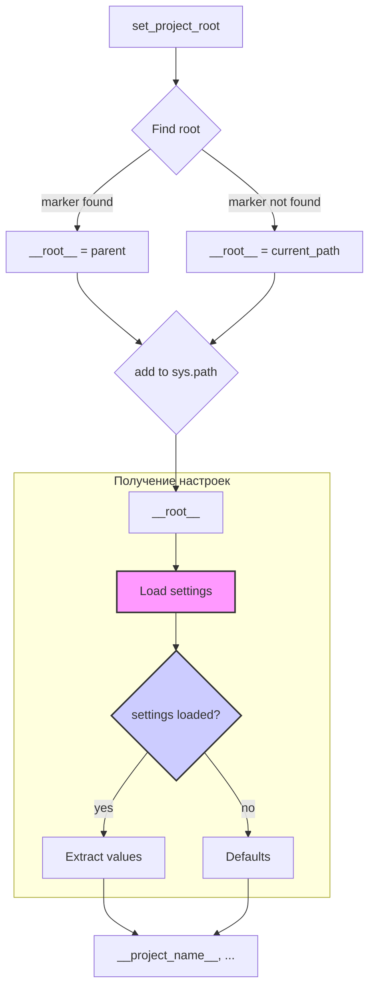

# <input code>

```python
## \file hypotez/src/category/header.py
# -*- coding: utf-8 -*-
#! venv/Scripts/python.exe
#! venv/bin/python/python3.12

"""
module: src.category 
	:platform: Windows, Unix
	:synopsis: Модуль определяющий корневой путь к проекту. Все импорты строятся относительно этого пути.
    :TODO: В дальнейшем перенести в системную переменную"""
MODE = 'dev'

import sys
import json
from packaging.version import Version

from pathlib import Path
def set_project_root(marker_files=('pyproject.toml', 'requirements.txt', '.git')) -> Path:
    """
    Finds the root directory of the project starting from the current file's directory,
    searching upwards and stopping at the first directory containing any of the marker files.

    Args:
        marker_files (tuple): Filenames or directory names to identify the project root.
    
    Returns:
        Path: Path to the root directory if found, otherwise the directory where the script is located.
    """
    __root__:Path
    current_path:Path = Path(__file__).resolve().parent
    __root__ = current_path
    for parent in [current_path] + list(current_path.parents):
        if any((parent / marker).exists() for marker in marker_files):
            __root__ = parent
            break
    if __root__ not in sys.path:
        sys.path.insert(0, str(__root__))
    return __root__


# Get the root directory of the project
__root__ = set_project_root()
"""__root__ (Path): Path to the root directory of the project"""

from src import gs

settings:dict = None
try:
    with open(gs.path.root / 'src' /  'settings.json', 'r') as settings_file:
        settings = json.load(settings_file)
except (FileNotFoundError, json.JSONDecodeError):
    ...

doc_str:str = None
try:
    with open(gs.path.root / 'src' /  'README.MD', 'r') as settings_file:
        doc_str = settings_file.read()
except (FileNotFoundError, json.JSONDecodeError):
    ...


__project_name__ = settings.get("project_name", 'hypotez') if settings  else 'hypotez'
__version__: str = settings.get("version", '')  if settings  else ''
__doc__: str = doc_str if doc_str else ''
__details__: str = ''
__author__: str = settings.get("author", '')  if settings  else ''
__copyright__: str = settings.get("copyrihgnt", '')  if settings  else ''
__cofee__: str = settings.get("cofee", "Treat the developer to a cup of coffee for boosting enthusiasm in development: https://boosty.to/hypo69")  if settings  else "Treat the developer to a cup of coffee for boosting enthusiasm in development: https://boosty.to/hypo69"
```

# <algorithm>

**Шаг 1:**  Определяется функция `set_project_root`. Она принимает кортеж `marker_files`, содержащий имена файлов/директорий, используемых для поиска корневой директории проекта.

**Шаг 2:**  Функция определяет текущий путь к файлу (`__file__`) и создаёт объект `Path` для удобного доступа.

**Шаг 3:**  Функция итерируется по родительским директориям текущего файла, начиная от текущего.

**Шаг 4:** Для каждой родительской директории проверяется, существует ли в ней хотя бы один файл из списка `marker_files`.

**Шаг 5:** Если найден родительский каталог, содержащий один или более файлов из `marker_files`, он устанавливается как корневой путь (`__root__`) и цикл прерывается.

**Шаг 6:** Если корневой путь не найден, используется текущий путь.

**Шаг 7:** Корневой путь добавляется в переменную `sys.path` (если его там ещё нет). Это позволяет интерпретатору Python импортировать модули из этого каталога.

**Шаг 8:** Возвращается корневой путь (`__root__`).

**Пример:**

Если скрипт находится в `hypotez/src/category/header.py`, а `pyproject.toml` находится в `hypotez`, то `__root__` будет `hypotez`.

**Шаг 9:**  Переменная `__root__` содержит корневой путь к проекту.

**Шаг 10:** Импортируется модуль `gs` из `src`.

**Шаг 11:** Попытка загрузить настройки из файла `settings.json` в переменную `settings`. Обрабатываются потенциальные ошибки `FileNotFoundError` и `json.JSONDecodeError`.

**Шаг 12:** Попытка загрузить README в `doc_str`. Обрабатываются потенциальные ошибки `FileNotFoundError` и `json.JSONDecodeError`.

**Шаг 13:**  Извлекаются значения из `settings` (или устанавливаются значения по умолчанию), если `settings` не пусто, в противном случае возвращаются значения по умолчанию. Эти значения сохраняются в переменные `__project_name__`, `__version__`, `__doc__`, `__details__`, `__author__`, `__copyright__`, `__cofee__`.


# <mermaid>



# <explanation>

**Импорты:**

- `sys`: Предоставляет доступ к системным переменным, в частности, `sys.path`.
- `json`: Для работы с JSON-файлами.
- `packaging.version`: Для работы с версиями пакетов (не используется напрямую).
- `pathlib`: Для работы с путями файлов.
- `src.gs`: По всей видимости, это собственный модуль проекта, содержащий переменные и функции для работы с ресурсами, в том числе с корневым каталогом проекта.


**Классы:**

Нет явных определений классов в этом коде.

**Функции:**

- `set_project_root(marker_files)`: Находит корневую директорию проекта, начиная от текущего файла и проверяя наличие заданных файлов/папок. Возвращает `Path` объект, который представляет корневой путь, и добавляет его в `sys.path`, если его там нет.  Это важная функция, так как она позволяет Python находить другие модули, импортированные из корневой директории.


**Переменные:**

- `__root__`: Хранит `Path` объект, представляющий корневой путь к проекту.
- `settings`, `doc_str`: Хранят загруженные данные из `settings.json` и `README.MD` соответственно, обрабатывая потенциальные исключения.
- `__project_name__`, `__version__`, `__doc__`, `__details__`, `__author__`, `__copyright__`, `__cofee__`: Эти переменные представляют собой значения из `settings.json`.  Если соответствующие ключи отсутствуют или `settings` не загрузился, используются значения по умолчанию.

**Возможные ошибки и улучшения:**

- **Обработка ошибок:** Обработка ошибок (try...except блоки) для чтения `settings.json` и `README.MD` важна. Однако, обработка `json.JSONDecodeError` не проверяет формат `settings.json`, может быть полезно добавить проверку типа.
- **Конфигурация:**  Вместо `marker_files`  возможно, лучше определить системную переменную для указания корневой директории или добавить дополнительный файл конфигурации.
- **Типизация:**  Использование аннотаций типов (`-> Path`) улучшает читаемость и позволяет статическим анализаторам выявлять потенциальные проблемы.
- **Проверка `settings`:**  Проверка `if settings`  в нескольких строках, где используются элементы словаря settings. Лучше использовать try...except для обработки отсутствия данных.


**Взаимосвязи с другими частями проекта:**

Модуль `gs` (и его атрибут `path.root`) является критически важным, так как он предоставляет доступ к корневому каталогу проекта.  Этот код опирается на функцию `gs.path.root`,  которая должна быть определена в другом модуле, вероятно, в `src/gs.py`. Код в `header.py` предполагает, что модуль `gs` предоставляет пути к важным файлам проекта.