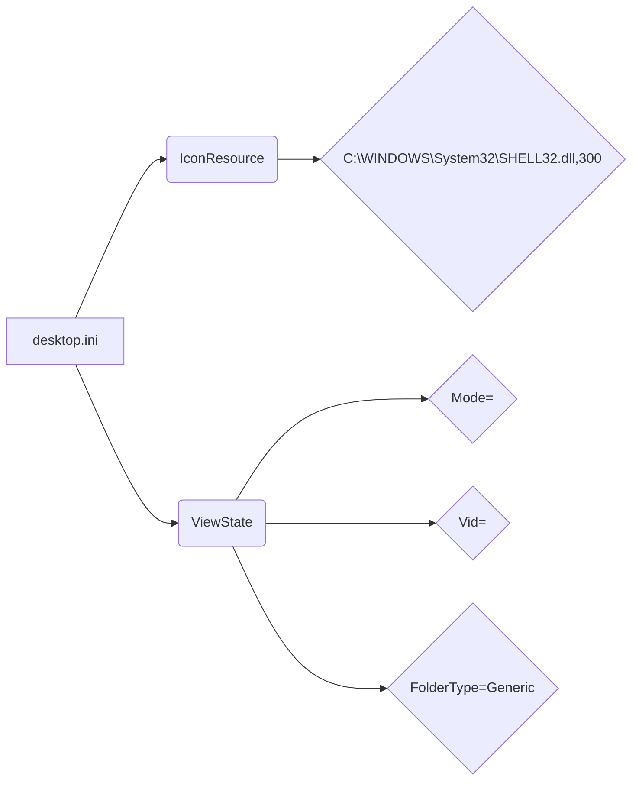

```MD
# Анализ кода desktop.ini

1. **<input code>**

```[.ShellClassInfo]
IconResource=C:\\WINDOWS\\System32\\SHELL32.dll,300
[ViewState]
Mode=
Vid=
FolderType=Generic
```

2. **<algorithm>**

Этот код не содержит алгоритма в привычном понимании. Это не код программы, а специальный метаданных-файл (информационный файл) для Windows, используемый для управления отображением и атрибутами папок.  Он определяет, как Windows должна отображать папку, а именно иконку и вид.  Блок-схема не применима.  Данные не перемещаются между функциями или классами.

3. **<mermaid>**



4. **<explanation>**

Файл `desktop.ini` используется в Windows для настройки отображения папок. Он содержит информацию, которую Windows использует для определения отображаемой иконки папки и других свойств.

* **`[.ShellClassInfo]`**: Это секция, определяющая атрибуты иконки.
* **`IconResource=C:\\WINDOWS\\System32\\SHELL32.dll,300`**:  Эта строка указывает, что иконка должна быть взята из файла `SHELL32.dll` (системный файл Windows) и использовать ресурс под индексом 300.  Это стандартная иконка для обычных папок.
* **`[ViewState]`**: Это секция, определяющая состояние папки.
* **`Mode=`**, **`Vid=`**, **`FolderType=Generic`**: Эти строки устанавливают различные параметры, связанные с видом, расположением и типом отображаемой папки. В данном случае вид и состояние не заданы,  `Mode=` и `Vid=` пусты, а тип установлен на `Generic`.

**Связь с другими частями проекта:**

Этот файл является метаданными, не связанными с кодом программы. Он напрямую связан с операционной системой Windows.  Других зависимостей в данном случае нет.

**Возможные ошибки или области для улучшений:**

* Нет ошибок в самом коде.  Однако, файл `desktop.ini` должен быть сохранён с кодировкой UTF-8 без BOM, чтобы избежать проблем с разными версиями Windows.


**Важно:** Этот файл - это *не* обычный программный код.  Его назначение – взаимодействие с Windows shell, а не с какими-то программами.  Поэтому нет функций, классов, переменных в привычном смысле.