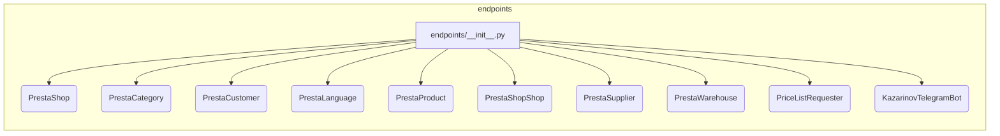

# <input code>

```python
## \file hypotez/src/endpoints/__init__.py
# -*- coding: utf-8 -*-\
#! venv/Scripts/python.exe
#! venv/bin/python/python3.12

"""
.. module: src.endpoints 
	:platform: Windows, Unix
	:synopsis:

"""
MODE = 'dev'


from .prestashop import PrestaShop, PrestaCategory, PrestaCustomer, PrestaLanguage, PrestaProduct, PrestaShopShop, PrestaSupplier, PrestaWarehouse, PriceListRequester 
from .kazarinov import KazarinovTelegramBot
```

# <algorithm>

Данный код представляет собой инициализационный файл для пакета `endpoints`.  Он импортирует классы и функции из других модулей внутри пакета `src.endpoints`.  Алгоритм работы сводится к импорту необходимых компонентов.  Никакой сложной логики обработки данных в этом файле нет.  В этом файле не описывается алгоритм.


# <mermaid>



# <explanation>

**Импорты:**

Файл `hypotez/src/endpoints/__init__.py` служит для импорта различных классов и функций из подпапок `prestashop` и `kazarinov` внутри `src/endpoints`.  Это типичный подход для модульного дизайна, где все классы и функции, необходимые для взаимодействия с другими частями проекта, объединены в одном файле, что облегчает импорт в других модулях.

`from .prestashop import ...` - импортирует классы, скорее всего, связанные с API или работой с данными платформы PrestaShop.  Это предполагает существование пакета `src/endpoints/prestashop`, содержащего эти определения классов.

`from .kazarinov import ...` - импортирует класс `KazarinovTelegramBot`, вероятно, связанный с взаимодействием с ботом Telegram для платформы Kazarinov. Это предполагает наличие пакета `src/endpoints/kazarinov` с соответствующим кодом.

**Классы:**

* `PrestaShop`, `PrestaCategory`, `PrestaCustomer`, и т.д.:  представляют собой классы для работы с данными PrestaShop.  Без доступа к их определению сложно сказать точно, какие данные они представляют или какие операции выполняют.  Вероятно, они отвечают за хранение данных о магазинах, категориях, клиентах и т.п.  Понятно, что эти классы должны обеспечивать взаимодействие с API или базой данных PrestaShop.
* `KazarinovTelegramBot`: Представляет класс для работы с ботом Telegram платформы Kazarinov.  Он, вероятно, содержит методы для отправки и получения сообщений, обработки событий и других действий, связанных с взаимодействием с этим ботом.


**Функции:**

В этом файле нет определений функций, только импорты.  Функции, которые могут использоваться, определены в `prestashop` и `kazarinov`.


**Переменные:**

`MODE = 'dev'`:  Переменная, вероятно, хранит режим работы приложения (например, 'dev' для разработки, 'prod' для производства).  Эта переменная может использоваться в других частях проекта для настройки поведения.


**Возможные ошибки и улучшения:**

* **Документация:**  Добавление более подробной документации к классам и функциям в `prestashop` и `kazarinov` значительно повысит читаемость и поддержку кода.
* **Исключения:**  В коде нет обработки исключений.  Если при работе с API или другими ресурсами могут возникать ошибки, это необходимо учесть.
* **Типизация:**  Использование типов данных (например, через аннотации) повысит надежность и читаемость кода.

**Связь с другими частями проекта:**

Этот `__init__.py` файл служит связующим звеном между модулем `endpoints` и другими частями проекта.  Он экспортирует классы, которые, вероятно, будут использоваться другими частями приложения для взаимодействия с PrestaShop, ботом Telegram и другими сервисами.  Следующие части проекта, скорее всего, импортируют классы из этого модуля.