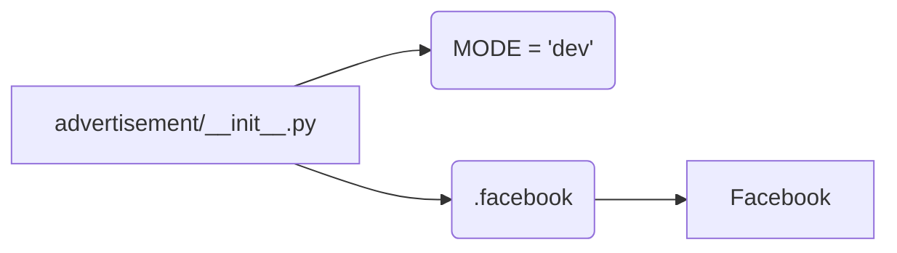

# <input code>

```python
## \file hypotez/src/endpoints/advertisement/__init__.py
# -*- coding: utf-8 -*-
#! venv/Scripts/python.exe
#! venv/bin/python/python3.12

"""
.. module: src.endpoints.advertisement 
	:platform: Windows, Unix
	:synopsis:

"""
MODE = 'dev'


from .facebook import Facebook
```

# <algorithm>

Этот код определяет модуль `advertisement` в пакете `endpoints` проекта `hypotez`.  Он содержит константу `MODE` и импортирует класс `Facebook` из подмодуля `facebook`.

**Блок-схема алгоритма:**

1. **Инициализация:** Модуль `advertisement` инициализируется с константой `MODE`, устанавливая значение `'dev'`.
2. **Импорт:** Модуль импортирует класс `Facebook` из подмодуля `facebook`.


**Пример данных:**

Константа `MODE` имеет строковое значение `'dev'`.

Данные не передаются между функциями или классами внутри этого файла.


# <mermaid>



**Объяснение диаграммы:**

Модуль `advertisement/__init__.py` имеет зависимость от подмодуля `facebook`, который, в свою очередь, содержит класс `Facebook`.  `MODE` - это переменная внутри самого модуля `advertisement/__init__.py`.  Никаких дополнительных зависимостей в этом фрагменте кода нет.


# <explanation>

* **Импорты:**
    * `from .facebook import Facebook`:  Импортирует класс `Facebook` из подмодуля `facebook`, который, скорее всего, находится в том же каталоге (в `hypotez/src/endpoints/advertisement/facebook.py`).  Символ `.` указывает на поиск модуля в текущем пакете.  Это важная часть модульной структуры Python.

* **Классы:**
    * **`Facebook`:** Класс, определённый в модуле `facebook.py`.  Этот код лишь импортирует его, а не создаёт экземпляры класса.  Его назначение неясно без просмотра определения `Facebook`.  Предположительно, `Facebook` отвечает за взаимодействие с платформой Facebook для рекламных кампаний.


* **Функции:**
    * Нет функций в данном файле.

* **Переменные:**
    * `MODE = 'dev'`: Строковая переменная, которая, вероятно, используется для управления режимом работы (например, 'dev' - режим разработки, 'prod' - режим производства)  Это важно для настройки различных настроек и поведения приложения в разных средах.


* **Возможные ошибки или улучшения:**
    * Нет явных ошибок, но без кода `facebook.py` невозможно оценить корректность импорта и использовать `Facebook` в коде.
    * Возможно, не хватает документации для `Facebook` и переменной `MODE`.
    * Необходимо проверить, что `facebook.py` существует и содержит определение класса `Facebook`.


* **Связь с другими частями проекта:**
    * Этот модуль импортирует класс `Facebook`.  Это означает, что `facebook.py` должен существовать и определять класс `Facebook`.  Кроме того, предположительно, `Facebook` используется для работы с рекламными API Facebook.  Дальнейшая логика взаимодействия с другими частями проекта  зависит от `facebook.py`.  Для понимания целой системы нужно изучить и остальные модули.


В целом, код представляет собой простой импорт необходимых компонентов для взаимодействия с платформой Facebook.  Без просмотра  `facebook.py` нельзя дать более детальное объяснение.