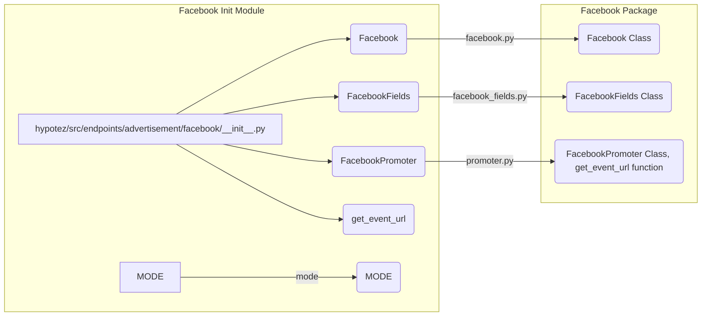

# <input code>

```python
## \file hypotez/src/endpoints/advertisement/facebook/__init__.py
# -*- coding: utf-8 -*-
#! venv/Scripts/python.exe
#! venv/bin/python/python3.12

"""
.. module: src.endpoints.advertisement.facebook 
	:platform: Windows, Unix
	:synopsis:

"""
MODE = 'dev'

from .facebook import Facebook
from .facebook_fields import FacebookFields
from .promoter import FacebookPromoter, get_event_url
```

# <algorithm>

Этот код представляет собой модуль инициализации для пакета `facebook` в рамках проекта `hypotez`.  Алгоритм работы крайне прост: он импортирует классы и функции из подпапок `facebook`, `facebook_fields` и `promoter`.

**Шаг 1:** Импорт необходимых компонентов.
- В файле импортируются классы `Facebook`, `FacebookFields` и `FacebookPromoter`, а также функция `get_event_url`. Эти элементы, предположительно, определены в файлах `facebook.py`, `facebook_fields.py` и `promoter.py`, которые находятся в подпапке `facebook` внутри каталога `endpoints/advertisement/`.
- `MODE = 'dev'` - вероятно, устанавливает режим работы для всей подсистемы (например, девелоперский, тестовый).

**Пример данных:** Нет явного примера передачи данных, так как на данном этапе это просто импорты.


# <mermaid>



**Объяснение диаграммы:**

Диаграмма иллюстрирует структуру импорта. Модуль `__init__.py` импортирует классы и функции из других файлов (`facebook.py`, `facebook_fields.py`, `promoter.py`) внутри пакета `facebook`.  `MODE` переменная локальна для `__init__.py`.  Зависимости показаны стрелками.


# <explanation>

* **Импорты:**
    * `from .facebook import Facebook`: Импортирует класс `Facebook` из файла `facebook.py` внутри текущего каталога.
    * `from .facebook_fields import FacebookFields`: Импортирует класс `FacebookFields` из файла `facebook_fields.py` внутри текущего каталога.
    * `from .promoter import FacebookPromoter, get_event_url`: Импортирует класс `FacebookPromoter` и функцию `get_event_url` из файла `promoter.py` внутри текущего каталога.  Это предполагает, что `promoter.py` содержит функции и классы, связанные с продвижением рекламных кампаний на Facebook.

* **Классы:**
    * `Facebook`: Вероятно, класс, представляющий общую функциональность работы с Facebook API.
    * `FacebookFields`: Вероятно, класс, содержащий константы или поля для работы с Facebook (например, названия полей для рекламных кампаний).
    * `FacebookPromoter`: Вероятно, класс, отвечающий за создание и управление рекламными кампаниями на Facebook.

* **Функции:**
    * `get_event_url`: Функция, которая, скорее всего, возвращает URL-адрес для определенного события на Facebook.

* **Переменные:**
    * `MODE = 'dev'`:  Поле, которое устанавливает режим работы (вероятно, dev - режим разработки). Эта константа может влиять на поведение других частей кода (например, подключаемые API).


* **Возможные ошибки и улучшения:**
    * Нет проверки импортированных файлов.  В случае отсутствия соответствующих файлов произойдет ошибка импорта.
    * Не указаны типы возвращаемых значений и параметры функций/методов.
    * Не описана работа внутри функций и классов.

* **Взаимосвязи с другими частями проекта:**
    Этот модуль `__init__.py` является точкой входа в подсистему работы с Facebook рекламой.  Далее код взаимодействует с другими частями проекта, вероятно, через классы Facebook, FacebookFields и FacebookPromoter, которые обращаются к Facebook API, базам данных или другим сервисам для выполнения конкретных задач.


```