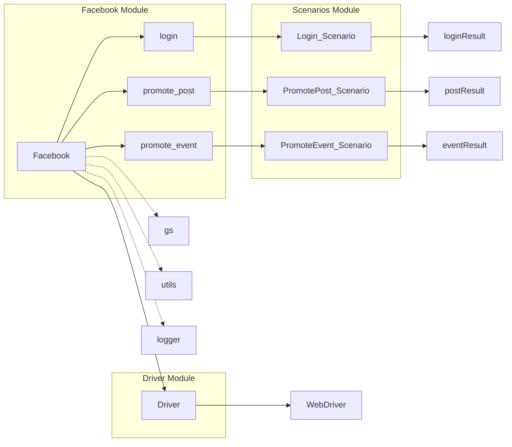

# Анализ кода файла hypotez/src/endpoints/advertisement/facebook/facebook.py

## <input code>

```python
## \file hypotez/src/endpoints/advertisement/facebook/facebook.py
# -*- coding: utf-8 -*-\n#! venv/Scripts/python.exe\n#! venv/bin/python/python3.12\n\n"""
.. module: src.endpoints.advertisement.facebook 
	:platform: Windows, Unix
	:synopsis: Модуль рекламы на фейсбук

 сценарии:
	- login: логин на фейсбук
	- post_message: отправка текствого сообщения в форму 
	- upload_media: Загрузка файла или списка файлов

"""
MODE = 'dev'

import os, sys
from pathlib import Path
from types import SimpleNamespace
from typing import Dict, List
...
from src import gs
from src.webdriver import Driver
from src.utils import j_loads, j_dumps, pprint
from src.logger import logger
from .scenarios.login import login
from .scenarios import switch_account, promote_post, post_title, upload_media, update_images_captions


class Facebook():
	"""  Класс общается с фейбуком через вебдрайвер """
	d: Driver
	start_page:str = r'https://www.facebook.com/hypotez.promocodes'
	promoter:str

	def __init__(self, driver:Driver, promoter:str, group_file_paths: list[str], *args, **kwards):
		""" Я могу передать уже запущенный инстанс драйвера. Например, из алиэкспресс
		@todo:
			- Добавить проверку на какой странице открылся фейсбук. Если открылась страница логина - выполнитл сценарий логина
		"""
		...
		
		#self.driver.get_url (self.start_page)
		#switch_account(self.driver) # <- переключение профиля, если не на своей странице

	def login(self) -> bool:
		return login(self)

	def promote_post(self, item:SimpleNamespace) -> bool:
		""" Функция отправляет текст в форму сообщения 
		@param message: сообщение текстом. Знаки `;` будут заменеы на `SHIFT+ENTER`
		@returns `True`, если успешно, иначе `False`
		"""
		...
		return  promote_post(self.driver, item)

	def promote_event(self,event:SimpleNamespace):
		""""""
		...
	
```

## <algorithm>

Блок-схема алгоритма сложна для построения в текстовом формате, т.к.  не хватает деталей реализации функций `login`, `promote_post` и `promote_event`,  которые импортированы из других файлов (`src/endpoints/advertisement/facebook/scenarios/*`).

**Предполагаемый алгоритм:**

1. **Инициализация (`__init__`)**:
   - Принимает `driver` (вебдрайвер), `promoter` (имя промоутера), `group_file_paths` (пути к файлам).
   - Возможная проверка текущей страницы. Если это не целевая страница, выполняется переключение аккаунта (`switch_account`).
2. **Логин (`login`)**:
   - Вызывает функцию `login` из модуля `.scenarios.login`.
   - Возвращает результат выполнения (`True` или `False`).
3. **Публикация поста (`promote_post`)**:
   - Принимает объект `item` (предполагается, что содержит данные поста).
   - Вызывает функцию `promote_post` из модуля `.scenarios`. Передает ей `self.driver` и `item`.
   - Возвращает результат выполнения.
4. **Публикация события (`promote_event`)**:
   - Принимает объект `event` (предполагается, что содержит данные события).


**Передача данных:**

- Объект `Facebook` хранит ссылку на вебдрайвер (`self.driver`) и другие данные.
- Функции, импортированные из `scenarios`, получают доступ к данным через `self.driver`.


## <mermaid>




## <explanation>

**Импорты:**

- `os`, `sys`, `Path`: Стандартные библиотеки Python для работы с операционной системой и файловой системой.
- `SimpleNamespace`, `Dict`, `List`: Из `types` и `typing` для работы с данными.
- `gs`, `Driver`, `j_loads`, `j_dumps`, `pprint`: Импортированы из модулей `src`. Это указывает на то, что проект имеет структурированную архитектуру. 
- `logger`: Вероятно, для логирования действий.
- `login`, `switch_account`, `promote_post`, `post_title`, `upload_media`, `update_images_captions`: Функции из подмодуля `scenarios` для управления рекламными действиями.


**Классы:**

- `Facebook`: Представляет взаимодействие с Facebook через вебдрайвер.
    - `d: Driver`: Вебдрайвер.
    - `start_page`: Стартовая страница Facebook.
    - `promoter`: Имя промоутера.
    - `__init__`: Инициализирует экземпляр класса, получает вебдрайвер и другие данные. В `__init__`  не хватает важной логики, например, авторизации (если страница не главная)
    - `login`: Вызывает сценарий авторизации.
    - `promote_post`: Вызывает сценарий публикации поста.
    - `promote_event`: Вызывает сценарий публикации события.


**Функции:**

- `__init__`: Инициализирует экземпляр класса `Facebook`. 
- `login`: Вызывает функцию из модуля `scenarios` для входа в аккаунт.
- `promote_post`: Вызывает функцию из модуля `scenarios` для публикации поста.
- `promote_event`: Вызывает функцию из модуля `scenarios` для публикации события.


**Переменные:**

- `MODE`: Вероятно, режим работы (например, 'dev', 'prod').
- `start_page`: Строка со ссылкой на целевую страницу на Facebook.

**Возможные ошибки и улучшения:**

- Отсутствие проверки страницы при инициализации (`__init__`).  Если страница не главная,  необходима авторизация. Необходимо добавить проверку текущей страницы и сценарий авторизации, если это не целевая страница.
- Нет обработки ошибок (`try...except`) в методах.
- Функции `promote_post` и `promote_event` не реализованы.
-  Необходима более подробная документация для функций и методов.
- Сложные сценарии (логин, пост, событие) вынесены в отдельные файлы, но не показано как эти файлы связаны и как они обмениваются данными между собой.  Это может быть сложно проследить без анализа файлов `.scenarios/*`.

**Взаимосвязи с другими частями проекта:**

- `Facebook` использует `Driver` для взаимодействия с браузером (из `src.webdriver`).
- `Facebook` использует модули `utils` и `logger` для обработки данных и ведения журнала.
- `Facebook` использует функции из `scenarios` для реализации сложных сценариев.


**Вывод:**

Код демонстрирует структурированный подход к разработке, но требует дальнейшей реализации и обработки ошибок. Необходимо добавить проверку текущей страницы при инициализации и авторизацию, если это не главная страница.  Недостаточно деталей в коде, чтобы построить полную блок-схему и точно проследить все логические связи.