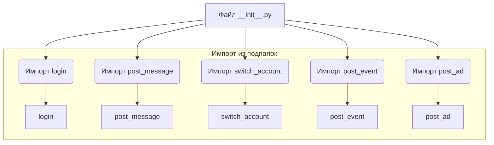
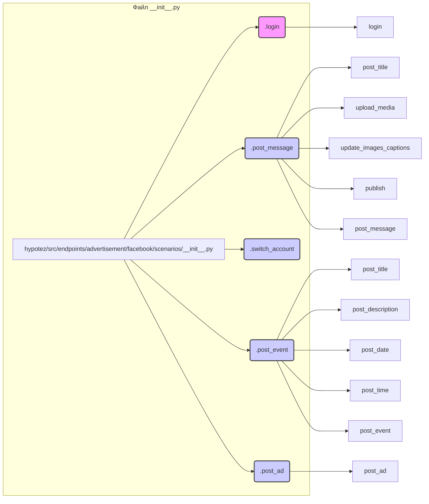

# Анализ файла `hypotez/src/endpoints/advertisement/facebook/scenarios/__init__.py`

## <input code>

```python
## \file hypotez/src/endpoints/advertisement/facebook/scenarios/__init__.py
# -*- coding: utf-8 -*-
#! venv/Scripts/python.exe
#! venv/bin/python/python3.12

"""
.. module: src.endpoints.advertisement.facebook.scenarios 
	:platform: Windows, Unix
	:synopsis:

"""
MODE = 'dev'

from .login import login
from .post_message  import *
from .switch_account import switch_account
from .post_message import (post_title as post_message_title,   # <- заголовок
                           upload_media as upload_post_media, # <- изображения 
                           update_images_captions as update_post_media_captions, # <- подписи к изображениям 
                           publish as message_publish,
                           post_message,
                           )

from .post_event import (post_title as post_event_title,
                         post_description as post_event_description,
                         post_date,
                         post_time,
                         #send,
                         post_event
                         )

from .post_ad import post_ad
```

## <algorithm>

Этот файл является модулем инициализации, который предоставляет доступ к функциям и классам, связанным с различными сценариями для Facebook рекламы в проекте `hypotez`.  Алгоритм работы состоит в импорте необходимых компонентов из подпапок `login`, `post_message`, `switch_account`, `post_event` и `post_ad`.  По сути, он собирает все нужные функции в одном месте для последующего использования.  Нет циклов или сложных условий, просто импорты.

**Пример:**

Если в другой части проекта нужно опубликовать пост, он может импортировать `message_publish` или `post_message` из этого файла, чтобы выполнить соответствующую операцию.

**Блок-схема:**



## <mermaid>



## <explanation>

**Импорты:**

Файл импортирует функции и классы из других модулей внутри папки `scenarios`.  Например, `from .login import login` импортирует функцию `login` из модуля `login.py` в той же папке.  `*`  в `from .post_message import *` импортирует *все* имена из модуля `post_message`. Это может привести к конфликтам имен, если в разных модулях есть функции с одинаковыми именами.  Использование алиасов (например, `post_title as post_message_title`) помогает избежать таких конфликтов.


**Классы:**

В файле нет классов.  Он содержит только импорты и одну переменную.


**Функции:**

Файл содержит импорты функций из других модулей, например `login`, `switch_account`, `post_message`, `post_event`, `post_ad`. Каждая функция имеет своё предназначение в рамках процесса работы с рекламой на Facebook.  Эти функции (или их части) вероятно реализуют логику работы с API Facebook.

**Переменные:**

`MODE = 'dev'` — переменная, которая, вероятно, используется для определения режима работы (разработка, производство). Это конфигурационная переменная.

**Возможные ошибки и улучшения:**

* **Конфликты имен:**  Использование `from .post_message import *` может привести к скрытию или переопределению имен. При большом количестве зависимостей это может привести к ошибкам.  Лучше использовать импорт по имени (например, `from .post_message import post_title`).
* **Документация:**  Недостаточно подробная документация (документированные строки) для функций, импортированных из других файлов.  Добавление docstrings к каждой функции улучшит читаемость и понимание кода.
* **Ошибки в импортах:** Убедитесь, что файлы, на которые ссылаются импорты (например, `login.py`, `post_message.py`), существуют в указанном пути.


**Взаимосвязь с другими частями проекта:**

Этот файл является частью инфраструктуры, отвечающей за взаимодействие с Facebook API для создания и управления рекламными кампаниями.  Другие части проекта, вероятно, используют эти функции для выполнения конкретных задач, например, для создания рекламных объявлений, управления аккаунтами, публикации сообщений и т.д.


```