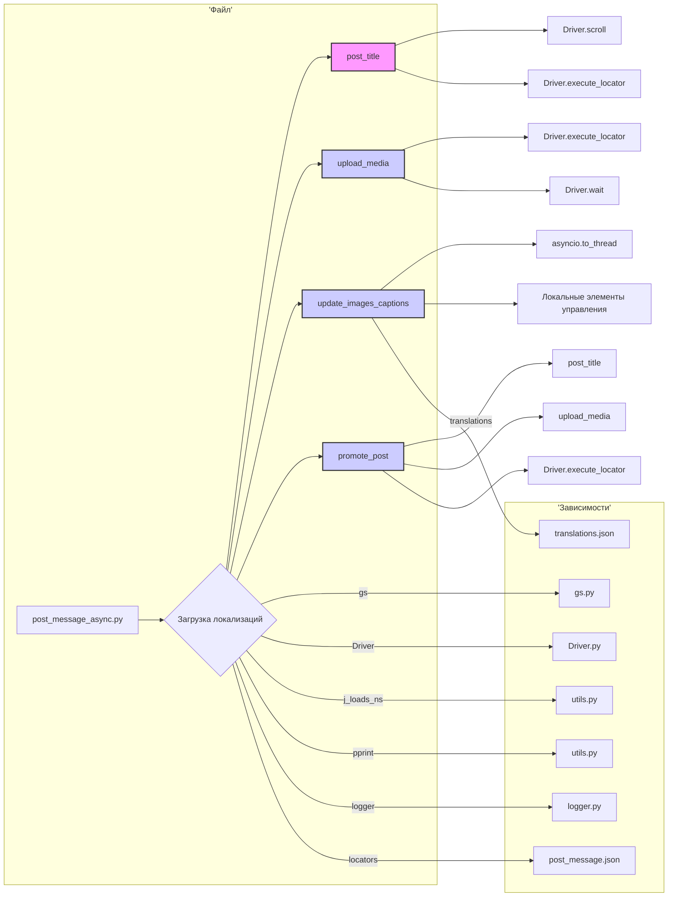

# <input code>

```python
## \file hypotez/src/endpoints/advertisement/facebook/scenarios/post_message_async.py
# -*- coding: utf-8 -*-\
#! venv/Scripts/python.exe
#! venv/bin/python/python3.12

"""
.. module: src.endpoints.advertisement.facebook.scenarios 
	:platform: Windows, Unix
	:synopsis: Публикация сообщения из `aliexpress` промо

"""
MODE = 'dev'

import time
import asyncio
from pathlib import Path
from types import SimpleNamespace
from typing import Dict, List
from selenium.webdriver.remote.webelement import WebElement
from src import gs
from src.webdriver import Driver
from src.utils import j_loads_ns, pprint
from src.logger import logger

# Load locators from JSON file.
locator: SimpleNamespace = j_loads_ns(
    Path(gs.path.src / 'endpoints' / 'advertisement' / 'facebook' / 'locators' / 'post_message.json')
)


def post_title(d: Driver, category: SimpleNamespace) -> bool:
    """ Sends the title and description of a campaign to the post message box.

    Args:
        d (Driver): The driver instance used for interacting with the webpage.
        category (SimpleNamespace): The category containing the title and description to be sent.

    Returns:
        bool: `True` if the title and description were sent successfully, otherwise `None`.

    Examples:
        >>> driver = Driver(...)
        >>> category = SimpleNamespace(title="Campaign Title", description="Campaign Description")
        >>> post_title(driver, category)
        True
    """
    # Scroll backward in the page
    if not d.scroll(1, 1200, 'backward'):
        logger.error("Scroll failed during post title", exc_info=False)
        return
    # Open the 'add post' box
    if not d.execute_locator(locator.open_add_post_box):
        logger.error("Failed to open 'add post' box", exc_info=False)
        return
    # Construct the message with title and description
    message = f"{category.title}; {category.description};"
    # Add the message to the post box
    if not d.execute_locator(locator.add_message, message):
        logger.error(f"Failed to add message to post box: {message=}", exc_info=False)
        return
    return True


async def upload_media(d: Driver, products: List[SimpleNamespace], no_video: bool = False) -> bool:
    """ ... """
    # ... (rest of the function)
    

async def update_images_captions(d: Driver, products: List[SimpleNamespace], textarea_list: List[WebElement]) -> None:
    """ ... """
    # ... (rest of the function)


async def promote_post(d: Driver, category: SimpleNamespace, products: List[SimpleNamespace], no_video: bool = False) -> bool:
    """ ... """
    # ... (rest of the function)


```

# <algorithm>

**Шаг 1:** Функция `post_title`:
1. Прокручивает страницу назад.
2. Открывает форму добавления поста.
3. Формирует сообщение из заголовка и описания кампании.
4. Добавляет сообщение в поле для ввода.
5. Возвращает `True` при успешном выполнении, `None` - при ошибке.

**Шаг 2:** Функция `upload_media`:
1. Открывает форму добавления медиа.
2. Обрабатывает список продуктов, итеративно загружает каждое изображение (или видео, если `no_video` = false).
3. Обновляет подписи к загруженным медиафайлам.

**Шаг 3:** Функция `update_images_captions`:
1. Загружает локализацию (переводы).
2. Синхронно обрабатывает каждый продукт, формируя подпись на основе атрибутов.
3. Добавляет подписи к загруженным изображениям.


**Шаг 4:** Функция `promote_post`:
1. Вызывает `post_title` для публикации заголовка и описания.
2. Вызывает `upload_media` для загрузки медиафайлов.
3. Выполняет действия, связанные с завершением редактирования и публикацией поста.
4. Возвращает `True`, если процесс прошел успешно, `None` в случае ошибки.

Данные передаются между функциями как аргументы. Например, `post_title` получает экземпляр `Driver` и `SimpleNamespace` с данными о кампании.  Функции `upload_media` и `promote_post` получают `Driver`, список продуктов (`List[SimpleNamespace]`) и другие параметры.


# <mermaid>



**Объяснение построения диаграммы и зависимостей:**

Диаграмма показывает взаимосвязи между функциями внутри файла `post_message_async.py` и внешними зависимостями.  Ключевые зависимости показаны в виде стрелок от модуля к его использованию:

- `gs` (из `src.gs`) - для доступа к путям.
- `Driver` (из `src.webdriver`) - для взаимодействия с веб-драйвером.
- `j_loads_ns`, `pprint` (из `src.utils`) - для обработки JSON-данных и вывода.
- `logger` (из `src.logger`) - для логирования ошибок.
- `locators` ( `post_message.json`) - для получения локаторов (координат) на странице.
- `translations` (`translations.json`) - файл с переводами (для `update_images_captions`).


# <explanation>

**Импорты:**

- `time`, `asyncio`, `Path`, `SimpleNamespace`, `Dict`, `List`, `WebElement` - стандартные библиотеки Python.
- `gs`, `Driver`, `j_loads_ns`, `pprint`, `logger` - из пользовательских пакетов проекта (`src`). Они предоставляют функции работы с файловой системой, веб-драйвером, обработкой JSON, выводом и логированием.

**Классы:**

- `Driver`: Представляет веб-драйвер (Selenium).  Он предоставляет методы для взаимодействия с браузером (прокрутка, нахождение элементов, отправка сообщений и т.д.).  Этот класс определён в другом модуле `src.webdriver`.

**Функции:**

- `post_title(d: Driver, category: SimpleNamespace) -> bool`: Отправляет заголовок и описание кампании на страницу.  Возвращает `True` при успехе.
- `upload_media(d: Driver, products: List[SimpleNamespace], no_video:bool = False) -> bool`: Загружает медиафайлы и обновляет подписи.  Принимает список продуктов.
- `update_images_captions(d: Driver, products: List[SimpleNamespace], textarea_list: List[WebElement]) -> None`: Обновляет подписи к изображениям асинхронно.
- `promote_post(d: Driver, category: SimpleNamespace, products: List[SimpleNamespace], no_video: bool = False) -> bool`: Управляет полным процессом публикации поста.


**Переменные:**

- `locator`: Хранит локаторы для элементов на странице (полученные из `post_message.json`).

**Возможные ошибки/улучшения:**

- **Обработка ошибок:** Функции не очень хорошо обрабатывают исключения.  Необходимо более детальное логирование ошибок и обработка `try...except` блоков для всех операций с веб-драйвером и файлами.
- **Обработка списка:** В `upload_media` есть попытка преобразовать `products` в список. Лучше сделать это перед запуском цикла, чтобы избежать ненужных проверок на каждой итерации.
- **Асинхронность:**  `update_images_captions` использует `asyncio.to_thread`.  Если возможно,  предпочтительнее обрабатывать все операции с `textarea_list` асинхронно.
- **Переиспользование кода:**  Функция `handle_product` в `update_images_captions` слишком громоздка, можно вынести логику формирования сообщения в отдельную функцию для лучшей читаемости.
- **Консистентность в обработке `no_video`**: У функции `promote_post` и `upload_media` разные варианты проверки `no_video`.  Необходимо приведение к единообразию.

**Цепочка взаимосвязей:**

Код связан с другими частями проекта через импортируемые модули (`gs`, `Driver`, `logger`, `utils`).  Он напрямую зависит от `post_message.json` для получения локаторов и `translations.json` для перевода сообщений.  Функция `promote_post`  является частью сценария, вероятно, связанного с автоматизацией публикации объявлений на Facebook.