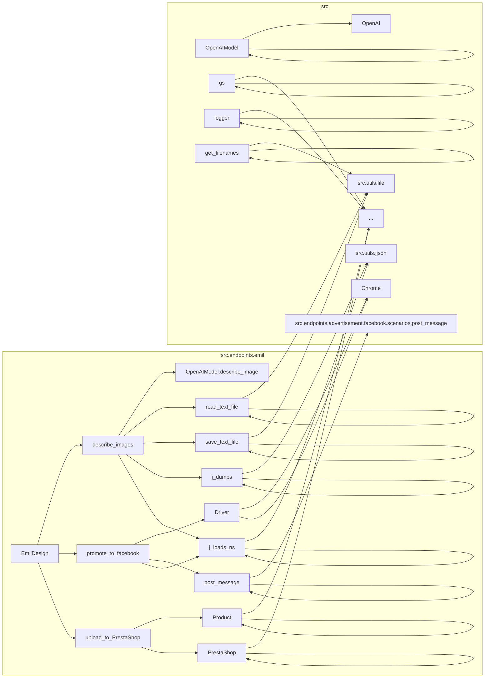

# <input code>

```python
## \file hypotez/src/endpoints/emil/emil_design.py
# -*- coding: utf-8 -*-
#! venv/Scripts/python.exe
#! venv/bin/python/python3.12

"""
.. module: src.endpoints.emil 
	:platform: Windows, Unix
	:synopsis:

"""
MODE = 'dev'

"""
	:platform: Windows, Unix
	:synopsis:

"""

"""
	:platform: Windows, Unix
	:synopsis:

"""

"""
  :platform: Windows, Unix

"""
"""
  :platform: Windows, Unix
  :platform: Windows, Unix
  :synopsis:
"""MODE = 'dev'

""" module: src.endpoints.emil """


""" Module for managing and processing images and promoting to Facebook and PrestaShop. """

import header
from pathlib import Path
from types import SimpleNamespace
import time

from src import gs, logger
from src.endpoints.PrestaShop.api.api import PrestaShop
from src.webdriver import Driver, Chrome
from src.ai.gemini import GoogleGenerativeAI
from src.ai.openai.model import OpenAIModel
from src.product import Product
from src.endpoints.advertisement.facebook.scenarios.post_message import post_message, post_title, upload_media
from src.utils.file import read_text_file, save_text_file, get_filenames
from src.utils.jjson import j_loads_ns, j_dumps
from src.logger import logger

class EmilDesign:
    """ Class for designing and promoting images through various platforms. """

    # Base path for the module data
    base_path: Path = (
        gs.path.google_drive
        / "emil"
    )

    def __init__(self):
        """ Initialize the EmilDesign class. """
        ...

    def describe_images(self, from_url: str = False):
        """ Describe images based on the provided instruction and examples.

        Args:
            from_url (str, optional): If True, uses URL to describe images. Defaults to False.
        """
        ...

        # Define paths for system instructions, examples, images directory, and output file
        system_instruction_path: Path = (
            self.base_path 
            / 'instructions'
            / 'hand_made_furniture_he.txt'
        )

        examples_path: Path = ( 
            self.base_path 
            / 'instructions'
            / "examples_he.txt"
        )

        images_dir: Path = (
            self.base_path
            / "images"
        )

        output_file: Path = (
            self.base_path
            /  "images_descritions_he.json"
        )

        base_url: str = r'https://emil-design.com/img/images_emil/'
        trainig_data = read_text_file(system_instruction_path)

        updated_images_path: Path = self.base_path / 'updated_images.txt'

        system_instruction = read_text_file(system_instruction_path)
        examples = read_text_file(examples_path)

        # Prompt for the AI model
        prompt: str = "איזה רהיטים מוצגים כאן?"

        # Initialize the AI model with the system instructions
        model = OpenAIModel(system_instruction=system_instruction, assistant_id='asst_uDr5aVY3qRByRwt5qFiMDk43')

        # Ask the model to categorize examples
        response = model.ask(examples, "this is example for build categories")
        logger.info(response)

        updated_images_list: list = read_text_file(updated_images_path, as_list=True) or []

        images_path_list: list = get_filenames(images_dir)
        data: list = []

        for image_path in images_path_list:
            if image_path in updated_images_list:
                continue

            # Describe the image either from URL or local file
            if from_url:
                response = model.describe_image(str(base_url + image_path), prompt, system_instruction)  # <- url
            else:
                response = model.describe_image(images_dir / image_path, prompt, system_instruction)  # <- local file

            if not response:
                continue

            # Process the response into a structured format
            res_ns: SimpleNamespace = j_loads_ns(response)
            setattr(res_ns, 'local_saved_image', str(Path(images_dir / image_path)))
            data.append(res_ns)
            j_dumps(data, output_file)
            updated_images_list.append(image_path)
            save_text_file(updated_images_list, updated_images_path)
            logger.info(response)
            ...


    def promote_to_facebook(self):
        """ Promote images and their descriptions to Facebook.

        This function logs into Facebook and posts messages derived from the image descriptions.
        """
        d = Driver(Chrome)
        d.get_url(r'https://www.facebook.com/groups/1080630957030546')
        messages: SimpleNamespace | list = j_loads_ns(self.base_path / "images_descritions_he.json")

        for m in messages:
            message: SimpleNamespace = SimpleNamespace() 
            setattr(message, 'title', f"{m.parent}\n{m.category}")
            setattr(message, 'description', m.description)
            message.products = SimpleNamespace()
            setattr(message.products, 'local_saved_image', [m.local_saved_image])

            post_message(d, message, without_captions=True)
            ...


    def upload_to_PrestaShop(self):
        """ Upload product information to PrestaShop.

        This function initializes a product and PrestaShop instance for uploading data.
        """
        p = Product()
        presta = PrestaShop()


if __name__ == "__main__":
    e = EmilDesign()
    # e.describe_images()
    # e.promote_to_facebook()
```

# <algorithm>

**Описание алгоритма работы `describe_images`:**

1. **Инициализация путей:** Определяются пути к файлам с инструкциями, примерами, изображениями и файлом для вывода результатов.
2. **Чтение данных:** Из файла `system_instruction_path` читаются системные инструкции, из `examples_path` — примеры, из `updated_images.txt` список обработанных изображений (если существует).
3. **Формирование запроса:** Создаётся запрос к модели `OpenAIModel` для описания изображений. Запрос включает системные инструкции и примеры.
4. **Обработка изображений:** Цикл перебирает список изображений в директории `images_dir`.
    * Если изображение уже обрабатывалось, пропускается.
    * Запрос к модели `OpenAIModel.describe_image` с изображением или URL.
    * Если ответ не пуст, то данные сериализуются в `SimpleNamespace` и добавляются в `data`.
    *  Обновляется список обработанных изображений.
    *  Список сохраняется в `updated_images.txt`.
5. **Сохранение результатов:** Результаты (данные о изображениях) сохраняются в файл `images_descritions_he.json` в формате JSON.


**Описание алгоритма работы `promote_to_facebook`:**

1. **Инициализация драйвера:** Создается объект `Driver` для взаимодействия с браузером.
2. **Загрузка страницы:** Открывается страница Facebook.
3. **Чтение данных:** Читаются данные из `images_descritions_he.json`.
4. **Цикл по сообщениям:** Перебираются данные из файла.
5. **Формирование сообщения:** Для каждого сообщения формируется новый `SimpleNamespace`, содержащий заголовок и описание, используя данные из файла.
6. **Отправка сообщения:** Отправляется сообщение на Facebook используя функцию `post_message`.

# <mermaid>



# <explanation>

**Импорты:**

* `header`:  Вероятно, содержит вспомогательные функции или настройки, специфичные для текущего проекта.  Необходимость неясна без контекста проекта.
* `pathlib`: Обеспечивает работу с путями к файлам, что важно для управления файловой системой.
* `SimpleNamespace`:  Класс для создания объектов, которые могут быть использованы для хранения и доступа к данным в виде атрибутов, подобно словарям.
* `time`:  Модуль для работы со временем, в данном случае, для вставки паузы, чтобы не перегрузить сервер.
* `gs`, `logger`: Импортируются из пакета `src` для доступа к глобальным настройкам и логированию.
* `PrestaShop`: Импорт из `src.endpoints.PrestaShop.api.api` для работы с API PrestaShop.
* `Driver`, `Chrome`: Из `src.webdriver` для управления веб-драйвером (в данном случае Chrome).
* `GoogleGenerativeAI`: Вероятно, используется для работы с моделью Gemini.
* `OpenAIModel`: Из `src.ai.openai.model` для работы с моделью OpenAI.
* `Product`: Из `src.product` для работы с продуктом.
* `post_message`, `post_title`, `upload_media`: Из `src.endpoints.advertisement.facebook.scenarios.post_message` для работы с Facebook.
* `read_text_file`, `save_text_file`, `get_filenames`: Из `src.utils.file` для работы с файлами.
* `j_loads_ns`, `j_dumps`: Из `src.utils.jjson` для работы с данными в формате JSON в виде `SimpleNamespace` объектов.

**Классы:**

* `EmilDesign`:  Основной класс, отвечающий за обработку изображений, описание их и продвижение в соц. сети и на PrestaShop.  Содержит методы `describe_images`, `promote_to_facebook`, `upload_to_PrestaShop`.  Атрибут `base_path` определяет базовый путь к данным для модуля.

**Функции:**

* `describe_images(self, from_url=False)`:  Получает описание изображений с помощью AI модели (OpenAI).  Аргумент `from_url` позволяет указать, загружать ли изображения из URL или из локальной директории. Возвращает результат описания изображений.
* `promote_to_facebook(self)`:  Продвигает изображения и их описания на Facebook.
* `upload_to_PrestaShop(self)`:  Загружает информацию о продуктах на PrestaShop.

**Переменные:**

* `MODE`, `base_path`, `system_instruction_path`, `examples_path`, `images_dir`, `output_file`, `base_url`, `updated_images_path`:  Хранят константы и переменные для доступа к файлам, настройкам и результатам.

**Возможные ошибки и улучшения:**

* Отсутствие обработки исключений (`try...except`) при работе с файлами и API вызовами может привести к сбою программы.
* Нет описания аргументов методов `post_message` и др.
* Недостаточно комментариев в коде.
* Не понятно, как обрабатываются ошибки, возвращаемые API.
* Логирование может быть улучшено, добавлением уровня деталей.
* Не ясны критерии успеха работы программы.
* Нет указания какой тип данных возвращает функция `model.describe_image`


**Взаимосвязи с другими частями проекта:**

Код тесно связан с другими модулями в `src`: `gs`, `logger`, `OpenAIModel`, `Driver`, `Product`, `PrestaShop`,  `read_text_file`, `save_text_file` и др. Он использует API и функционал этих модулей для выполнения своих задач.  Необходим контекст проекта для понимания более подробных взаимосвязей.