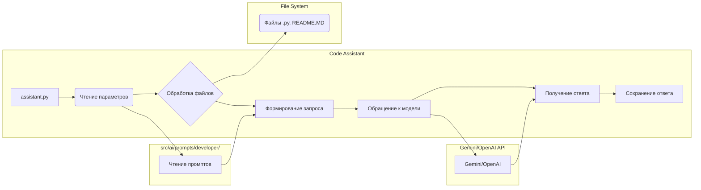

```MD
# Анализ кода Code Assistant

## <input code>

```[Русский](https://github.com/hypo69/hypo/blob/master/endpoints/hypo69/code_assistant/README.RU.MD)
# Code Assistant: Обучение модели коду проекта

## Описание

`Code Assistant` — инструмент для взаимодействия с моделями **Gemini** и **OpenAI** для обработки исходного кода. Он выполняет задачи, такие как создание документации, проверка кода, и генерация тестов на основе кода из указанных файлов.

## Основные возможности

- **Чтение исходных файлов**: Чтение кода из файлов с расширениями `.py` и `README.MD` из указанных директорий.
- **Обработка с помощью моделей**: Отправка кода в модели для выполнения задач, таких как создание документации или проверка ошибок.
- **Генерация результатов**: Ответы моделей сохраняются в указанные директории для каждой роли.

## Структура проекта

- **Модели**: Используются модели **Gemini** и **OpenAI** для обработки запросов.
- **Промпты**: Программа читает промпты из файлов в директории `src/ai/prompts/developer/` (например, `doc_writer_en.md`).
- **Файлы**: Обрабатываются файлы с расширениями `.py` и `README.MD` в указанных стартовых директориях.

## Пример использования

... (Примеры командной строки)

## Параметры командной строки

... (Список параметров)

## Логика работы

1. **Чтение файлов**: Поиск файлов с расширениями `.py` и `README.MD` в указанных стартовых директориях.
2. **Загрузка промптов**: Загрузка файлов промптов для каждой роли и языка из директории `src/ai/prompts/developer/`.
3. **Обработка запросов**: Формирование запросов на основе загруженных файлов и отправка их в модели.
4. **Сохранение ответов**: Ответы от моделей сохраняются в директории, соответствующей роли и модели (например, `docs/raw_rst_from_<model>/<lang>/`).

## Исключения

... (Настройка исключений)

## Логирование

... (Логирование)

## Зависимости

... (Gemini API, OpenAI API)
```

## <algorithm>

**Блок-схема алгоритма:**

```mermaid
graph TD
    A[Получить параметры командной строки] --> B{Проверка параметров};
    B -- Валидные параметры -- > C[Чтение настроек из settings.json (если применимо)];
    B -- Невалидные параметры -- > D[Вывод ошибки и выход];
    C --> E[Чтение промптов из src/ai/prompts/developer/];
    E --> F[Обработка файлов из start_dirs];
    F --> G[Формирование запроса для модели];
    G --> H[Отправка запроса в Gemini/OpenAI];
    H --> I[Получение ответа от модели];
    I --> J[Сохранение ответа в соответствующую директорию];
    J --> K[Завершение работы];
    D --> K;
```

**Примеры:**

* **A:** `python assistant.py --role doc_writer --lang ru --models gemini --start_dirs /path/to/dir1 /path/to/dir2`
* **B:** Проверяет, присутствуют ли необходимые параметры (role, lang, models, start_dirs) и их корректность.
* **C:** Если используется `--settings`, происходит чтение настроек из файла `settings.json`.
* **E:** Из `src/ai/prompts/developer/` загружаются файлы с промптами, соответствующие заданной роли и языку.
* **F:** Происходит поиск файлов `.py` и `README.MD` в указанных директориях.
* **G:** На основе промптов и содержимого файлов формируется запрос для модели (например, используя шаблон).
* **H:** Запрос отправляется в выбранную модель (Gemini/OpenAI).
* **I:** Модель возвращает ответ.
* **J:** Ответ сохраняется в соответствующую директорию (например, `docs/raw_rst_from_gemini/ru/`).
* **K:** Программа завершает свою работу.

## <mermaid>



## <explanation>

**Импорты:**

Кода импортов в предоставленном фрагменте нет. Вероятно, в файле `assistant.py`  имеются импорты для работы с файлами, обработкой командной строки,  API моделей (Gemini и OpenAI),  и логированием.  Эти импорты связаны с модулями Python, предоставляющими необходимые функции.  Примеры: `os`, `argparse`, `json`, `logging`.

**Классы:**

Скорее всего, в файле `assistant.py` определены классы для работы с API моделей,  для организации данных о файлах,  для хранения настроек.   Подробности о них можно увидеть в самом файле.

**Функции:**

Ключевые функции в `assistant.py`:

* `main()`: Точка входа в программу, обработка параметров командной строки, загрузка настроек, инициализация моделей, обработка файлов, сохранение результатов.
* Функции для работы с файлами:  `read_files()`, `parse_arguments()`, `load_settings()`, `save_response()` -  Эти функции отвечают за обработку файлов.
* Функции для работы с промптами: `load_prompts()`, `format_prompt()` - эти функции отвечают за чтение и формирование промптов.
* Функции для работы с моделями: `send_request_to_model()` -  эта функция отправляет запрос в модель.


**Переменные:**

Переменные содержат параметры командной строки, пути к файлам, данные из файлов, и прочее. Тип переменных зависит от их значения (строки, списки, словари).


**Возможные ошибки и улучшения:**

* Не указаны возможные типы ошибок (FileNotFoundError, API ошибки, ошибки парсинга JSON).  Необходимо добавить обработку исключений.
* Не описана валидация вводимых данных (напр., валидация параметров, проверка существования файлов, валидность входных данных API)
* Отсутствие обработки ошибок при работе с API.  Проверки на ошибки связи с сервером моделей, неверные ключи API.
* Возможно, не описано использование фреймворка для структурного построения кода.
* Не хватает детального описания взаимодействия с другими частями проекта (какие модули, файлы и папки использует, какие зависимости есть).

**Цепочка взаимосвязей с другими частями проекта:**

Программа `code_assistant`  зависит от API моделей (Gemini, OpenAI), файлов с промптами в директории `src/ai/prompts/developer/`, а также, вероятно, от настроек из `code_assistant.json`.   Возможно, она взаимодействует с другими частями проекта,  хранящими данные о моделях, параметрах, исключениях.  Без просмотра кода `assistant.py` сложно точно определить все взаимосвязи.

**Заключение:**

Предоставленный README описывает общую логику работы, но для глубокого анализа требуется изучение кода `assistant.py`.