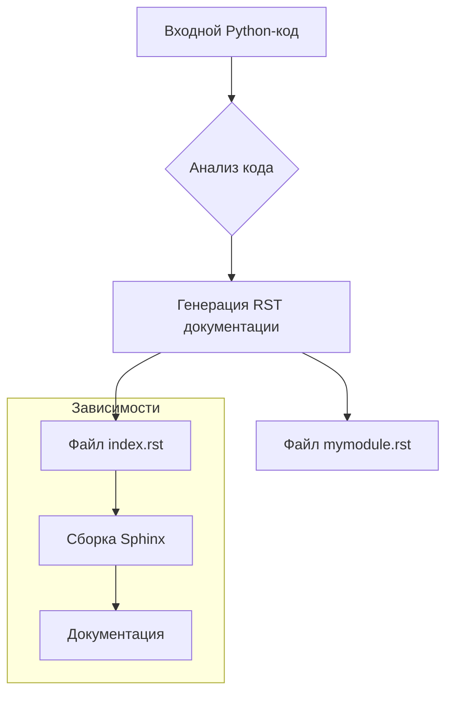

# ИНСТРУКЦИЯ по написанию документации в формате reStructuredText (rst) для Python-кода

## <input code>

```
# ИНСТРУКЦИЯ
For each input Python file, create documentation in `rst` format for subsequent compilation with Sphinx. The documentation must meet the following requirements:

1. **Формат документации**:
   - Используйте стандарт `reStructuredText (rst)`.
   - Каждый файл должен начинаться с заголовка и краткого описания содержимого.
   - Для всех классов и функций используйте следующий формат комментариев:
     ```python
     def function(param: str, param1: Optional[str | dict | str] = None) -> dict | None:
         """
         Args:
             param (str): Описание параметра `param`.
             param1 (Optional[str | dict | str], optional): Описание параметра `param1`. По умолчанию `None`.

         Returns:
             dict | None: Описание возвращаемого значения. Возвращает словарь или `None`.

         Raises:
             SomeError: Описание ситуации, в которой возникает исключение `SomeError`.
         """
     ```
   - Используйте `ex` вместо `e` в блоках обработки исключений.

2. **Дерево TOC**:
   - Включайте разделы в документацию с помощью `.. toctree::`.
   - Структура файла `index.rst` должна содержать ссылки на все описания модулей.

3. **Форматирование документации**:
   - Все заголовки классов, функций и методов должны быть документированы с использованием директив Sphinx (`autoclass`, `autofunction`).
   - Пример:
     ```rst
     .. automodule:: module_name
         :members:
         :undoc-members:
         :show-inheritance:
     ```

4. **Заголовки разделов**:
   - Используйте заголовки уровня 1 (`=`), уровня 2 (`-`), уровня 3 (`~`) и уровня 4 (`^`).

5. **Пример файла**:
   ```rst
   Имя модуля
   ===========\n

   .. automodule:: module_name
       :members:
       :undoc-members:
       :show-inheritance:

   Функции
   --------\n

   .. autofunction:: module_name.function_name
   ```

Создайте соответствующую документацию для каждого входного Python-файла в формате `rst`.
## <algorithm>

Алгоритм работы состоит в генерации документации RST для Python-кода.  Подробная блок-схема не может быть представлена в Markdown, но общий процесс выглядит так:

1. **Ввод**: Получение списка Python-файлов для обработки.

2. **Обработка каждого файла**:
    - **Парсинг кода**:  Проход по коду с целью определения функций, классов, атрибутов.

    - **Создание документации**:  Генерируется RST-текст, содержащий:
        - Заголовки (модуль, классы, функции).
        - Описания (с использованием аннотаций docstring).
        - Директивы `automodule`, `autofunction`, `autoclass`.
        - Структура TOC.


3. **Выход**: Сохранение сгенерированных файлов RST.

Пример: Для файла `mymodule.py`, содержащего `MyClass` и `my_function`, алгоритм сгенерирует `mymodule.rst`, содержащий описания `MyClass`, `my_function`, а также ссылки для индекса.


## <mermaid>



**Объяснение диаграммы:**

* **Входной Python-код** - исходные данные.
* **Анализ кода** - процесс определения функций, классов и их атрибутов.
* **Генерация RST документации** - основной блок, генерирующий файлы документации.
* **Файл mymodule.rst** и **Файл index.rst** - созданные файлы документации в формате RST.
* **Сборка Sphinx** - инструмент для компиляции RST в HTML или другой формат.
* **Документация** - конечный результат, готовый к использованию документ.


## <explanation>

**Импорты:**

Код не содержит импортов, но предполагается использование стандартных библиотек Python для работы с файлами и обработкой исключений.

**Классы:**

Код описывает, как создавать структуру документации, но не предоставляет конкретные классы.  Он описывает, каким должен быть формат, как работать с аннотациями Python, но не содержит функциональных классов самих по себе.


**Функции:**

Код описывает структуру комментариев (docstrings) для функций, но не содержит сами функции. В реальной реализации потребовались бы функции для обработки файлов, парсинга кода и генерации RST.


**Переменные:**

Код не содержит объявлений переменных.  В реализованном варианте переменные будут использоваться для хранения информации о файлах, коде, сгенерированной документации.


**Возможные ошибки или улучшения:**

* **Недостаточно конкретики:** Код описывает **как** нужно создавать документацию, но не предоставляет **реализацию**.  Необходимо разработать функции для парсинга Python кода, генерации текста RST и обработки исключений.
* **Сложность обработки кода**:  Обработка кода может быть сложной, если в нём есть сложная логика и нестандартные конструкции.
* **Обработка ошибок**: Необходимо разработать функции обработки ошибок при работе с файлами и кодом.
* **Универсальность**: Нужно добавить обработку различных типов классов и функций, а так же исключений.
* **Взаимодействие с другими частями проекта:**  Предполагается использование в рамках проекта Sphinx, для сборки.


**Цепочка взаимосвязей:**

Код предназначен для использования в качестве руководства по созданию документации. Реализация генерации документации будет взаимодействовать с Python-файлами и, вероятно, с инструментом сборки Sphinx, который будет компилировать файлы RST.