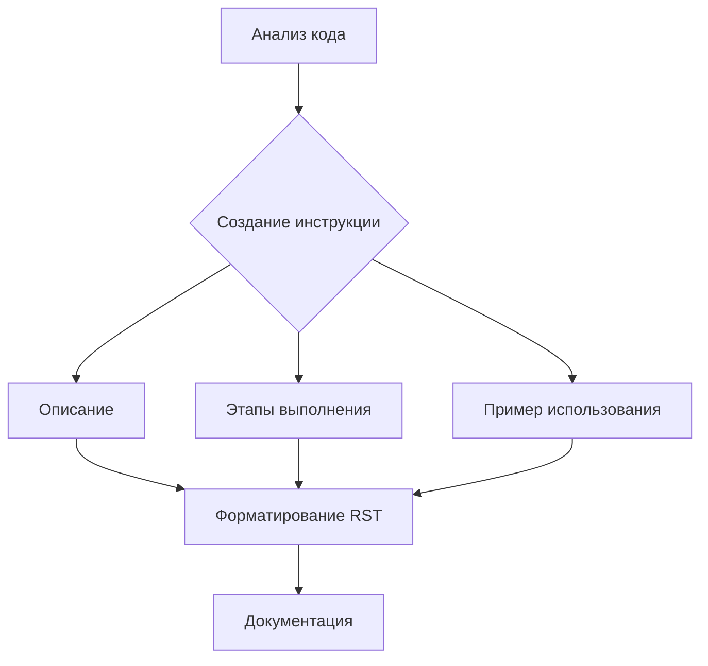

# Анализ кода: Инструкции по генерации документации

**1. <input code>**

```
**Instructions for Code Documentation Generation**

1. **Analyze the code**: Understand the logic and actions performed by the given code block.
  
2. **Create a step-by-step guide**:
    - **Description**: Explain what the code block does.
    - **Execution steps**: Outline the sequence of actions in the code.
    - **Usage example**: Provide a code example showing how to use this block in a project.

3. **Formatting**: Follow the structure in `reStructuredText (RST)`:

```rst
How to use this code block
=========================================================================================\n
\nDescription
-------------------------
[Explain what the code does.]
\n
Execution steps
-------------------------
1. [First step description.]
2. [Second step description.]
3. [Continue as necessary...]
\n
Usage example
-------------------------
.. code-block:: python
\n
    [Example usage code]
```

4. **Avoid vague terms** like "getting" or "doing." Be specific about what the code does, e.g., "checks," "validates," or "sends."
```

**2. <algorithm>**

Этот код представляет собой набор инструкций по написанию документации к коду. Алгоритм работы можно представить как последовательность действий:

* **Шаг 1:** Анализ кода. Код должен быть проанализирован для понимания его логики и выполняемых действий.
* **Шаг 2:** Создание пошаговой инструкции.  
    * **Описание:** Описывается, что делает данный фрагмент кода.
    * **Этапы выполнения:** Описывается последовательность действий в коде.
    * **Пример использования:** Приводится пример использования данного фрагмента в проекте.
* **Шаг 3:** Форматирование. Документация должна быть отформатирована в соответствии со стандартом RST (reStructuredText).
* **Шаг 4:** Избегание неясности. В описании следует избегать общих фраз, вместо этого нужно использовать конкретные глаголы и действия.


**Пример:**

Если анализируется код функции, вычисляющей сумму двух чисел, то описание будет: "Функция вычисляет сумму двух целых чисел".  Пошаговая инструкция будет: "1. Принимает два аргумента, 2. Складывает их, 3. Возвращает результат". Пример использования - фрагмент кода, демонстрирующий вызов функции.


**Передача данных:**

Данные передаются в виде аргументов в функциях и методах, и возвращаются функциями в виде результата.  Описание описывает логику работы, но не указывает на то, где данные хранятся.

**3. <mermaid>**



**4. <explanation>**

* **Импорты**:  В этом коде нет импортов, это набор инструкций.
* **Классы**: Нет классов.
* **Функции**:  Нет функций.  Код описывает структуру документации, а не реализацию кода.
* **Переменные**: Нет переменных.
* **Возможные ошибки/улучшения**:  Инструкции могут быть более подробными и конкретными.  В документации не хватает примеров кода, которые бы показывали, как использовать эти правила на практике.

**Цепочка взаимосвязей с другими частями проекта:**

Эти инструкции применимы ко всем частям проекта, которые требуют документации.  Они определяют стандарт, по которому создается документация, чтобы все компоненты проекта имели единообразный стиль описания.