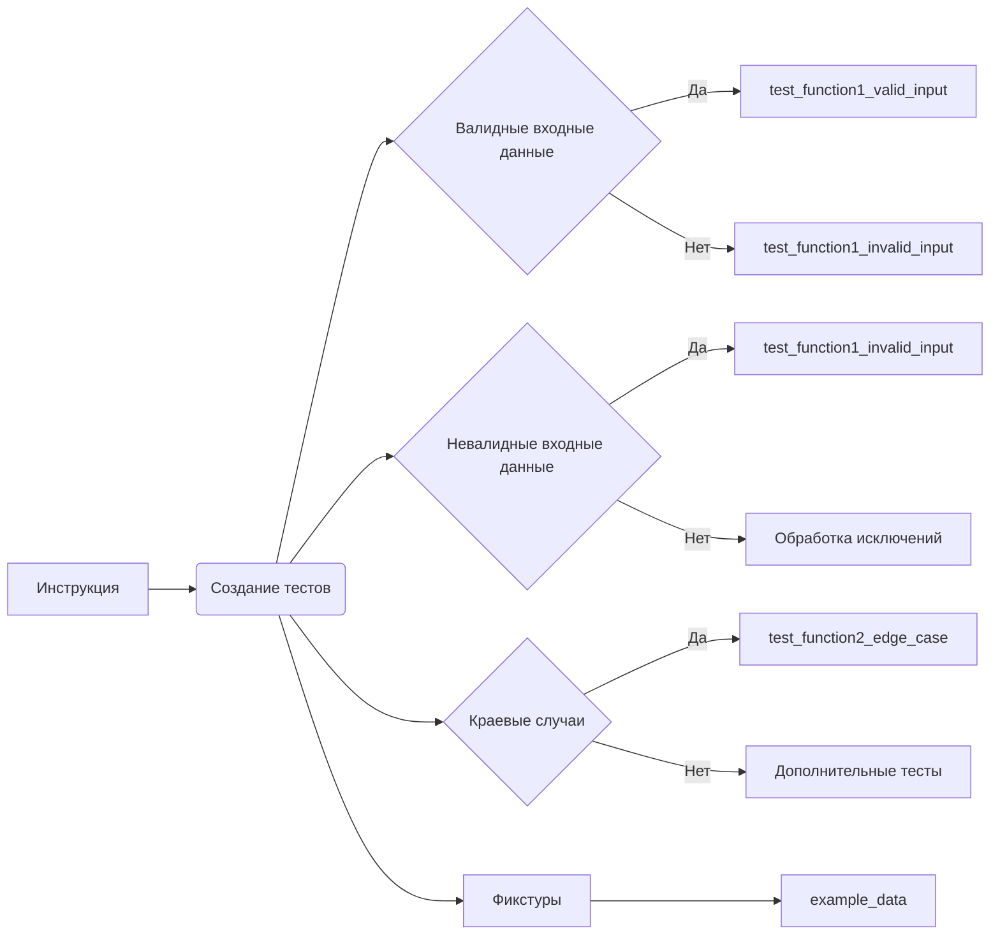

# Анализ кода: Инструкция по написанию тестов pytest

**1. <input code>**

```python
# Prompt for Writing `pytest` Tests

# Write test cases for the following Python code using the `pytest` library.
# The tests should cover the main functions, methods, or classes to verify their correctness.
# Include edge cases and exception handling where appropriate.

# Requirements:
# 1. Use clear and descriptive test function names that indicate their purpose.
# 2. Ensure all tests are isolated and independent of one another.
# 3. Consider various scenarios, including:
#    - Valid inputs.
#    - Invalid or unexpected inputs, where applicable.
#    - Edge or boundary cases.
# 4. Use `pytest.raises` for exception testing.
# 5. If fixtures are needed for the functions, define them separately.
# 6. Add comments explaining the logic of the test cases.

# Example structure for the tests:

import pytest

# Fixture definitions, if needed
@pytest.fixture
def example_data():
    """Provides test data for the function."""
    return {...}

# Tests for Function 1
def test_function1_valid_input():
    """Checks correct behavior with valid input."""
    ...

def test_function1_invalid_input():
    """Checks correct handling of invalid input."""
    ...

# Tests for Function 2
def test_function2_edge_case():
    """Checks behavior with edge cases."""
    ...
```


**2. <algorithm>**

Нет предоставленного кода для анализа.  Алгоритм работы, описанный в предоставленном фрагменте, это *инструкция* по созданию тестов, а не описание реального кода.  Блок-схема для инструкции по написанию тестов невозможна.


**3. <mermaid>**



Эта диаграмма описывает процесс написания тестов на примере функции `function1`, демонстрируя ветвление, связанное с различными типами входных данных и необходимостью проверки исключений.


**4. <explanation>**

* **Импорты:**  Код демонстрирует импорт `pytest` модуля, который необходим для написания тестов pytest. Это ключевой импорт для выполнения тестовых функций. Нет зависимостей от других пакетов `src` в этом примере.

* **Классы:** Нет определенных классов в примере.

* **Функции:**
    * `test_function1_valid_input`: Функция для проверки работы функции `function1` с валидными входными данными.
    * `test_function1_invalid_input`: Функция для проверки работы функции `function1` с невалидными входными данными.
    * `test_function2_edge_case`: Функция для проверки работы функции `function2` с краевыми случаями.
    * `example_data`:  Фикстура для предоставления тестовых данных для функций.

* **Переменные:**  Нет объявленных переменных непосредственно в примере; примеры работы с переменными должны быть в функциях, которые тестируются.

* **Возможные ошибки или области для улучшений:**  Фрагмент кода – это *инструкция*, а не реализация.  Невозможно выявить ошибки в отсутствующем коде.  Необходим код, который будет тестироваться, чтобы выявлять ошибки.  В инструкциях, таких как эта, рекомендуется, но не обязательно использовать фикстуры для `example_data`.  Наличие фикстур может упростить тестирование в случаях, когда данные для функции сложны или требуют значительной предварительной подготовки.


**Цепочки взаимосвязей:**

Этот фрагмент кода – это  *инструкция* по тестированию, а не реализация какой-либо части проекта.  Прямые взаимосвязи с другими частями проекта отсутствуют,  т.к. это руководство по написанию тестов.  Для того, чтобы определить зависимости, необходим код тестируемой части.