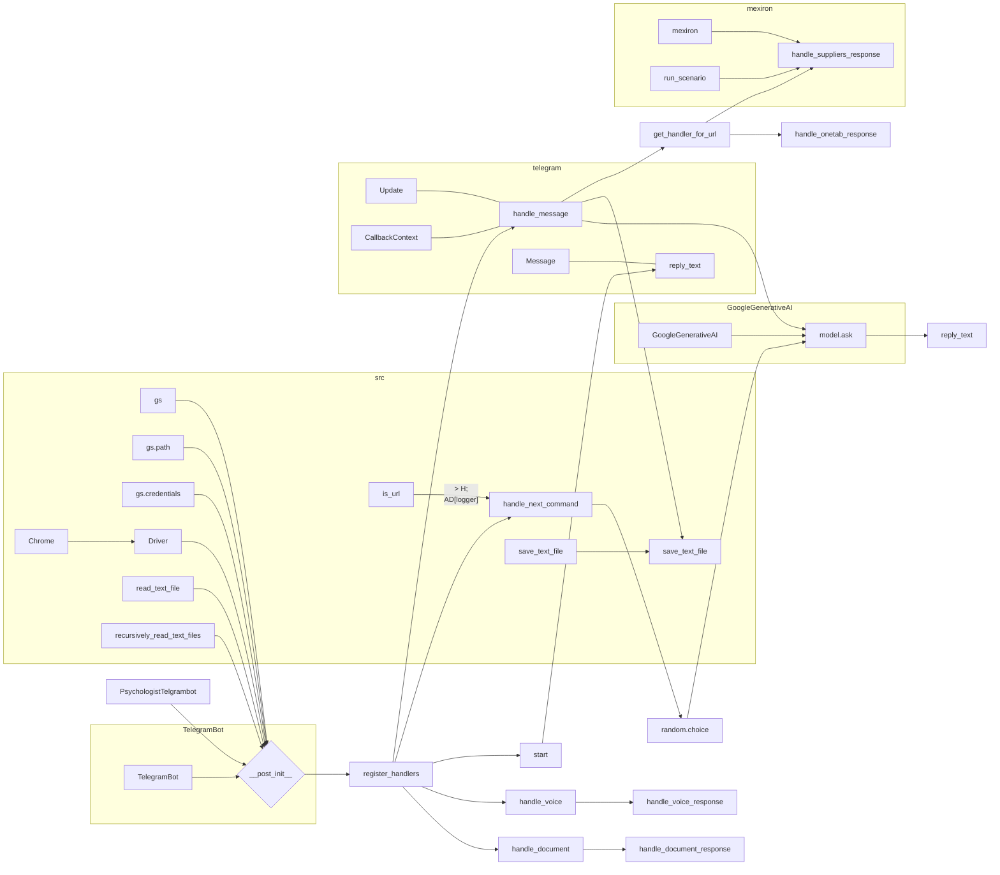

# <input code>

```python
## \file hypotez/src/endpoints/hypo69/small_talk_bot/bot.py
# -*- coding: utf-8 -*-
#! venv/Scripts/python.exe
#! venv/bin/python/python3.12

"""
.. module: src.endpoints.hypo69.small_talk_bot 
	:platform: Windows, Unix
	:synopsis:

"""
MODE = 'dev'

...
""" t.me/hypo69_psychologist_bot_bot's specific bot with customized behavior."""
import header
import asyncio
from pathlib import Path
from typing import Optional
from dataclasses import dataclass, field
import random
from telegram import Update
from telegram.ext import CommandHandler, MessageHandler, filters, CallbackContext

from src import gs
from src.bots.telegram import TelegramBot
from src.webdriver import Driver, Chrome
from src.ai.gemini import GoogleGenerativeAI
from src.utils.file import read_text_file, recursively_read_text_files, save_text_file
from src.utils.url import is_url
from src.logger import logger

@dataclass
class PsychologistTelgrambot(TelegramBot):
    """Telegram bot with custom behavior for Kazarinov."""

    token: str = field(init=False)
    d: Driver = field(init=False)
    model: GoogleGenerativeAI = field(init=False)
    system_instruction: str = field(init=False)
    questions_list: list = field(init=False)
    timestamp: str = field(default_factory=lambda: gs.now)

    def __post_init__(self):
        mode = 'test'
        #self.token = gs.credentials.telegram.hypo69_test_bot if mode == 'test' else gs.credentials.telegram.hypo69_psychologist_bot
        self.token = gs.credentials.telegram.hypo69_psychologist_bot
        super().__init__(self.token)

        self.d = Driver(Chrome)

        self.system_instruction = read_text_file(
            gs.path.google_drive / 'hypo69_psychologist_bot' / 'prompts' / 'chat_system_instruction.txt'
        )
        self.questions_list = recursively_read_text_files(
            gs.path.google_drive / 'hypo69_psychologist_bot' / 'prompts' / 'train_data' / 'q', ['*.*'], as_list=True
        )

        self.model = GoogleGenerativeAI(
            api_key=gs.credentials.gemini.hypo69_psychologist_bot,
            system_instruction=self.system_instruction,
            generation_config={"response_mime_type": "text/plain"}
        )

        self.register_handlers()

    # ... (rest of the code)
```

# <algorithm>

**Шаг 1:** Инициализация бота.
* Создается экземпляр класса `PsychologistTelgrambot`.
* В конструкторе `__post_init__` устанавливаются значения для `token`, `d` (драйвер браузера), `model` (модель AI), `system_instruction`, `questions_list` из соответствующих файлов на Google Диск.
* Вызывается метод `super().__init__(self.token)` для инициализации родительского класса `TelegramBot` с полученным токеном.
* Регистрируются обработчики команд и сообщений.

**Шаг 2:** Регистрация обработчиков.
* Метод `register_handlers` добавляет обработчики для команд `/start`, `/help`, текстовых сообщений, голосовых сообщений и документов в приложение.

**Шаг 3:** Обработка команд и сообщений.
* Функции `start`, `handle_message`, `handle_voice`, `handle_document` и другие обрабатывают различные типы сообщений.  
    * `start`: отвечает на команду `/start`.
    * `handle_message`: отвечает на обычные текстовые сообщения, сохраняя их в файл журналов и запрашивая ответ у модели `model`.
    * `handle_voice` и `handle_document` обрабатывают голосовые и загруженные документы соответственно.


**Шаг 4:** Обработка URL
* `get_handler_for_url` - определяет обработчик для URL-адресов в сообщении.


**Пример:**
Пользователь отправляет сообщение с URL.  
* `get_handler_for_url` находит соответствующий URL в словаре `url_handlers`.
* Выполняется функция `handle_suppliers_response` или `handle_onetab_response`.
* Если сценарная функция возвращает `True` - отправляет сообщение "Готово!". Иначе "Хуёвенько. Попробуй еще раз".

**Шаг 5:**  Генерация ответов и обработка ошибок.
* `handle_message` использует модель `model` для получения ответа на вопрос пользователя.
* `handle_next_command` выбирает случайный вопрос из списка вопросов и отправляет его вместе с ответом модели.
* Обработка ошибок (try...except) ловит исключения при взаимодействии с файлами и моделью AI.


# <mermaid>



# <explanation>

**Импорты:**

- `header`: вероятно, содержит конфигурацию или вспомогательные функции, специфичные для данной среды.  Необходимо посмотреть в файле `header.py` для понимания.
- `asyncio`: необходим для асинхронной обработки событий в Telegram боте.
- `pathlib`: для работы с путями к файлам.
- `typing`: для типизации кода.
- `dataclasses`: для создания данных классов.
- `random`: для случайного выбора вопросов.
- `telegram`, `telegram.ext`: для взаимодействия с Telegram API.
- `src`: основной пакет проекта.
- `gs`: глобальные настройки (например, пути к файлам на Google Диск).
- `src.bots.telegram`: класс TelegramBot для создания ботов, взаимодействующих с Telegram API.
- `src.webdriver`: класс Driver для взаимодействия с браузером, `Chrome` - конкретная реализация для Chrome.
- `src.ai.gemini`: класс `GoogleGenerativeAI` для работы с моделью Gemini от Google.
- `src.utils.file`: функции для работы с файлами (чтение, запись).
- `src.utils.url`: функция `is_url` для проверки URL.
- `src.logger`: для логирования.

**Классы:**

- `PsychologistTelgrambot`: наследуется от `TelegramBot`.  Определяет специфичное поведение для бота. Имеет атрибуты: `token`, `d` (драйвер браузера), `model` (модель AI), `system_instruction`, `questions_list`,  `timestamp`.  Методы `__post_init__`, `register_handlers`, `start`, `handle_message`, `handle_voice`, `handle_document`, `get_handler_for_url`, `handle_suppliers_response`, `handle_onetab_response`, `handle_next_command`.  Взаимодействует с другими частями проекта, например, `gs` и `model`.

**Функции:**

- `__post_init__`: Инициализирует атрибуты класса после создания экземпляра.
- `register_handlers`: Регистрирует обработчики команд и сообщений для применения Telegram API.
- `start`: Обрабатывает команду `/start`.
- `handle_message`: Обрабатывает текстовые сообщения, получая ответ от модели и сохраняет их в файлы.
- `get_handler_for_url`: Определяет какой обработчик использовать для URL сообщения.
- `handle_suppliers_response`: Обрабатывает сообщения с URL, относящимися к поставщикам, с помощью `mexiron`.
- `handle_onetab_response`: Обрабатывает сообщения с URL, относящимися к OneTab, с помощью `mexiron`.
- `handle_next_command`: Отправляет случайный вопрос и ответ модели.
- `handle_document`: Обрабатывает загруженные документы, возвращает их содержимое.

**Переменные:**

- `MODE`: Значение, вероятно, используется для выбора конфигураций (например, `dev` или `prod`).
- `token`: Токен доступа к Telegram API.
- `d`: экземпляр `Driver` для работы с браузером.
- `model`: экземпляр `GoogleGenerativeAI` для работы с моделью.
- `system_instruction`: инструкции для модели.
- `questions_list`: Список вопросов для функции `handle_next_command`.
- `log_path`: Путь к файлу журналов.

**Возможные ошибки/улучшения:**

- Нет явного указания структуры данных `mexiron`.
- Отсутствие обработки ошибок при работе с внешними сервисами (например, API Gemini или Google Drive).
- Обработка потенциально большого количества данных, например, `questions_list`, могла бы быть оптимизирована (кеширование, paginations).
- Не очень хороший способ обработки сообщений с URL. Вместо прямого сравнения строк, можно использовать библиотеку для работы с URL.
- Отсутствие комментариев внутри функций.

**Взаимосвязи с другими частями проекта:**

Код тесно связан с различными компонентами проекта `src`.  `PsychologistTelgrambot` использует `gs` для получения настроек, `TelegramBot` для взаимодействия с Telegram API, `GoogleGenerativeAI` для получения ответов, `read_text_file`, `save_text_file` и `recursively_read_text_files` для обработки файлов, а также `mexiron` для выполнения сценариев.