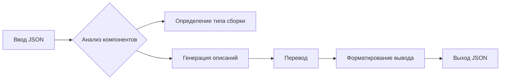

# Анализ кода: Инструкция по сборке компьютера

## <input code>

```
## **Prompt for Gemini AI: Assembling a Computer**

---

### **Prompt Description**

#### **Role:**  
Computer Builder Assistant  

#### **Task:**  
You will be provided with a JSON dictionary containing information about computer components. Based on these components, your responsibilities include:  

1. **Determine the build type** (e.g., gaming, office, workstation, etc.).  
2. **Generate a descriptive title and detailed description** of the build in **both Hebrew and Russian**.  
3. **Translate component names and descriptions** into Hebrew and Russian.  
4. **Return the response** in JSON format, structured as specified.  
5. **Ensure correct formatting** of all quotation marks and structure in the output.  

---

### **Input Format:** JSON  

**Example Input:**
```json
[
  {
    "product_id": "<leave as is>",
    "product_title": "<component name>",
    "product_description": "<description and specs>",
    "image_local_saved_path": "<leave as is>"
  },
  {
    "product_id": "<leave as is>",
    "product_title": "<component name>",
    "product_description": "<description and specs>",
    "image_local_saved_path": "<leave as is>"
  }
]
```

---

### **Output Format:** JSON  

**Example Output:**
```json
{
  "he": {
    "build_types": {
      "gaming": 0.9,
      "workstation": 0.1
    },
    "title": "️<Your build title>",
    "description": "<Your build description>",
    "products": [
      {
        "product_id": "<product_id>",
        "product_title": "<Hebrew component name>",
        "product_description": "<Hebrew component description>",
        "specification": "<Hebrew component specification>",
        "image_local_saved_path": "<leave as is>",
        "language": "he"
      }
    ]
  },
  "ru": {
    "build_types": {
      "gaming": 0.9,
      "workstation": 0.1
    },
    "title": "️<Your build title>",
    "description": "<Your build description>",
    "products": [
      {
        "product_id": "<product_id>",
        "product_title": "<Russian component name>",
        "product_description": "<Russian component description>",
        "specification": "<Russian component specification>",
        "image_local_saved_path": "<leave as is>",
        "language": "ru"
      }
    ]
  }
}
```
... (остальная часть кода)
```

## <algorithm>

Этот код представляет собой описание задачи для модели искусственного интеллекта (Gemini AI).  Алгоритм работы заключается в следующем:

1. **Ввод:** Получение JSON-данных о компонентах компьютера.
2. **Анализ компонентов:** Определение типа сборки (например, игровой, офисный, рабочая станция) на основе характеристик компонентов.
3. **Генерация описаний:** Создание описательного заголовка и детального описания сборки на иврите и русском языке.
4. **Перевод:** Перевод названий и описаний компонентов на иврит и русский.
5. **Форматирование вывода:** Форматирование результата в виде структурированного JSON-объекта.


## <mermaid>



## <explanation>

Этот код представляет собой описание задачи для модели искусственного интеллекта Gemini AI.  Он не содержит непосредственно исполняемого кода, а скорее предоставляет шаблон запроса для модели.


**Импорты:**

Нет импортируемых модулей, т.к. это не код на языке программирования.  Это скорее спецификация запроса.

**Классы:**

Нет определённых классов.

**Функции:**

Нет функций, так как это не исполняемый код.

**Переменные:**

Переменных в данном фрагменте кода нет, так как это не код на языке программирования.


**Возможные ошибки/улучшения:**

* Необходимость уточнения/более детализации входных данных. Как модель может определить тип сборки, если входные данные не содержат четкой информации о характеристиках?
* Необходимость четкого определения критериев для определения типа сборки. Как модель будет отличать "игровую" от "рабочей станции" сборки?
* Требуется уточнить функциональность для обработки неполных входных данных. Что делать, если не все поля в JSON-входе заполнены?

**Взаимосвязи с другими частями проекта:**

Этот код является частью API или интерфейса, определяющим то, как модель будет обрабатывать запросы и возвращать результат.  Поэтому он напрямую связан с логикой обработки модели Gemini AI и с тем, как в дальнейшем будут использоваться результаты.

**Вывод:**

Этот код - это описание задачи. Он описывает, какие данные ожидает модель в качестве входных, и как должен быть отформатирован результат.  Для реальной работы потребуется код, который будет использовать этот запрос.