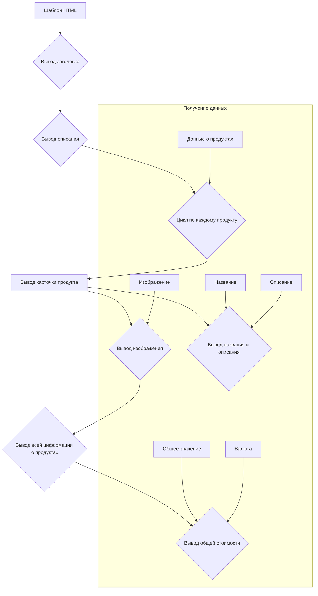

# <input code>

```html
## \file hypotez/src/endpoints/kazarinov/react/templates/template.html
# -*- coding: utf-8 -*-
#! venv/Scripts/python.exe

""" module: src.endpoints.kazarinov.react.templates """
MODE = 'debug'
<!DOCTYPE html>
<html lang="{{ language }}">

<head>
    <meta charset="UTF-8">
    <meta name="viewport" content="width=device-width, initial-scale=1.0">
    <title>{{ title }}</title>
    <link rel="stylesheet" href="https://cdn.jsdelivr.net/npm/bootstrap@5.3.0/dist/css/bootstrap.min.css">
    <style>
        body {
            background-color: #ffffff; /* Белый фон */
            color: #000000; /* Черный текст */
            font-family: 'Segoe UI', Tahoma, Geneva, Verdana, sans-serif;
        }
        .product-card {
            display: flex;
            align-items: center;
            background-color: #f8f9fa; /* Светлый фон карточек */
            border: 1px solid #dee2e6;
            border-radius: 8px;
            padding: 15px;
            margin: 15px 0;
        }
        .product-card img {
            width: 400px;
            height: 300px;
            object-fit: contain; /* Сохранение пропорций изображения */
            border-radius: 5px;
            background-color: white; /* Белый фон под изображением */
            margin-right: 15px; /* Отступ справа от изображения */
        }
        .product-info {
            flex: 1; /* Занимает оставшееся пространство */
        }
        .price-tag {
            background-color: #238636;
            color: white;
            padding: 5px 10px;
            border-radius: 5px;
        }
        .footer {
            text-align: center;
            margin-top: 30px;
            padding: 15px;
            border-top: 1px solid #dee2e6;
        }
    </style>
</head>

<body>
    <div class="container">
        <h1 class="text-center my-5">{{ title }}</h1>
        <p class="lead">{{ description }}</p>

        <div class="row">
            \
            <div class="col-md-12 product-card">\
                \
                <div class="product-info">\
                    <h3>{{ product.product_title }}</h3>\
                    <p>{{ product.product_description }}</p>\
                </div>\
            </div>\
            \
        </div>

        <div class="footer">
            <p>Общая стоимость: 
                <span class="price-tag">{{ price }} {{ currency }}</span>
            </p>
        </div>
    </div>
</body>

</html>
```

# <algorithm>


Данные о продуктах, названии, описании, изображении и валюте передаются извне в шаблон.  Шаблон выводит  заголовок, описание, карточки каждого продукта (с изображением, названием и описанием) и общую стоимость.


# <mermaid>

```mermaid
graph LR
    A[template.html] --> B(Flask/Django);
    B --> C{Данные о продуктах};
    C --> D(product 1);
    C --> E(product 2);
    C --> F...;
    D --> G[Изображение];
    D --> H[Название];
    D --> I[Описание];
    E --> G;
    E --> H;
    E --> I;
    F --> G;
    F --> H;
    F --> I;
    B --> J[CSS Bootstrap];
    B --> K[JavaScript(возможно)];

    subgraph Внешние зависимости
        J --> L(jsdelivr);
    end
```
HTML-шаблон `template.html` получает данные о продуктах (и, возможно, другие параметры) от серверного приложения (Flask/Django). Сервер собирает данные и передаёт их в шаблон в виде переменных (например, `products`, `title`, `description` и т.д.). Шаблон использует библиотеку Bootstrap для стилизации. Возможно, используется дополнительный JavaScript для интерактивности.


# <explanation>

**Импорты:**

В данном коде отсутствуют импорты в традиционном смысле (например, `import` в Python).  Файл представляет собой HTML-шаблон, который использует Django или Flask для обработки шаблонизации.


**Классы:**

Нет классов в данном фрагменте кода. Это чисто HTML-шаблон.


**Функции:**

Нет функций в коде. Это HTML-шаблон.


**Переменные:**

Переменные `{{ language }}`, `{{ title }}`, `{{ description }}`, `{{ price }}`, `{{ currency }}` и `{{ product.image_local_saved_path }}`, `{{ product.product_title }}`, `{{ product.product_description }}` являются шаблонизаторами. Их значения должны быть предоставлены серверным приложением, которое обрабатывает этот шаблон. `product` - это объект (предположительно) с атрибутами `image_local_saved_path`, `product_title`, `product_description`.


**Возможные ошибки и улучшения:**

* **Уязвимость к XSS (Cross-Site Scripting):**  Если значения `{{ ... }}` не обработаны сервером, существует риск внедрения вредоносного кода. Серверное приложение должно тщательно экранировать любые вводимые пользователем данные, прежде чем передавать их в шаблон.
* **Отсутствие валидации данных:**  Серверное приложение должно валидировать данные, которые передаются в шаблон, например, чтобы убедиться, что переменные `{{ product.image_local_saved_path }}`, `{{ product.product_title }}`, `{{ product.product_description }}` содержат допустимые значения.
* **Не ясна логика подстановки пути к картинке:** Непонятно, как определяется путь к локальным изображениям (`{{ product.image_local_saved_path }}`). Серверное приложение должно корректно генерировать и передавать эти пути.


**Взаимосвязь с другими частями проекта:**

Данный HTML-шаблон тесно связан с серверной частью проекта (например, Flask или Django), которая отвечает за:

* Подготовку данных `products`, `title`, `description`, `price`, `currency` и т.д.
* Обработку запросов и передачу данных в шаблон.
* Возможно, за создание и обработку локальных путей к изображениям `product.image_local_saved_path`.


В целом, код представляет собой хорошо структурированный HTML-шаблон, готовый к использованию в веб-приложении, предполагающем отображение информации о продуктах с ценами.  Однако для безопасной работы необходимо убедиться, что серверная часть приложения обрабатывает входящие данные должным образом.