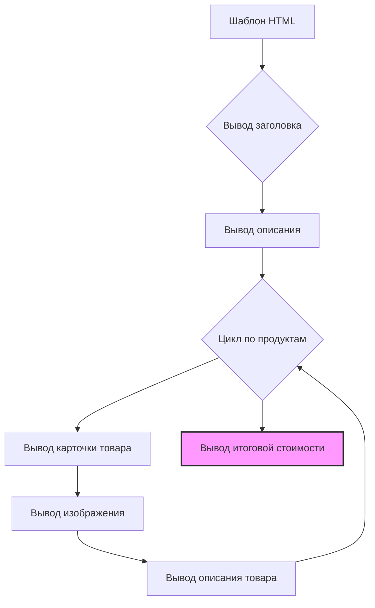

```MD
# Анализ кода template_1.html

## <input code>

```html
# -*- coding: utf-8 -*-\n#! venv/Scripts/python.exe\n\n""" module: src.endpoints.kazarinov.react.templates """\nMODE = 'debug'\n<!DOCTYPE html>\n<html lang="{{ language }}">\n\n<head>\n    <meta charset="UTF-8">\n    <meta name="viewport" content="width=device-width, initial-scale=1.0">\n    <title>{{ title }}</title>\n    <link rel="stylesheet" href="https://cdn.jsdelivr.net/npm/bootstrap@5.3.0/dist/css/bootstrap.min.css">\n    <style>\n        body {\n            background-color: #0d1117;\n            color: #c9d1d9;\n            font-family: 'Segoe UI', Tahoma, Geneva, Verdana, sans-serif;\n        }\n        // ... (CSS styles for product cards, price tag, and footer)\n    </style>\n</head>\n\n<body>\n    <div class="container">\n        <h1 class="text-center my-5">{{ title }}</h1>\n        <p class="lead">{{ description }}</p>\n\n        <div class="row">\n            \n            <div class="col-md-6 product-card">\n                <h3>{{ product.product_title }}</h3>\n                \n                <p>{{ product.product_description }}</p>\n            </div>\n            \n        </div>\n\n        <div class="footer">\n            <p>Общая стоимость: \n                <span class="price-tag">{{ price }} {{ currency }}</span>\n            </p>\n        </div>\n    </div>\n</body>\n\n</html>
```

## <algorithm>



Пример: Если `products` содержит два товара, цикл `for` выполнится дважды, выведя по две карточки товара.  `price` = 100, `currency` = "₽",  `language` = "ru",  `title` = "Товары", `description` = "Описание товаров".


## <mermaid>

```mermaid
graph LR
    A[template_1.html] --> B(Bootstrap CSS);
    A --> C(Django Templates);
    B --> D{JS, CSS};
    C --> E{Python (views)};
```

* `template_1.html`:  Основной HTML-шаблон.
* `Bootstrap CSS`: Внешний CSS-фреймворк для стилизации.
* `Django Templates`:  Язык шаблонов Django, который используется для динамического заполнения данных в HTML.
* `Python (views)`: Часть приложения, генерирующая данные (`products`, `title`, `description`, `price`, `currency`).


## <explanation>

* **Импорты:** Нет импортов в обычном смысле.  Файл представляет собой HTML-шаблон, использующий возможности Django шаблонов.
* **Классы:** Нет определенных классов.  Все элементы представлены в виде HTML-тегов.
* **Функции:** Нет функций.  Вместо этого используется Django-синтаксис шаблонов (`{{ ... }}` и ``).
* **Переменные:**
    * `language`: Язык интерфейса.
    * `title`: Заголовок страницы.
    * `description`: Описание.
    * `products`: Список продуктов (предполагается, что это объект Python, передаваемый в шаблон).  Каждый элемент в списке `products` является словарем с ключами `product_title`, `image_local_saved_path`, `product_description`.
    * `price`: Общая стоимость.
    * `currency`: Валюта.
* **Возможные ошибки/улучшения:**
    * Отсутствие валидации данных.  Необходимо убедиться, что переменные `price`, `currency` и `products` имеют корректные типы и значения.
    * Необходимо использовать `` для проверки наличия данных. Если `products` пуст, не будет отображаться карточки товаров.
    * Отсутствие описания, как и откуда берется  `image_local_saved_path`.


**Взаимосвязи с другими частями проекта:**

Шаблон `template_1.html` использует Django шаблоны для отображения данных, передаваемых из `views`. Взаимодействие происходит через Python-код, который заполняет переменные в шаблоне.  Определенные атрибуты (например, `product.image_local_saved_path`) указывают, что `products` — структура, генерируемая в приложении Python (вероятно, в Django views). Этот шаблон предполагает существование данных, которые должны быть подготовлены в соответствующей логике обработки запросов приложения.