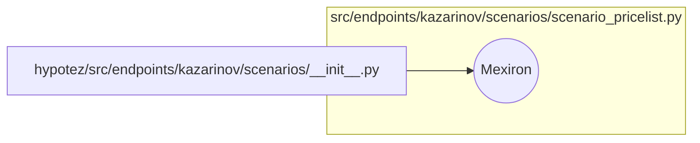

1. **<input code>**

```python
## \file hypotez/src/endpoints/kazarinov/scenarios/__init__.py
# -*- coding: utf-8 -*-
#! venv/Scripts/python.exe
#! venv/bin/python/python3.12

"""
.. module: src.endpoints.kazarinov.scenarios
	:platform: Windows, Unix
	:synopsis:

"""
MODE = 'dev'


from .scenario_pricelist import Mexiron
```

2. **<algorithm>**

Этот код представляет собой инициализацию модуля `src.endpoints.kazarinov.scenarios`.  Алгоритм состоит из единственного шага - импорта класса `Mexiron` из модуля `scenario_pricelist`.  В данном случае нет циклов, условных операторов, или каких-либо других сложных логических операций.  Данные не перемещаются между функциями или классами.

Пример:  Этот код подготавливает среду для использования класса `Mexiron` в других частях проекта.


3. **<mermaid>**



4. **<explanation>**

* **Импорты**:
    `from .scenario_pricelist import Mexiron`:  Этот импорт позволяет использовать класс `Mexiron` из модуля `scenario_pricelist`, который находится в той же директории (`./scenario_pricelist.py`). Символ `.` указывает на текущую директорию. Это стандартный подход в Python для организации модулей.

* **Классы**:
    `Mexiron`:  Этот класс определен в модуле `scenario_pricelist.py` и импортируется в текущий файл.  Без предоставленного кода из `scenario_pricelist.py`, точную функциональность `Mexiron` невозможно определить.

* **Функции**:
    Нет функций.  Только импорт.

* **Переменные**:
    `MODE = 'dev'`:  Это переменная, хранящая строковое значение 'dev'.  Вероятно, используется для определения режима работы, например, для выбора различных конфигураций.  Однако, без дополнительного контекста ее точная роль не ясна.


* **Возможные ошибки или области для улучшений**:
    - Отсутствует документация для класса `Mexiron`.  Добавление `docstring` к классу и методам `Mexiron` позволит лучше понять его назначение.

* **Цепочка взаимосвязей**:
    Этот модуль (`__init__.py`) импортирует класс `Mexiron` из `scenario_pricelist.py`, предположительно, `scenario_pricelist.py` определяет логику работы с ценами в сценариях.  Дальнейшие импорты или вызовы функций `Mexiron` из других частей кода проекта будут зависеть от того, как этот класс используется в других частях кодовой базы.  Проект скорее всего использует эту функцию (прямо или косвенно) для работы со сценариями.


**Вывод**: Код выполняет простую задачу импорта класса из другого файла.  Без дополнительных сведений о классе `Mexiron`, трудно судить о его функции и влиянии на весь проект.  Рекомендовано добавить документацию к классу `Mexiron` в файле `scenario_pricelist.py` для лучшего понимания его функциональности.