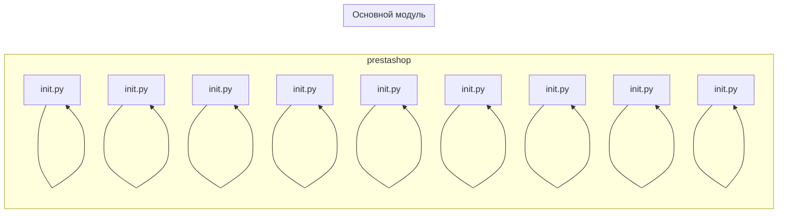

```MD
# Анализ кода hypotez/src/endpoints/prestashop/__init__.py

## <input code>

```python
## \file hypotez/src/endpoints/prestashop/__init__.py
# -*- coding: utf-8 -*-\
#! venv/Scripts/python.exe
#! venv/bin/python/python3.12

"""
.. module: src.endpoints.prestashop 
	:platform: Windows, Unix
	:synopsis:

"""
MODE = 'dev'

from .api import PrestaShop
from .product import PrestaProduct
from .supplier import PrestaSupplier
from .category import PrestaCategory
from .warehouse import PrestaWarehouse
from .language import PrestaLanguage
from .shop import PrestaShopShop
from .pricelist import PriceListRequester
from .customer import PrestaCustomer
```

## <algorithm>

Этот код является модулем инициализации, который импортирует различные классы и константы из подмодулей `prestashop`.  Блок-схема здесь не применимо, т.к. нет логической последовательности выполнения действий.  Здесь происходит только импорт, без вызова функций или запуска каких-либо процессов.

## <mermaid>



## <explanation>

**Импорты:**

Этот файл импортирует классы из подмодулей `prestashop`. Например, `from .api import PrestaShop` импортирует класс `PrestaShop` из модуля `api.py` внутри пакета `prestashop`.  Это ключевая часть модульной архитектуры Python, позволяющая организовать код в модули и подмодули для лучшей организации и повторного использования.  Связь - `src.endpoints.prestashop` является папкой, содержащей модули для работы с PrestaShop API. `api.py`, `product.py`, и т.д. — это  модули внутри этой папки, которые, вероятно, содержат классы, реализующие отдельные аспекты работы с API PrestaShop.

**Классы:**

* **`PrestaShop`, `PrestaProduct`, `PrestaSupplier`, `PrestaCategory`, `PrestaWarehouse`, `PrestaLanguage`, `PrestaShopShop`, `PriceListRequester`, `PrestaCustomer`:**  Все эти классы, предполагая, что они существуют в соответствующих файлах `.py`, вероятно, представляют разные сущности или ресурсы из API PrestaShop.  Это предполагает определённую организацию, где каждый класс отвечает за взаимодействие с конкретным аспектом API (продукты, поставщики, магазины и т. д.).

**Функции:**

В данном файле отсутствуют функции.  Все импортированные классы должны быть определены в соответствующих файлах и могут иметь методы для взаимодействия с API PrestaShop.

**Переменные:**

* **`MODE = 'dev'`:**  Вероятно, константа, определяющая режим работы (разработка, производство), которая может использоваться в других частях кода для настройки поведения приложения.


**Возможные ошибки и улучшения:**

* **Отсутствие документации:**  Несмотря на наличие docstring, классы и методы внутри импортированных файлов должны быть задокументированы более подробно. Это улучшит понимание и поддержку кода в будущем.
* **Обработка ошибок:**  Нужно учитывать ситуации, когда API PrestaShop возвращает ошибки.  В классах должны быть обработчики исключений.

**Цепочка взаимосвязей с другими частями проекта:**

Этот модуль является частью модульной архитектуры, вероятно, являясь частью API для взаимодействия с данным ресурсом PrestaShop. Другие части проекта, скорее всего, будут использовать эти импортированные классы для доступа к данным или функциональности API PrestaShop.  Это часть более крупного приложения, где эти классы используются в других модулях для взаимодействия и отображения информации Престашоп.