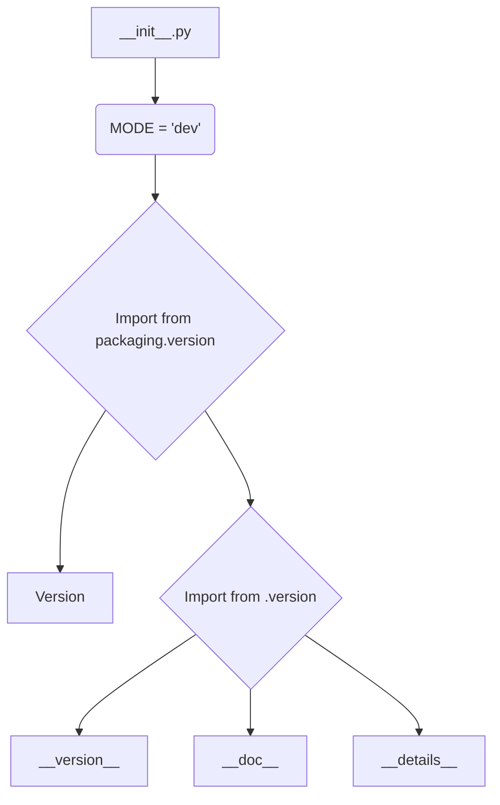

# <input code>

```python
## \file hypotez/src/endpoints/prestashop/_examples/__init__.py
# -*- coding: utf-8 -*-\n#! venv/Scripts/python.exe\n#! venv/bin/python/python3.12\n\n"""
.. module: src.endpoints.prestashop._examples 
	:platform: Windows, Unix
	:synopsis:

"""
MODE = 'dev'

"""
	:platform: Windows, Unix
	:synopsis:

"""


"""
	:platform: Windows, Unix
	:synopsis:

"""


"""
  :platform: Windows, Unix

"""
"""
  :platform: Windows, Unix
  :platform: Windows, Unix
  :synopsis:
"""MODE = 'dev'
  
""" module: src.endpoints.prestashop._examples """


from packaging.version import Version
from .version import __version__, __doc__, __details__
```

# <algorithm>

Этот код представляет собой инициализирующий модуль (`__init__.py`) для пакета `src.endpoints.prestashop._examples`.  В нем нет выраженной пошаговой логики, он скорее содержит константные определения и импорты.  Данных не обрабатывается. Алгоритм в этом случае сводится к определению констант и импорту.


# <mermaid>



# <explanation>

**1. Импорты:**

- `from packaging.version import Version`: Импортирует класс `Version` из пакета `packaging`.  Этот пакет, вероятно, используется для работы с версиями пакетов.  В данном случае импорт класса `Version`, скорее всего, нужен для проверки или обработки версий, хотя в этом конкретном файле он не используется напрямую.
- `from .version import __version__, __doc__, __details__`: Импортирует переменные `__version__`, `__doc__`, и `__details__` из файла `version.py` в том же каталоге (`_examples`). Эти переменные, скорее всего, содержат метаданные о версии модуля, его документацию и дополнительные детали.


**2. Классы:**

В этом коде нет определений классов.


**3. Функции:**

Нет определений функций.


**4. Переменные:**

- `MODE = 'dev'`:  Строковая константа, определяющая режим работы. Вероятно, используется для настройки поведения других частей приложения (например, в зависимости от стадии разработки - development или production).


**5. Возможные ошибки или области для улучшений:**

- **Нет явной логики:** Файл `__init__.py` слишком простой.  Он содержит лишь константные определения и импорты.  Возможно, здесь следует добавить какие-то функции или классы, описывающие логику взаимодействия с Престашоп.
- **Непонятная цель некоторых комментариев:** Не все комментарии непосредственно отражают функциональность файла. Необходимость дополнительных, не связанных с кодом, комментариев к строкам, определяющим переменные, под вопросом.


**6. Взаимосвязи с другими частями проекта:**

- Этот файл является частью пакета `endpoints/prestashop/_examples`.  Связь с другими частями проекта будет зависеть от того, как этот пакет используется.  Вероятно, `src.endpoints.prestashop._examples` содержит примеры реализации для работы с Престашоп.  Файл `version.py` является зависимым модулем и, скорее всего, содержит  метаинформацию о пакете.


**Общее:**

Код представляет собой  очень базовый модуль. В нём не реализована ни одна функция или класс.  Для того, чтобы оценить его в полном объёме, необходимо увидеть связывающие его части проекта.