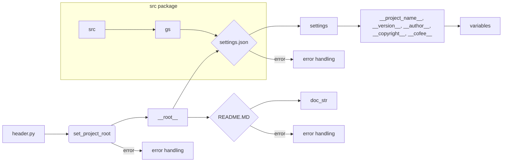

# <input code>

```python
## \file hypotez/src/endpoints/prestashop/api/header.py
# -*- coding: utf-8 -*-\
#! venv/Scripts/python.exe
#! venv/bin/python/python3.12

"""
.. module: src.endpoints.prestashop.api 
	:platform: Windows, Unix
	:synopsis:

"""
MODE = 'dev'

import sys
import json
from packaging.version import Version

from pathlib import Path
def set_project_root(marker_files=('pyproject.toml', 'requirements.txt', '.git')) -> Path:
    """ Finds the root directory of the project starting from the current file's directory,
    searching upwards and stopping at the first directory containing any of the marker files.

    Args:
        marker_files (tuple): Filenames or directory names to identify the project root.
    
    Returns:
        Path: Path to the root directory if found, otherwise the directory where the script is located.
    """
    __root__:Path
    current_path:Path = Path(__file__).resolve().parent
    __root__ = current_path
    for parent in [current_path] + list(current_path.parents):
        if any((parent / marker).exists() for marker in marker_files):
            __root__ = parent
            break
    if __root__ not in sys.path:
        sys.path.insert(0, str(__root__))
    return __root__


# Get the root directory of the project
__root__ = set_project_root()
"""__root__ (Path): Path to the root directory of the project"""

from src import gs

settings:dict = None
try:
    with open(gs.path.root / 'src' /  'settings.json', 'r') as settings_file:
        settings = json.load(settings_file)
except (FileNotFoundError, json.JSONDecodeError):
    ...

doc_str:str = None
try:
    with open(gs.path.root / 'src' /  'README.MD', 'r') as settings_file:
        doc_str = settings_file.read()
except (FileNotFoundError, json.JSONDecodeError):
    ...


__project_name__ = settings.get("project_name", 'hypotez') if settings  else 'hypotez'
__version__: str = settings.get("version", '')  if settings  else ''
__doc__: str = doc_str if doc_str else ''
__details__: str = ''
__author__: str = settings.get("author", '')  if settings  else ''
__copyright__: str = settings.get("copyrihgnt", '')  if settings  else ''
__cofee__: str = settings.get("cofee", "Treat the developer to a cup of coffee for boosting enthusiasm in development: https://boosty.to/hypo69")  if settings  else "Treat the developer to a cup of coffee for boosting enthusiasm in development: https://boosty.to/hypo69"
```

# <algorithm>

**Шаг 1:** Найти корневой каталог проекта.
   * Функция `set_project_root` ищет вверх по дереву каталогов, начиная с текущего файла, пока не найдет директорию, содержащую файлы `pyproject.toml`, `requirements.txt`, или `.git`.
   * Пример: Если текущий файл находится в `hypotez/src/endpoints/prestashop/api/header.py`, функция будет искать корень в родительских каталогах: `hypotez/src/endpoints/prestashop/api`, `hypotez/src/endpoints/prestashop`, ... пока не найдет директорию, содержащую один из указанных файлов.
   * Если корень не найден, возвращается текущий каталог.
   * Результат: Путь к корневому каталогу проекта (__root__).

**Шаг 2:** Добавить корневой каталог в sys.path.
   * Если корневой каталог не входит в список `sys.path`, то он добавляется в начало этого списка. Это необходимо для импорта модулей из других каталогов проекта.
   * Пример: Если корневой каталог – это `hypotez`, то `sys.path` будет изменен, чтобы Python мог найти модули из каталога `src`.

**Шаг 3:** Загрузить настройки проекта.
   * Читает файл `settings.json` в корневом каталоге проекта (`gs.path.root / 'src' / 'settings.json`).
   * Обрабатывает возможные ошибки `FileNotFoundError` и `json.JSONDecodeError` если файл не существует или невалиден.
   * Сохраняет загруженные настройки в переменную `settings`.
   * Пример: Файл `settings.json` содержит данные о названии проекта, версии и прочих параметрах.

**Шаг 4:** Загрузить описание проекта.
   * Читает файл `README.MD` в корневом каталоге проекта (`gs.path.root / 'src' / 'README.MD`).
   * Обрабатывает возможные ошибки `FileNotFoundError` и `json.JSONDecodeError` если файл не существует или невалиден.
   * Сохраняет загруженный текст в переменную `doc_str`.
   * Пример: `README.MD` содержит описание проекта, который может быть отображен в документации.


**Шаг 5:** Получить переменные проекта.
   * Извлекает данные из `settings` с помощью `settings.get`.
   * Задает значения по умолчанию, если ключ не найден.
   * Пример: `__project_name__` получит значение из `settings`, если есть, иначе – `hypotez`.

**Шаг 6:** Создать переменные проекта.
   * Эти переменные хранят информацию о проекте.


# <mermaid>



**Описание зависимостей:**

* `header.py` зависит от `set_project_root` для получения пути к корневому каталогу.
* `header.py` зависит от `gs`, который, вероятно, определяет пути к файлам конфигурации проекта. (Деталей о `gs` на основе предоставленного кода нет.)
* `header.py` зависит от `json` для работы с файлом `settings.json`.
* `header.py` использует `pathlib` для работы с путями к файлам.
* `header.py` использует `packaging.version` для работы с версиями.
* `header.py` использует `sys` для манипулирования `sys.path`.

# <explanation>

**Импорты:**

* `sys`: Предоставляет доступ к системным переменным, в частности, к списку импортируемых модулей (`sys.path`).
* `json`: Для работы с файлами JSON.
* `packaging.version`: Для работы с версиями пакетов.
* `pathlib`: Для работы с файловыми путями.
* `src.gs`: Предполагается, что это модуль или пакет, содержащий утилиты для работы с файловыми путями и ресурсами проекта.  Без дополнительной информации о `gs` сложно оценить его функциональность.

**Классы:**

Нет определенных классов.

**Функции:**

* `set_project_root`:
    * `marker_files`: Кортеж строк, представляющих имена файлов или папок, которые используются для определения корневого каталога проекта.
    * `Returns`: Путь (`Path`) до корневого каталога проекта.
    * Функция ищет вверх по древу каталогов, пока не найдет каталог, содержащий один из перечисленных файлов или папок. Если такой каталог не найден, возвращает текущий каталог.  Этот метод полезен для поиска корня проекта, независимо от того, где расположен скрипт.

**Переменные:**

* `__root__`: Путь к корневому каталогу проекта.
* `settings`: Словарь, содержащий настройки проекта, загруженный из `settings.json`.
* `doc_str`: Строка, содержащая описание проекта, полученная из `README.MD`.
* `__project_name__`, `__version__`, `__author__`, `__copyright__`, `__cofee__`: Переменные, хранящие информацию о проекте.


**Возможные ошибки и улучшения:**

* **Обработка ошибок:** Блоки `try...except`  в коде помогают избежать аварийного завершения программы при ошибках чтения файлов. Это хорошо, но можно добавить более подробную информацию об ошибке, например, вывести сообщение об ошибке в `stderr`.
* **Улучшенная обработка путей:** Использование `pathlib` улучшает работу с путями. Можно еще более улучшить работу с относительными путями, используя `os.path.join` для объединения строк.
* **Глобальные переменные:** Использование глобальных переменных (`__root__`, `settings`, ...)  может быть не лучшим вариантом.  Рассмотрите возможность передать эти значения в функции, которые их используют.
* **Документация:** Документация в начале файла (`"""Docstring"""`) очень полезна.  Можно использовать `type hints` для большей ясности типов.
* **Использование `gs`:** Пока нет информации о `gs`, непонятно, как он организован и какие функциональные возможности он предоставляет.

**Взаимосвязи с другими частями проекта:**

Файл `header.py` устанавливает корневой каталог проекта и загружает настройки из `settings.json` и `README.MD`.  Это критично для работы всех модулей, которые импортируются из проекта. Без `__root__` и `sys.path` другие компоненты проекта не смогут найти необходимые файлы.  `gs` вероятно содержит функции для доступа к ресурсам проекта.  Связь с другими частями проекта (какими именно) определяется кодом внутри `gs`.