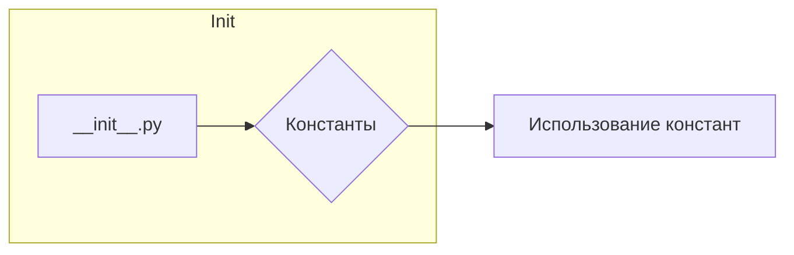

```MD
# Анализ файла `hypotez/src/endpoints/prestashop/domains/ecat_co_il/__init__.py`

**1. <input code>**

```python
## \file hypotez/src/endpoints/prestashop/domains/ecat_co_il/__init__.py
# -*- coding: utf-8 -*-\
#! venv/Scripts/python.exe
#! venv/bin/python/python3.12

"""
.. module: src.endpoints.prestashop.domains.ecat_co_il 
	:platform: Windows, Unix
	:synopsis:

"""
MODE = 'dev'

"""
	:platform: Windows, Unix
	:synopsis:

"""


"""
	:platform: Windows, Unix
	:synopsis:

"""


"""
  :platform: Windows, Unix

"""
"""
  :platform: Windows, Unix
  :platform: Windows, Unix
  :synopsis:
"""MODE = 'dev'
  
""" module: src.endpoints.prestashop.domains.ecat_co_il """


"""    Client's websites
@namespace src: pestashop.domains
\file __init__.py
 @section libs imports:
Author(s):
  - Created by [Name] [Last Name] on 07.11.2023 .
"""
```

**2. <algorithm>**

Этот файл, скорее всего, является инициализационным модулем для домена `ecat_co_il` в системе `prestashop`.  Алгоритм работы в данном случае неявный. Файл содержит ряд комментариев, описывающих назначение модуля и его платформ, но сам по себе не содержит логики выполнения.

**3. <mermaid>**



**4. <explanation>**

* **Импорты:**  В данном файле нет импортов.  Вместо импортов присутствуют многочисленные строковые комментарии, которые, по всей видимости, должны использоваться для документации или в системах управления версиями.  Отсутствие импортов означает, что этот файл не выполняет никакой активной работы. Он, скорее всего, предназначен для описания модуля и его функций.

* **Классы:** Нет определенных классов.

* **Функции:** Нет определенных функций.

* **Переменные:**  `MODE = 'dev'`:  Эта переменная глобальная и хранит строку 'dev'. Вероятно, это конфигурационная переменная, которая используется для определения режима работы системы (например, "dev" для разработки, "prod" для производства).

* **Возможные ошибки или области для улучшений:**

    * **Отсутствие функциональности:**  Файл не содержит никакой функциональности.  Он просто содержит комментарии. Необходимо добавить функции или классы, которые будут определять поведение модуля.
    * **Избыточные комментарии:** Некоторые комментарии повторяются или не содержат ценной информации. Нужно убрать избыточные комментарии и структурировать оставшиеся в соответствии с соглашениями о стилистике кода.
    * **Несоответствие имени файла:** Имя файла `__init__.py` предполагает, что этот файл содержит инициализационные функции. Однако, в данном случае это не так.

* **Взаимосвязи с другими частями проекта:**  Связь с другими частями проекта не очевидна из самого файла. Однако, предполагается, что `MODE` переменная будет использоваться в других модулях для выбора стратегии поведения в зависимости от текущей среды (например, использование определенных библиотек, API или конфигураций). Без дополнительного контекста из других файлов проекта невозможно проследить все взаимосвязи.


**Дополнительные замечания:**

Файл сильно нуждается в улучшении.  Наличие комментариев с тегами `@namespace` и `@section` говорит о некотором шаблоне (возможно, для документации или автоматизации создания кода), но без контекста из других файлов трудно определить, как он должен использоваться.  В идеале, данный файл должен содержать импорты необходимых модулей и/или классы/функции, которые будут реализовывать логику домена `ecat_co_il`.