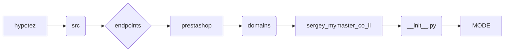

```MD
# Анализ файла hypotez/src/endpoints/prestashop/domains/sergey_mymaster_co_il/__init__.py

## <input code>

```python
## \file hypotez/src/endpoints/prestashop/domains/sergey_mymaster_co_il/__init__.py
# -*- coding: utf-8 -*-
#! venv/Scripts/python.exe
#! venv/bin/python/python3.12

"""
.. module: src.endpoints.prestashop.domains.sergey_mymaster_co_il 
	:platform: Windows, Unix
	:synopsis:

"""
MODE = 'dev'

"""
	:platform: Windows, Unix
	:synopsis:

"""


"""
	:platform: Windows, Unix
	:synopsis:

"""


"""
  :platform: Windows, Unix

"""
"""
  :platform: Windows, Unix
  :platform: Windows, Unix
  :synopsis:
"""MODE = 'dev'
  
""" module: src.endpoints.prestashop.domains.sergey_mymaster_co_il """


"""    Client's websites
@namespace src: pestashop.domains
\file __init__.py
 @section libs imports:
Author(s):
  - Created by [Name] [Last Name] on 07.11.2023 .
"""
```

## <algorithm>

Этот файл, скорее всего, является инициализационным файлом для подмодуля `prestashop` в рамках проекта `hypotez`.  Он не содержит логики, а лишь определяет переменную `MODE` и содержит комментарии.  Пошаговая блок-схема не применима, так как нет выполняемых инструкций.

## <mermaid>



## <explanation>

Файл `__init__.py` в Python используется для обозначения папки как модуля.  В данном случае, он определяет, что папка `sergey_mymaster_co_il` является подмодулем пакета `domains`, который, в свою очередь, является подмодулем `prestashop` в `endpoints` проекта `hypotez`.

**Импорты:**  Нет импортов. Файл содержит только глобальную переменную `MODE`, которая, судя по комментариям, определяет режим работы.

**Классы:** Нет классов.

**Функции:** Нет функций.

**Переменные:**
* `MODE`: Строковая переменная, вероятно, хранящая режим работы (например, 'dev', 'prod'). В данном случае она определена неоднократно, что может быть ошибкой или стилистической особенностью.

**Возможные ошибки и улучшения:**

* **Повторное определение переменной:** Переменная `MODE` определена несколько раз с одинаковым значением. Это избыточно и, вероятно, является ошибкой. Следует оставить только одно определение.

* **Недостаточная функциональность:** Файл `__init__.py`  не выполняет никакой работы, кроме как указывает, что это модуль. Для инициализации приложения потребуется больше кода.

* **Неиспользуемые комментарии:**  Некоторые комментарии являются пустыми или повторяющими информацию, которая уже неявно выражена структурой папок.

**Цепочка взаимосвязей:**

Этот файл связан с другими частями проекта через иерархическую структуру папок.  Зависимость от `endpoints/prestashop/domains/sergey_mymaster_co_il` будет создаваться в других файлах приложения при импорте переменных или функций из данного модуля.  Зависимости и структура папок определяют, как модули взаимодействуют друг с другом. Для полноценной работы потребуется реализация соответствующих классов и функций в файлах данного подмодуля.