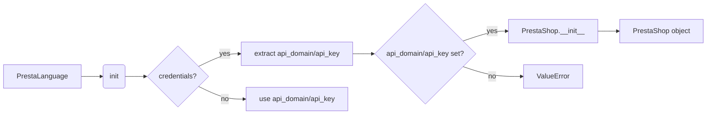

```MD
# Анализ кода файла hypotez/src/endpoints/prestashop/language.py

## <input code>

```python
# -*- coding: utf-8 -*-\
#! venv/Scripts/python.exe
#! venv/bin/python/python3.12

"""
.. module: src.endpoints.prestashop 
	:platform: Windows, Unix
	:synopsis:

"""
MODE = 'dev'

...
from types import SimpleNamespace
from .api import PrestaShop
from src import gs
from src.utils import pprint
from .api import PrestaShop
import header
from src.logger import logger
from src.logger.exceptions import PrestaShopException

from typing import Optional

class PrestaLanguage(PrestaShop):
    """ 
    Класс, отвечающий за настройки языков магазина PrestaShop.

    Пример использования класса:

    .. code-block:: python

        prestalanguage = PrestaLanguage(API_DOMAIN=API_DOMAIN, API_KEY=API_KEY)
        prestalanguage.add_language_PrestaShop('English', 'en')
        prestalanguage.delete_language_PrestaShop(3)
        prestalanguage.update_language_PrestaShop(4, 'Updated Language Name')
        print(prestalanguage.get_language_details_PrestaShop(5))
    """

    def __init__(self, 
                 credentials: Optional[dict | SimpleNamespace] = None, 
                 api_domain: Optional[str] = None, 
                 api_key: Optional[str] = None, 
                 *args, **kwards):
        """Инициализация класса PrestaLanguage.

        Args:
            credentials (Optional[dict | SimpleNamespace], optional): Словарь или объект SimpleNamespace с параметрами `api_domain` и `api_key`. Defaults to None.
            api_domain (Optional[str], optional): Домен API. Defaults to None.
            api_key (Optional[str], optional): Ключ API. Defaults to None.
        """

        if credentials is not None:
            api_domain = credentials.get('api_domain', api_domain)
            api_key = credentials.get('api_key', api_key)

        if not api_domain or not api_key:
            raise ValueError('Необходимы оба параметра: api_domain и api_key.')

        super().__init__(api_domain, api_key, *args, **kwards)
```

## <algorithm>

Блок-схема алгоритма не может быть представлена, так как код не содержит циклов и сложной логики.

**Пошаговый алгоритм:**

1. Импортируются необходимые модули, в том числе `PrestaShop` из текущего модуля (`./api`) и других частей проекта (`src`).

2. Определяется класс `PrestaLanguage`, наследующий от `PrestaShop`.

3. Конструктор `__init__` принимает параметры `credentials`, `api_domain`, `api_key`.

4. Если `credentials` задан, извлекаются значения `api_domain` и `api_key` из него.

5. Проверяется, что `api_domain` и `api_key` заданы. Если нет, выбрасывается исключение `ValueError`.

6. Вызывается конструктор родительского класса `PrestaShop` с переданными параметрами.

## <mermaid>



## <explanation>

**Импорты:**

- `from types import SimpleNamespace`: Импортирует класс `SimpleNamespace` для создания объекта-контейнера для параметров.
- `from .api import PrestaShop`: Импортирует класс `PrestaShop` из файла `api.py` в том же каталоге (`endpoints/prestashop`).  Это ключевой модуль, от которого наследуется текущий класс.
- `from src import gs`: Импортирует модуль `gs` из пакета `src`.  Непонятно, для чего используется в данном контексте, без дополнительной информации.
- `from src.utils import pprint`: Импортирует функцию `pprint` из модуля `utils` в пакете `src`. Вероятно, для вывода отладочной информации.
- `from .api import PrestaShop`: Дублирует импорт. Необходимо удалить один из них.
- `import header`: Импортирует модуль `header`. Непонятно, какое функциональность он предоставляет, без дополнительной информации.
- `from src.logger import logger`: Импортирует объект `logger` для ведения журналов.
- `from src.logger.exceptions import PrestaShopException`: Импортирует пользовательское исключение `PrestaShopException`, вероятно, для обработки ошибок, связанных с PrestaShop.
- `from typing import Optional`: Импортирует тип `Optional`, используемый для указания опциональных параметров в аннотациях типов.

**Классы:**

- `PrestaLanguage`: Класс, предназначенный для работы с языками магазина PrestaShop. Он наследуется от класса `PrestaShop`, предоставляя базовые методы для работы с API.  
    - `__init__`: Метод инициализации класса. Принимает параметры `credentials`, `api_domain`, `api_key`.  Обрабатывает получение значений `api_domain` и `api_key` как из аргумента `credentials`, так и из отдельных аргументов. Валидирует наличие `api_domain` и `api_key`, что важно для работы с API. Вызывает конструктор родительского класса (`super().__init__`).

**Функции:**

Код не содержит функций, кроме `__init__` класса.

**Переменные:**

- `MODE = 'dev'`: Переменная, вероятно, используется для настройки режима работы (например, для выбора логгера).

**Возможные ошибки и улучшения:**

1. **Дублирование импорта:** Импорт `PrestaShop` из текущего модуля и из пакета `src` является избыточным. Нужно удалить один из импортов.

2. **Нет обработки ошибок в `PrestaShop.__init__`:**  Если в `PrestaShop.__init__` есть обработка ошибок, следует убедиться, что она здесь также включена для корректного перенаправления ошибок.

3. **Проверка типа `credentials`:**  Лучше добавить проверку, что `credentials` — это действительно словарь или `SimpleNamespace`, чтобы избежать неожиданного поведения.

4. **Документация:**  Документация к классу (`"""..."""`) не содержит примеров, как использовать `*args, **kwards`. Добавьте примеры для большей ясности.

5. **Непонятное использование `gs`:**  Непонятно, какой функционал предоставляет `gs`, если он используется. Необходимо документация или комментарии.

6. **`header`:** Непонятно, для чего используется модуль `header`. Необходимо документация или комментарии.

**Взаимосвязи с другими частями проекта:**

Класс `PrestaLanguage` зависит от класса `PrestaShop`, который, скорее всего, определен в файле `api.py` в том же каталоге (`endpoints/prestashop`).  В свою очередь, `PrestaShop` потенциально зависит от других модулей, которые обеспечивают взаимодействие с внешними сервисами или базами данных.  В данном случае  `logger`, `pprint` и другие зависимости из `src`.