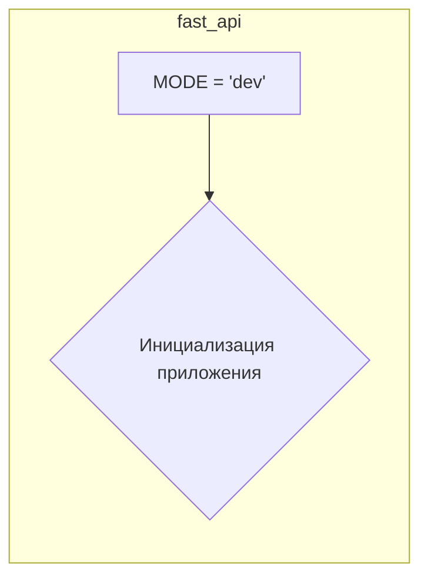

# <input code>

```python
## \file hypotez/src/fast_api/__init__.py
# -*- coding: utf-8 -*-
#! venv/Scripts/python.exe
#! venv/bin/python/python3.12

"""
.. module: src.fast_api 
	:platform: Windows, Unix
	:synopsis:

"""
MODE = 'dev'
```

# <algorithm>

Этот файл `hypotez/src/fast_api/__init__.py` является инициализационным файлом пакета `fast_api`.  Он содержит всего одну переменную, которая, скорее всего, определяет режим работы приложения (например, `dev`, `prod`).  Блок-схема крайне проста:


В этом случае переменная `MODE` инициализирует строкой 'dev', но её значение не используется в этом фрагменте кода.  Логика работы приложения будет определяться другими модулями и файлами внутри пакета `fast_api`.

# <mermaid>



# <explanation>

**Импорты:**  В этом файле отсутствуют импорты.  Это стандартный инициализационный файл, который часто используется для определения констант или переменных, которые могут использоваться другими модулями внутри пакета `fast_api` в проекте `hypotez`.

**Классы:** Нет классов.

**Функции:** Нет функций.

**Переменные:**

* `MODE`: Строковая константа, вероятно, используемая для управления режимом работы приложения (например, `dev` для разработки, `prod` для производства). Значение по умолчанию установлено как `'dev'`.

**Возможные ошибки или области для улучшений:**

* Отсутствует функциональность.  Сам по себе этот файл не выполняет никакой работы.  Он просто определяет переменную `MODE`.
* Непонятно, как эта переменная используется.  Для более глубокого понимания необходимо посмотреть на файлы, использующие эту переменную.  
* Неопределено поведение в разных средах.  Комментарии документации не поясняют, как поведение переменной `MODE` отличается при запуске в разных средах.

**Цепочка взаимосвязей:**

Переменная `MODE` определяет режим работы приложения.  Для того, чтобы эта переменная оказала влияние, в других файлах пакета `fast_api` должны быть условные операторы, которые зависят от этого значения (например, разные настройки конфигурации, подключение к разным базам данных в зависимости от режима `dev`/`prod`).  Эти связи реализуются в модулях и файлах, которые импортируются из этого файла.  Без этих связей, эта переменная бесполезна. Без доступа к остальным частям кода проекта сложно сказать, как эта переменная используется и какова её роль в более широкой архитектуре приложения.