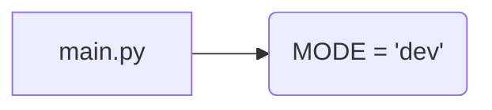

1. **<input code>**

```python
## \file hypotez/src/fast_api/gemini/backend/main.py
# -*- coding: utf-8 -*-
#! venv/Scripts/python.exe
#! venv/bin/python/python3.12

"""
.. module: src.fast_api.gemini.backend 
	:platform: Windows, Unix
	:synopsis:

"""
MODE = 'dev'

"""
	:platform: Windows, Unix
	:synopsis:

"""

"""
	:platform: Windows, Unix
	:synopsis:

"""


"""
  :platform: Windows, Unix

"""
"""
  :platform: Windows, Unix
  :platform: Windows, Unix
  :synopsis:
"""MODE = 'dev'
  
""" module: src.fast_api.gemini.backend """
```

2. **<algorithm>**

Этот код не содержит алгоритма в привычном понимании. Он представляет собой пустой файл с комментариями, определяющими модуль `src.fast_api.gemini.backend` и задающий переменную `MODE`.  Блок-схема не может быть построена, так как нет выполняемого кода.

3. **<mermaid>**



4. **<explanation>**

* **Импорты:**  Файл `main.py` не содержит импортов. Отсутствует логика, которая требует импорта библиотек или других модулей.

* **Классы:**  Нет определений классов.

* **Функции:** Нет определений функций.

* **Переменные:**  `MODE = 'dev'` - глобальная переменная, определяющая режим работы.  Её значение 'dev' предполагает, что приложение находится в режиме разработки.

* **Возможные ошибки/улучшения:**
    * Отсутствует реальная функциональность.  Файл фактически пуст.  Требуется написать код для реализации логики модуля.
    * Комментарии не отражают функциональности. Необходимо улучшить документацию, чтобы она соответствовала содержанию кода.
    * Неоптимальное использование комментариев. Комментарии типа `""" :platform: Windows, Unix """` не несут никакой практической ценности и только затрудняют понимание кода.


**Цепочка взаимосвязей:**

Файл `main.py`  является частью проекта `hypotez` и, скорее всего, будет включать в себя в дальнейшем код, который будет взаимодействовать с другими частями проекта `hypotez` (например, через API FastAPI, если в проекте он используется).  Конкретная цепочка взаимосвязей пока неизвестна, так как код пустой.


**Заключение:**

Файл представляет собой заготовку для модуля `src.fast_api.gemini.backend`.  Для дальнейшего анализа необходимо добавить код, определяющий функциональность.