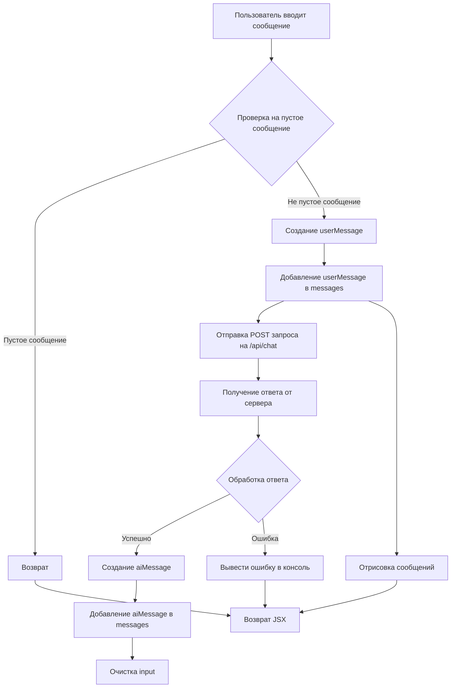

```MD
# Анализ кода приложения чат-бота на React

## <input code>

```javascript
function App() {
  const [input, setInput] = React.useState("");
  const [messages, setMessages] = React.useState([]);

  const sendMessage = async () => {
    if (input.trim() === "") return;

    const userMessage = { role: "user", content: input };
    setMessages([...messages, userMessage]);

    try {
      const response = await fetch("http://localhost:8000/api/chat", {
        method: "POST",
        headers: {
          "Content-Type": "application/json"
        },
        body: JSON.stringify({ prompt: input })
      });

      const data = await response.json();
      const aiMessage = { role: "assistant", content: data.response };
      setMessages([...messages, userMessage, aiMessage]);
    } catch (error) {
      console.error("Error:", error);
    }

    setInput("");
  };

  return (
    <div>
      <div className="chat-box" style={{ height: '400px', overflowY: 'scroll', border: '1px solid #ccc', padding: '10px' }}>
        {messages.map((msg, index) => (
          <div key={index} className={msg.role === "user" ? "text-right" : "text-left"}>
            <strong>{msg.role === "user" ? "You" : "AI"}:</strong> {msg.content}
          </div>
        ))}
      </div>
      <div className="input-group mt-3">
        <input
          type="text"
          className="form-control"
          placeholder="Type your message..."
          value={input}
          onChange={(e) => setInput(e.target.value)}
          onKeyDown={(e) => e.key === "Enter" ? sendMessage() : null}
        />
        <button className="btn btn-primary" onClick={sendMessage}>Send</button>
      </div>
    </div>
  );
}

ReactDOM.render(<App />, document.getElementById('chat-app'));
```

## <algorithm>

**Блок-схема:**



**Пример:**

Пользователь вводит "Привет, бот!".  В блоке `D` создаётся объект `userMessage` с `role` "user" и `content` "Привет, бот!".  В блоке `F` отправляется POST запрос на сервер. Сервер обрабатывает запрос и возвращает ответ, например, "Привет!". В блоке `I` создаётся объект `aiMessage` с `role` "assistant" и `content` "Привет!". В блоке `J`  `aiMessage` добавляется в массив `messages`.  В итоге, в `messages` будут оба сообщения.  `input` очищается.


## <mermaid>

```mermaid
graph LR
    subgraph React Component
        App --> sendMessage;
        sendMessage --> fetch;
        fetch --> data;
        data --> setMessages;
        setMessages --> render;
        render --> JSX;
        JSX --> chat-box;
        chat-box --> messages;
        chat-box --> input;
    end
    subgraph Back-End API
        fetch --> api/chat;
        api/chat --> response;
    end

    note right of fetch
        API endpoint for chat
    note right of data
      JSON data from API
```

## <explanation>

**Импорты:**

Код импортирует `React` и `ReactDOM` из библиотек React, но импорты не указаны напрямую в коде, предположительно они подключаются через менеджер пакетов(npm, yarn).

**Классы:**

В коде нет классов.  Функция `App` является компонентом React.

**Функции:**

- `App`: Компонент React, обрабатывающий взаимодействие с пользователем.
- `sendMessage`: Асинхронная функция, отправляющая сообщение на сервер, обрабатывающая ответ, обновляющая массив `messages` и очищающая поле ввода `input`.
    - Аргументы: Не принимает.
    - Возвращаемые значения: Не имеет.
    - Пример: Когда пользователь кликает "Отправить" или нажимает Enter, `sendMessage` выполняется.

**Переменные:**

- `input`: Строка, содержащая текст сообщения пользователя. Тип данных - строка.
- `messages`: Массив, содержащий сообщения пользователей и чат-бота.  Тип данных - массив объектов.

**Возможные ошибки и улучшения:**

- **Обработка ошибок:** Обработка ошибок в `sendMessage` необходима для более надежной работы. Нужно добавить более подробную информацию о типе ошибки.
- **Типизация:** Использование типов данных для переменных (например, `input: string`, `messages: Array<object>`) сделало бы код более понятным и снизило бы вероятность ошибок.
- **Улучшенный UX:**  Можно добавить индикатор загрузки, чтобы пользователь понимал, что идёт процесс отправки/получения ответа.
- **API:** Нужно указать на подключенный API, например, `http://localhost:8000/api/chat`. Описание API,  (например, формат входных/выходных данных) с серверной части приложения.
- **Локализация:** Добавить возможность перевода на разные языки.


**Взаимосвязи с другими частями проекта:**

Функция `sendMessage` делает POST запрос к `/api/chat` на сервер. Сервер, вероятно, обрабатывает запрос с помощью фреймворка Python (например, FastAPI), что позволяет реализовать логику обработки чат-бота.  Зависимость от серверного приложения подразумевается.  Следует подробно изучить серверный код `/api/chat` чтобы проследить цепочку взаимосвязей.