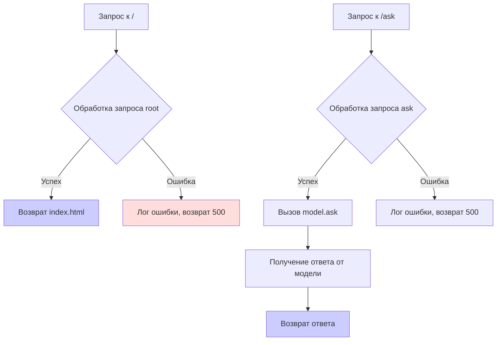

```MD
# Анализ кода файла hypotez/src/fast_api/openai.py

## <input code>

```python
## \file hypotez/src/fast_api/openai.py
# -*- coding: utf-8 -*-\
#! venv/Scripts/python.exe
#! venv/bin/python/python3.12

"""
.. module: src.fast_api 
	:platform: Windows, Unix
	:synopsis:This module provides a FastAPI application for interacting with the OpenAI model.
It includes API endpoints for querying the model and training it based on provided data.
"""
MODE = 'dev'
import header
from fastapi import FastAPI, HTTPException
from fastapi.middleware.cors import CORSMiddleware
from fastapi.staticfiles import StaticFiles
from fastapi.responses import HTMLResponse
from pydantic import BaseModel
from pathlib import Path
import uvicorn

from src import gs
from src.utils import j_loads
from src.logger import logger  # Используем ваш класс логгирования

from src.ai.openai.model.training import OpenAIModel
from src.gui.openai_trаigner import AssistantMainWindow

app = FastAPI()

app.mount("/static", StaticFiles(directory=gs.path.src / 'fast_api' / 'html' / 'openai_training'), name="static")

app.add_middleware(
    CORSMiddleware,
    allow_origins=["*"],  # Разрешить запросы с любых источников
    allow_credentials=True,
    allow_methods=["*"],  # Разрешить все HTTP методы (GET, POST и т.д.)
    allow_headers=["*"],  # Разрешить все заголовки
)

model = OpenAIModel()

class AskRequest(BaseModel):
    """ Data model for the `/ask` endpoint request."""
    message: str
    system_instruction: str = None

@app.get("/", response_class=HTMLResponse)
async def root():
    """ Serve the `index.html` file at the root URL. """
    try:
        return HTMLResponse(open("html/openai/index.html").read())
    except Exception as ex:
        logger.error(f"Error during request: {str(ex)}")
        raise HTTPException(status_code=500, detail=f"Error processing the request\n{ex}")

@app.post("/ask")
async def ask_model(request: AskRequest):
    """ Processes the user's request and returns the response from the model. """
    try:
        response = model.ask(request.message, request.system_instruction)
        return {"response": response}
    except Exception as ex:
        logger.error(f"Error during request: {str(ex)}")
        raise HTTPException(status_code=500, detail=f"Error processing the request\n{ex}")

# Остальные эндпоинты...

if __name__ == "__main__":
    uvicorn.run(app, host="127.0.0.1", port=8000)
```

## <algorithm>

**Блок-схема:**




**Пример:**
* Пользователь делает GET-запрос к `/`.
* Запрос обрабатывается функцией `root()`.
* Функция `root()` открывает файл `html/openai/index.html`.
* Содержимое файла возвращается в качестве ответа.

* Пользователь отправляет POST-запрос к `/ask` с данными запроса.
* Функция `ask_model()` получает данные запроса.
* Данные передаются методу `model.ask()`.
* Модель возвращает ответ.
* Ответ возвращается клиенту в виде JSON.

## <mermaid>

```mermaid
graph LR
    subgraph FastAPI Application
        A[app] --> B(mount /static);
        B --> C[StaticFiles];
        A --> D(add_middleware);
        D --> E[CORSMiddleware];
        A --> F(get /);
        A --> G(post /ask);
        F --> H[root()];
        G --> I[ask_model()];
        H --> J[HTMLResponse];
        I --> K[model.ask()];
        K --> L[Ответ модели];
    end
    subgraph OpenAI Model
        K -- данные --> M[OpenAIModel];
        M --> L;
    end
    subgraph src packages
        M --> N[src.ai.openai.model.training];
        N --> O[OpenAIModel];
        C --> P[html];
    end

    style A fill:#ccf;
    style E fill:#ccf;
    style K fill:#ccf;
    style M fill:#ccf;
    style J fill:#ccf;
```


## <explanation>

**Импорты:**

* `import header`: Импортирует модуль `header`, который, вероятно, содержит конфигурацию или вспомогательные функции, относящиеся к проекту.  Необходимо выяснить его содержимое, чтобы понять контекст.
* `from fastapi import ...`: Импортирует необходимые классы и функции FastAPI для создания веб-приложения.
* `from fastapi.middleware.cors import ...`: Импортирует класс `CORSMiddleware` для настройки обработки кросс-доменных запросов.
* `from fastapi.staticfiles import ...`: Импортирует класс `StaticFiles` для обработки статических файлов (HTML, CSS, JS).
* `from fastapi.responses import ...`: Импортирует класс `HTMLResponse` для отправки HTML-ответов.
* `from pydantic import ...`: Импортирует класс `BaseModel` для создания схем данных.
* `from pathlib import ...`: Импортирует класс `Path` для работы с путями к файлам.
* `import uvicorn`: Импортирует утилиту для запуска FastAPI приложения.
* `from src import gs`: Импортирует модуль `gs`, вероятно, содержащий глобальные настройки или ресурсы.
* `from src.utils import j_loads`: Импортирует функцию `j_loads` для обработки JSON данных.
* `from src.logger import logger`: Импортирует класс логгирования.
* `from src.ai.openai.model.training import OpenAIModel`: Импортирует класс `OpenAIModel` из модуля, отвечающего за взаимодействие с моделью OpenAI.
* `from src.gui.openai_trаigner import AssistantMainWindow`: Импортирует класс `AssistantMainWindow`, предположительно, для графического интерфейса пользователя.

**Классы:**

* `AskRequest(BaseModel)`: Модель данных для запроса к эндпоинту `/ask`. Определяет структуру данных, ожидаемых от клиента, используя `pydantic.BaseModel`.

**Функции:**

* `root()`: Обрабатывает GET-запрос к корневому пути (`/`). Возвращает HTML-страницу `index.html`. Важно, что `try...except` блок обрабатывает возможные исключения при чтении файла.
* `ask_model()`: Обрабатывает POST-запрос к `/ask`.  Принимает данные запроса в виде объекта `AskRequest`, получает ответ от модели `OpenAIModel.ask()` и возвращает результат в формате JSON.

**Переменные:**

* `app`: Экземпляр класса `FastAPI`, представляющий веб-приложение.
* `model`: Экземпляр класса `OpenAIModel`.

**Зависимости:**
Код сильно связан с другими модулями из `src`, в том числе:
* `src.ai.openai.model.training` (для взаимодействия с моделью OpenAI).
* `src.gui.openai_trаigner` (для графического интерфейса).
* `src.utils` (для обработки данных).
* `src.logger` (для логгирования).
* `gs` (для глобальных настроек).

**Возможные ошибки и улучшения:**

* **Обработка ошибок:** Обработка ошибок в `root()` и `ask_model()` является хорошей практикой. Однако, рекомендуется добавить более детальную информацию об ошибке в лог (например, тип ошибки, стек-трейс).
* **Типы данных:** Необходимо проверить типы данных, передаваемые в `OpenAIModel.ask()`.
* **Валидация данных:** Продвинутая валидация данных в `AskRequest` может улучшить устойчивость к неверным входам.
* **`header`:** Необходимо понять функциональность модуля `header`.
* **`j_loads`:** Необходимо понять, как работает функция `j_loads`.
* **`gs`:** Понимание переменной `gs.path` важно для понимания пути к ресурсам.

**Цепочка взаимосвязей:**

`hypotez/src/fast_api/openai.py` получает данные от клиента, использует `OpenAIModel`, который, предположительно, использует OpenAI API для получения ответа. Также взаимодействует с `src.gui.openai_trаigner` для управления графическим интерфейсом.