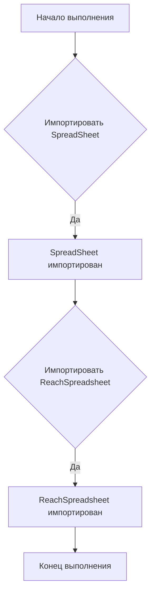

# Анализ файла hypotez/src/goog/spreadsheet/__init__.py

## <input code>

```python
## \file hypotez/src/goog/spreadsheet/__init__.py
# -*- coding: utf-8 -*-\
#! venv/Scripts/python.exe
#! venv/bin/python/python3.12

"""
.. module: src.goog.spreadsheet 
	:platform: Windows, Unix
	:synopsis:

"""
MODE = 'dev'


from .spreadsheet import SpreadSheet
from .reach_spreadsheet import ReachSpreadsheet
```

## <algorithm>

Этот файл является инициализирующим модулем для пакета `goog.spreadsheet`.  Он просто импортирует классы `Spreadsheet` и `ReachSpreadsheet` из вложенных модулей.  Алгоритм работы сводится к импорту этих классов.  Нет сложных вычислений или циклов.

**Пример:**

Импортирование происходит при выполнении `import hypotez.src.goog.spreadsheet`

**Пошаговая блок-схема:**



Данные не перемещаются между функциями или классами в этом файле.  Он лишь задает импорт.


## <mermaid>

```mermaid
graph LR
    subgraph Spreadsheet Package
        A[hypotez/src/goog/spreadsheet/__init__.py] --> B(SpreadSheet);
        A --> C(ReachSpreadsheet);
    end
    subgraph Sub-Modules
        B -- Import -- D[spreadsheet.py];
        C -- Import -- E[reach_spreadsheet.py];
    end
```

В данном случае зависимости лежат вложенных модулях (`spreadsheet.py` и `reach_spreadsheet.py`) внутри пакета `goog/spreadsheet`.  


## <explanation>

**Импорты:**

- `from .spreadsheet import SpreadSheet`: Импортирует класс `Spreadsheet` из модуля `spreadsheet.py` в текущем пакете (`src.goog.spreadsheet`).  Символ `.` указывает на поиск модуля внутри текущего пакета.
- `from .reach_spreadsheet import ReachSpreadsheet`: Импортирует класс `ReachSpreadsheet` из модуля `reach_spreadsheet.py` в текущем пакете.

**Классы:**

Этот код не определяет классы, а только импортирует их. Классы `Spreadsheet` и `ReachSpreadsheet` предполагаются определенными в файлах `spreadsheet.py` и `reach_spreadsheet.py` соответственно.  

**Функции:**

Нет функций в этом файле.

**Переменные:**

- `MODE = 'dev'`:  Переменная, вероятно, задающая режим работы (например, `dev` или `prod`).  В данном случае глобальная переменная.

**Возможные ошибки или области для улучшений:**

- Отсутствует документирование `MODE`  (что он делает).
- Нет проверки на существование импортируемых файлов.  Если `spreadsheet.py` или `reach_spreadsheet.py` не существует, то произойдет ошибка `ImportError`.


**Связь с другими частями проекта:**

Этот файл является частью пакета `goog.spreadsheet` (предположительно, для работы с Google Sheets).  Другие части проекта, вероятно, будут использовать эти классы для взаимодействия с Google Sheets API (например, загрузка, изменение данных).  Недостаточно информации, чтобы определить полную взаимосвязь.  Для анализа следует просмотреть файлы `spreadsheet.py` и `reach_spreadsheet.py`, а также код, который использует этот модуль.