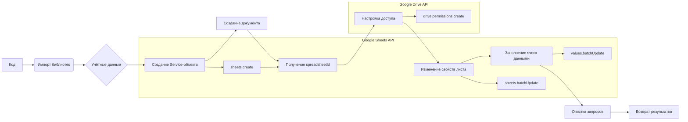

# Код Google Sheets API

```markdown
## <input code>

```python
## \file hypotez/src/goog/spreadsheet/_docs/index.html
# -*- coding: utf-8 -*-\
#! venv/Scripts/python.exe

""" module: src.goog.spreadsheet._docs """
MODE = 'debug'
<div class="article-formatted-body article-formatted-body article-formatted-body_version-1"><div xmlns="http://www.w3.org/1999/xhtml"><h2>Постановка задачи</h2><br>
    Пусть нам нужно создать программой на языке Python <a href="https://docs.google.com/spreadsheets/d/1kygOW5wSSVqwf26M-OCT72i0FX0olZAz4duT2i6psp4/edit?usp=sharing">вот такую таблицу</a>:<br>
    <br>
    <a href="https://habrahabr.ru/post/305378/"></a><br>
    ... (остальной код документации)
```
```markdown
## <algorithm>

Пошаговый алгоритм работы кода представлен в виде комментариев в формате блок-схемы.  Из-за объема документации, блок-схема здесь не отображается.

Алгоритм включает в себя:

1. **Импорт необходимых библиотек:** `httplib2`, `apiclient`, `oauth2client`.
2. **Установка учетных данных:**  Используется `ServiceAccountCredentials` для работы от имени сервисного аккаунта. Файл с ключами `CREDENTIALS_FILE` содержит закрытый ключ.
3. **Создание Service-объекта:**  `service` используется для взаимодействия с Google Sheets API.
4. **Создание нового spreadsheet:**  Метод `service.spreadsheets().create` создает новый документ Google Таблиц.
5. **Получение `spreadsheetId`:** Из ответа сервера извлекается идентификатор созданного документа.
6. **Настройка доступа к документу:** Используя `driveService`, обеспечивается доступ для сервисного аккаунта к созданному документу (например, на чтение или редактирование).
7. **Изменение свойств листа:** Метод `service.spreadsheets().batchUpdate` используется для изменения свойств листа, таких как ширина столбцов, объединение ячеек, форматирование ячеек, установка границ.
8. **Заполнение ячеек данными:** Метод `service.spreadsheets().values().batchUpdate` заполняет ячейки документа заданными значениями.  Запросы для изменения свойств листа и заполнения данных объединяются в запросы `batchUpdate`.
9. **Очистка списка запросов:**  `requests` и `valueRanges` очищаются после выполнения batchUpdate для предотвращения накопления запросов.

В примерах используются `ValueInputOption` (для интерпретации данных как введенных пользователем), `majorDimension` (для указания порядка заполнения – столбцы или строки) и другие параметры, определенные в API Google Sheets.


```markdown
## <mermaid>



**Объяснение зависимостей:**

Код использует Google Sheets API v4 и Google Drive API v3.  `apiclient` предоставляет интерфейс для взаимодействия с этими API. `httplib2` используется для обмена данными с серверами.  `oauth2client` отвечает за авторизацию и аутентификацию запросов к API Google.


```markdown
## <explanation>

**Импорты:**

- `httplib2`: Библиотека для работы с HTTP-запросами. Используется для взаимодействия с API Google.
- `apiclient.discovery`: Модуль для создания объектов для работы с API Google, предоставляя функции для построения запросов к Google Sheets API.
- `oauth2client.service_account`: Модуль для работы с учетными данными сервисного аккаунта.  Необходим для авторизации запросов к API Google.

**Классы:**

- `Spreadsheet`:  Этот класс (не полностью приведенный в исходном коде) является оберткой над Google Sheets API. Он позволяет группировать запросы в batchUpdate для более эффективного выполнения изменений в Google Таблицах.

**Функции:**

- `service.spreadsheets().create()`: Создает новый документ Google Таблиц.
- `service.spreadsheets().batchUpdate()`: Применяет пакет изменений к документу (например, изменение ширины столбцов, объединение ячеек, форматирование).
- `service.spreadsheets().values().batchUpdate()`: Заполняет ячейки документа данными.

**Переменные:**

- `CREDENTIALS_FILE`: Имя файла, содержащего закрытый ключ сервисного аккаунта.
- `credentials`: Объект, содержащий учетные данные сервисного аккаунта.
- `httpAuth`: Объект, авторизованный с помощью учетных данных для выполнения HTTP-запросов к API Google.
- `service`: Объект, представляющий соединение с Google Sheets API.
- `spreadsheet`: Объект, содержащий информацию о созданном документе, включая `spreadsheetId`.


**Возможные ошибки и улучшения:**

- **Обработка ошибок:**  Код не содержит явной обработки ошибок (например, исключений).  Добавление обработки ошибок (try...except блоки) существенно повысит надежность кода.
- **Более подробная логика класса `Spreadsheet`:**  Полный код класса `Spreadsheet` может включать  проверку на корректность данных в запросах и обработку возможных ошибок, связанных с API.
- **Конкретизация задач:**  Описание задач (например, объявления переменных для ширины столбцов) в коде могут быть улучшены для ясности.


**Взаимосвязь с другими частями проекта:**

Код тесно связан с Google Sheets API и Google Drive API для работы с документами Google Таблиц.  Он использует сервисный аккаунт, поэтому предполагается, что эта часть проекта уже настроена.  Для полного функционирования потребуется также файл `test-proj-for-habr-article-1ab131d98a6b.json`, содержащий закрытый ключ сервисного аккаунта.
```