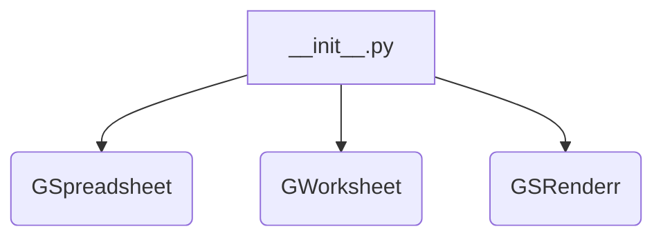
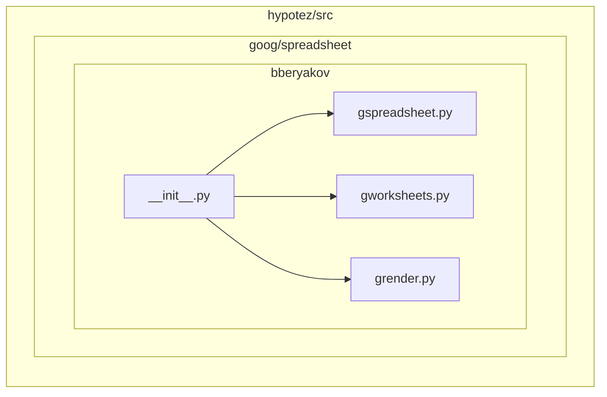

# Анализ кода hypotez/src/goog/spreadsheet/bberyakov/__init__.py

## <input code>

```python
## \file hypotez/src/goog/spreadsheet/bberyakov/__init__.py
# -*- coding: utf-8 -*-\
#! venv/Scripts/python.exe
#! venv/bin/python/python3.12

"""
.. module: src.goog.spreadsheet.bberyakov 
	:platform: Windows, Unix
	:synopsis:

"""
MODE = 'dev'

from .gspreadsheet import GSpreadsheet
from .gworksheets import GWorksheet
from .grender import GSRenderr
```

## <algorithm>

Этот код представляет собой инициализационный модуль (`__init__.py`) для пакета `bberyakov` в подпакете `spreadsheet` проекта `hypotez`.  В нём импортируются классы/модули из других файлов этого пакета.  Блок-схема в данном случае простая - импорт:



Данные не перемещаются между функциями или методами, так как это только импорт.  Логика выполнения заложено в импортируемых модулях (gspreadsheet, gworksheets, grender).


## <mermaid>



## <explanation>

**Импорты:**

* `from .gspreadsheet import GSpreadsheet`: Импортирует класс `GSpreadsheet` из файла `gspreadsheet.py` в текущем подпакете.  Это указывает на то, что `gspreadsheet.py` содержит определение класса `GSpreadsheet`, который, вероятно, связан с работой с Google Spreadsheets.
* `from .gworksheets import GWorksheet`: Импортирует класс `GWorksheet` из файла `gworksheets.py`. Вероятно, этот класс связан с работой с отдельными листами Google Spreadsheets.
* `from .grender import GSRenderr`: Импортирует класс или функцию `GSRenderr` из файла `grender.py`. Вероятно, этот класс/функция отвечает за визуализацию или рендеринг данных из таблиц Google Spreadsheets.

**Классы:**

* Классы `GSpreadsheet`, `GWorksheet`, и `GSRenderr` определены в соответствующих файлах (`gspreadsheet.py`, `gworksheets.py`, `grender.py`).  Конкретные реализации и функциональность этих классов будут раскрываться при просмотре данных файлов.

**Переменные:**

* `MODE = 'dev'`: Переменная глобального уровня.  Вероятно, используется для определения режима работы (например, 'dev' - для разработки, 'prod' - для производства).

**Функции:**

Нет функций в данном файле.

**Возможные ошибки и улучшения:**

* Отсутствует явное описание назначения модуля.
* Отсутствие документации к классам `GSpreadsheet`, `GWorksheet`, и `GSRenderr`  в файлах `gspreadsheet.py`, `gworksheets.py`, и `grender.py` снижает читаемость и понимание.

**Цепочка взаимосвязей:**

Модуль `__init__.py` в пакете `bberyakov` является частью более крупной структуры проекта `hypotez`.  Он связывает классы и модули в подпакете `spreadsheet` с внешними системами (Google Spreadsheets, скорее всего).  Для полного понимания нужно проанализировать файлы `gspreadsheet.py`, `gworksheets.py` и `grender.py`.