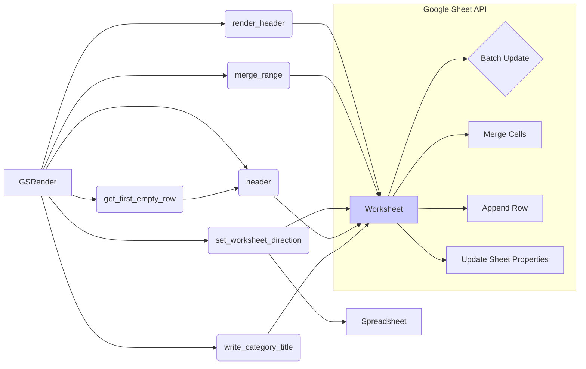

```MD
# <input code>

```python
## \file hypotez/src/goog/spreadsheet/bberyakov/grender.py
# -*- coding: utf-8 -*-\n#! venv/Scripts/python.exe\n#! venv/bin/python/python3.12\n
"""
.. module: src.goog.spreadsheet.bberyakov 
	:platform: Windows, Unix
	:synopsis:

"""
MODE = 'dev'

"""
	:platform: Windows, Unix
	:synopsis:

"""

"""
	:platform: Windows, Unix
	:synopsis:

"""


"""
  :platform: Windows, Unix

"""
"""
  :platform: Windows, Unix
  :platform: Windows, Unix
  :synopsis:
"""MODE = 'dev'
  
""" module: src.goog.spreadsheet.bberyakov """


"""  Render Google Table

 
 @section libs imports:
  - json 
  - typing 
  - gspread_formatting 
  - gspread 
  - goog.helpers 
  - gspread.utils 
  
Author(s):
  - Created by [Davidka] [BenAvraham] on 08.11.2023 .
"""
# ------------------------------
from src import gs
from src.helpers import logger, WebDriverException,  pprint

# -------------------------------


import json
from typing import List, Type, Union
from spread_formatting import *
from spread import Spreadsheet, Worksheet
from goog.helpers import hex_color_to_decimal, decimal_color_to_hex, hex_to_rgb

from spread.utils import ValueInputOption, ValueRenderOption


class GSRender():
    """
     [Class's description]


    """
    """
     Table Render
    Украшательства. 
    ------------------------------
    class CellFormat(
        numberFormat: Any | None = None,
        backgroundColor: Any | None = None,
        borders: Any | None = None,
        padding: Any | None = None,
        horizontalAlignment: Any | None = None,
        verticalAlignment: Any | None = None,
        wrapStrategy: Any | None = None,
        textDirection: Any | None = None,
        textFormat: Any | None = None,
        hyperlinkDisplayType: Any | None = None,
        textRotation: Any | None = None,
        backgroundColorStyle: Any | None = None
    )
    """
    render_schemas: dict
    

    def __init__ (self, *args, **kwards) -> None:
        """
         [Function's description]

        Parameters : 
             self : [description]
             *args : [description]
             **kwards : [description]
        Returns : 
             None : [description]

        """
        #self.render_schemas = json.loads('goog\schema.json')
        ...
    
    def render_header (self, ws: Worksheet, world_title: str, range: str = 'A1:Z1', merge_type: str('MERGE_ALL') | str('MERGE_COLUMNS') | str('MERGE_ROWS') = 'MERGE_ALL' ) -> None:
        """
         Рисую заголовок таблицы в первой строке

        Parameters : 
             self : [description]
             ws : Worksheet : таблица в книге
             world_title : str : заголовок гугл таблицы
             range : 'A1:Z1' : диапазон ячеек
             merge_type : str('MERGE_ALL') | str('MERGE_COLUMNS') | str('MERGE_ROWS') = 'MERGE_ALL' : 'MERGE_ALL' | 'MERGE_COLUMNS' | 'MERGE_ROWS'
        Returns : 
             None : [description]

        """
        # ... (rest of the code)
```

# <algorithm>

**Описание алгоритма**

Код реализует класс `GSRender` для форматирования и редактирования Google Spreadsheets.  Алгоритм разбивается на функции для отдельных операций.

1. **`render_header`**:
   - Принимает `Worksheet` и строку `world_title` (заголовок).
   - Устанавливает цвет фона и текста заголовка.
   - Создает объект `CellFormat` с заданными параметрами.
   - Применяет `ConditionalFormatRule` для форматирования ячеек.  (Если значение ячейки больше 50).
   - Устанавливает высоту строки.
   - Применяет форматирование к заданному диапазону ячеек.
   - Вызывает `merge_range` для объединения ячеек.

2. **`merge_range`**:
   - Объединяет ячейки в заданном диапазоне по типу `merge_type`.

3. **`set_worksheet_direction`**:
   - Изменяет направление листа Google Sheet на право-налево (`rtl`).

4. **`header`**:
   - Находит первую пустую строку в листе.
   - Добавляет строку заголовка `ws_header`.
   - Форматирует диапазон ячеек заголовка.

5. **`write_category_title`**:
   - Находит первую пустую строку в листе.
   - Добавляет строку категории `ws_category_title`.
   - Объединяет ячейки в строке категории.


6. **`get_first_empty_row`**:
   - Находит первую пустую строку в заданной колонке (`by_col`) или в последней строке таблицы.

**Пример данных и их перемещение:**

- Входные данные для `render_header`: `ws` (экземпляр класса `Worksheet`), `world_title` (строка).
- Входные данные для `merge_range`: `ws` (экземпляр класса `Worksheet`), `range` (диапазон ячеек), `merge_type` (тип объединения).
- Результаты функций возвращаются или используются как аргументы для следующих вызовов функций.


# <mermaid>



# <explanation>

**Импорты:**

- `from src import gs`: Импортирует модуль `gs` из пакета `src`. Предположительно, `gs` отвечает за взаимодействие с Google Sheets API.
- `from src.helpers import logger, WebDriverException, pprint`: Импортирует модули `logger`, `WebDriverException`, `pprint` из пакета `src.helpers`.  `logger` – ведение логов, `WebDriverException` – исключение для взаимодействия с браузерами (вероятно, используется для тестирования), `pprint` –  форматированный вывод.
- `import json`: Импортирует модуль `json` для работы с JSON-данными.
- `from typing import List, Type, Union`: Импортирует типы данных из модуля `typing`, что используется для ясности и проверки типов данных в коде.
- `from spread_formatting import *`: Импортирует все определения из модуля `spread_formatting`, вероятно, содержащего функции для форматирования ячеек.
- `from spread import Spreadsheet, Worksheet`: Импортирует классы `Spreadsheet` и `Worksheet` из модуля `spread`. Предполагается, что `Spreadsheet` представляет собой всю Google таблицу, а `Worksheet` — отдельный лист.
- `from goog.helpers import hex_color_to_decimal, decimal_color_to_hex, hex_to_rgb`: Импортирует функции для преобразования цветов из разных представлений. Вероятно, определены в модуле `goog.helpers`.
- `from spread.utils import ValueInputOption, ValueRenderOption`: Импортирует константы `ValueInputOption` и `ValueRenderOption` (вероятно, для опций ввода и рендеринга данных в ячейки).


**Классы:**

- `GSRender`: Класс, отвечающий за рендеринг (отображение и форматирование) данных в Google Sheet. Содержит методы для выполнения различных операций (формирование заголовка, объединение ячеек, изменение направления листа).
- `CellFormat`, `Color`, `TextFormat`, `ConditionalFormatRule`, `BooleanRule`, `BooleanCondition`, `GridRange`: Непосредственно классы из пакета `spread` или `spread_formatting`, которые определены выше и используются для форматирования ячеек.  


**Функции:**

- `render_header`, `merge_range`, `set_worksheet_direction`, `header`, `write_category_title`, `get_first_empty_row`:  Функции, реализующие функционал класса. Каждая функция имеет понятные комментарии, описывающие их назначение и параметры.


**Переменные:**

- `MODE`: Переменная, вероятно, хранит режим работы (например, 'dev' или 'prod').
- `ws`, `world_title`, `range`, `merge_type`, `sh`, `ws_header`, `ws_category_title`, `row`, `by_col`, `table_range` – переменные, хранящие данные, необходимые для работы функций класса.  Они имеют определенные типы данных, прописанные через `typing`, что повышает читаемость кода.

**Возможные ошибки и улучшения:**

- Отсутствует обработка исключений при взаимодействии с Google Sheets API (например, если произошла ошибка при добавлении строки).  Рекомендуется добавить `try...except` блоки для обработки подобных ситуаций.
- Не указаны типы возвращаемых значений.
-  Недостаточно комментариев к функциям.  Комментарии, в частности, не описывают, какие именно данные возвращаются при вызове функции, хотя в документации к функции это явно указано.

**Взаимосвязи с другими частями проекта:**

- Класс `GSRender` зависит от других модулей,  связанных с Google Sheets API и форматированием.  Эти зависимости не ясны без доступа к `src`, `src.helpers`, `spread`, `spread_formatting`, и `goog.helpers`.