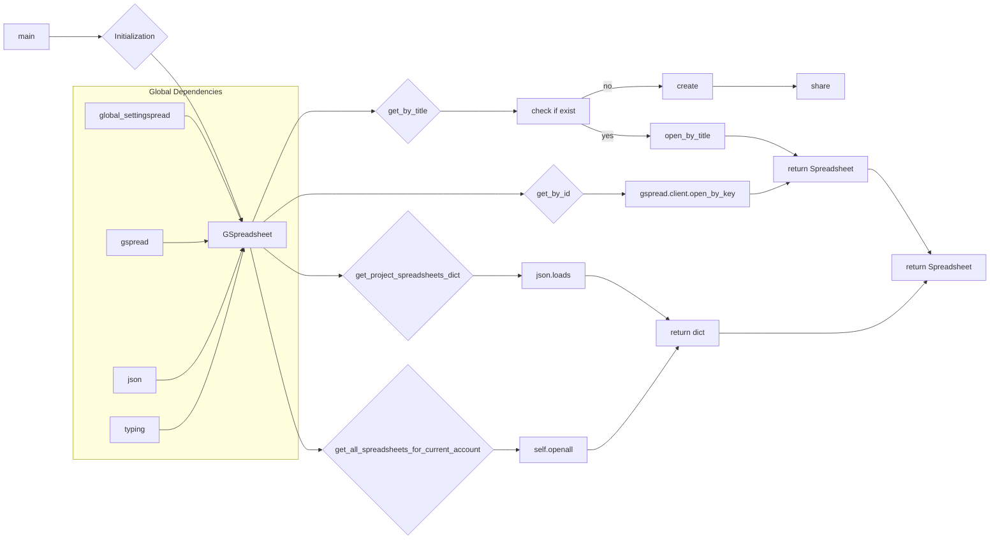

# <input code>

```python
## \file hypotez/src/goog/spreadsheet/bberyakov/gspreadsheet.py
# -*- coding: utf-8 -*-\
#! venv/Scripts/python.exe
#! venv/bin/python/python3.12

"""
.. module: src.goog.spreadsheet.bberyakov 
	:platform: Windows, Unix
	:synopsis:

"""
MODE = 'dev'

"""
	:platform: Windows, Unix
	:synopsis:

"""

"""
	:platform: Windows, Unix
	:synopsis:

"""

"""
  :platform: Windows, Unix

"""
"""
  :platform: Windows, Unix
  :platform: Windows, Unix
  :synopsis:
"""MODE = 'dev'
  
""" module: src.goog.spreadsheet.bberyakov """


"""  [File's Description]

@namespace src: src
 \package beeryakov.goog
\file gspreadsheet.py

 @section libs imports:
  - gspread 
  - gspread 
  - json 
  - typing 
Author(s):
  - Created by [Davidka] [BenAvraham] on 08.11.2023 .
"""

from global_settingspread import Spreadsheet, service_account
import gspread
#import gs
#from global_settings import GWorksheet
import json
from typing import List, Type, Union

# see another app in
# https://github.com/xflr6/GSpreadsheet


class GSpreadsheet(Spreadsheet):
    """
     [Class's description]

    ## Inheritances : 
        - Implements Spreadsheet : [description]

    """
    """
    Книга Google sheets 
    """
    gsh: Spreadsheet = None # <- книга
    # """ Книги """

    gclient = gspread.client
    
    def __init__(self, s_id: str = None, s_title: str = None, *args, **kwards):
        """
         [Function's description]

        Parameters : 
             self : [description]
             s_id : str = None : [description]
             s_title : str = None : [description]
             *args : [description]
             **kwards : [description]

        """
        """
        Книга google spreadsheet
        """
        
        secret_file = f'goog\\onela-hypotez-1aafa5e5d1b5.json'
        self.gclient = service_account(filename = secret_file)
        if s_id:
            self.gsh = self.get_by_id('1ZcK74BCgWKVr4kODjPmSvjp5IyO0OxhXdbeHKWzLQiM')
        if s_title:
            self.gsh = self.get_by_title(s_title)
   
    def get_project_spreadsheets_dict(self) -> dict:
        """
         [Function's description]

        Parameters : 
             self : [description]
        Returns : 
             dict : [description]

        """
        return json.loads('goog\\spreadsheets.json')
    
    #def create_spreadsheet (self, sh_title: str = 'New Spreadsheet') -> Spreadsheet:
    def get_by_title (self, sh_title: str = 'New Spreadsheet'):
        """
         [Function's description]

        Parameters : 
             self : [description]
             sh_title : str = 'NewSpreadsheet' : [description]

        """
        """
        Создаю книгу, если такой нет
        """
        if sh_title not in [sh.title for sh in self.gsh.openall()]:
            self.gsh.create(sh_title)
            self.gsh.share('d07708766@gmail.com', perm_type='user', role='writer')

            # _gsh = self.create(sh_title)
            # self.set_spreadsheet_direction(_gsh, 'rtl')
            # _gsh.share('d07708766@gmail.com', perm_type='user', role='writer')
            # self = _gsh
        else:
            print(f'Spreadsheet {sh_title} already exist')
            self.gsh.open_by_title(sh_title)

    def get_by_id (self, sh_id: str) -> Spreadsheet:
        """
         [Function's description]

        Parameters : 
             self : [description]
             sh_id : str : [description]
        Returns : 
             Spreadsheet : [description]

        """
        """
        Открываю таблицу
        """
        #self = self.gclient.open_by_key (sh_id)
        return self.gclient.open_by_key (sh_id)
   
    def get_all_spreadsheets_for_current_account (self):
        """
         [Function's description]

        Parameters : 
             self : [description]

        """
        """
        открываю все книги (spreadsheets) аккаунта
        """
        return self.openall()
    
    
```

# <algorithm>

**Шаг 1:** Импортирование необходимых библиотек (gspread, json, typing, global_settingspread).
*   Пример: `from global_settingspread import Spreadsheet, service_account`  — импортирует классы и функцию из модуля `global_settingspread`.

**Шаг 2:** Определение класса `GSpreadsheet`, который наследуется от класса `Spreadsheet`.
*   Пример: `class GSpreadsheet(Spreadsheet):` — создает класс для работы с Google Sheets.

**Шаг 3:** Инициализация класса `GSpreadsheet`.
*   Пример: `self.gclient = service_account(filename = secret_file)`  — получает объект аутентификации Google.
*   В зависимости от входных параметров, инициализация может подгружать таблицу по ID или названию.

**Шаг 4:** Функция `get_by_title`:
*   Проверяет, существует ли таблица с данным названием. Если нет, создает её.
*   Пример: `self.gsh.create(sh_title)` — создает таблицу с указанным названием.
*   Разрешает доступ к таблице для пользователя.
*   Если таблица существует, открывает её.

**Шаг 5:** Функция `get_by_id`:
*   Открывает таблицу по её ID.
*   Возвращает объект Spreadsheet, представляющий открытую таблицу.
*   Пример: `return self.gclient.open_by_key(sh_id)` — возвращает объект, представляющий открытую таблицу.

**Шаг 6:** Функция `get_project_spreadsheets_dict`:
*   Загружает данные о таблицах из файла `spreadsheets.json`.
*   Пример: `return json.loads('goog\\spreadsheets.json')` — загружает JSON-данные и возвращает их в виде словаря.

**Шаг 7:** Функция `get_all_spreadsheets_for_current_account`:
*   Возвращает все таблицы текущего аккаунта.
*   Пример: `return self.openall()` — предполагается, что `self.openall()` — метод для получения всех таблиц.

Данные передаются между классами и методами в виде аргументов, а также через атрибуты объекта `GSpreadsheet` (например, `self.gsh`).


# <mermaid>



**Описание диаграммы:**

Диаграмма показывает основные взаимосвязи в коде. `GSpreadsheet` - главный класс, который использует методы `get_by_id`, `get_by_title` и др. для работы с Google Sheets. `gspread`, `json`, и `typing` - библиотеки, которые используются в `GSpreadsheet`. `global_settingspread` - модуль, от которого `GSpreadsheet` наследуется.

# <explanation>

**Импорты:**

- `from global_settingspread import Spreadsheet, service_account`: Импортирует классы `Spreadsheet` и функцию `service_account` из модуля `global_settingspread`.  Эти импорты предполагают, что `global_settingspread` содержит определения классов и функций для работы с Google Sheets, включая аутентификацию.

- `import gspread`: Импортирует библиотеку `gspread` для взаимодействия с Google Sheets API.

- `import json`: Импортирует модуль `json` для работы с JSON-данными (вероятно, для обработки конфигурации или данных).

- `from typing import List, Type, Union`: Импортирует типы данных из модуля `typing` для улучшения читаемости и поддержки статической типизации.

**Классы:**

- `GSpreadsheet`:  Этот класс расширяет функционал `Spreadsheet` (из `global_settingspread`). Он предназначен для работы с Google Sheets, предоставляя методы для создания, чтения, изменения и удаления таблиц. Важно отметить, что в представленном коде нет реализации методов, предполагаемых в `Spreadsheet` (например, `create`, `set_spreadsheet_direction`).

**Функции:**

- `__init__(self, s_id: str = None, s_title: str = None, *args, **kwards)`:  Конструктор класса `GSpreadsheet`. Он инициализирует атрибут `gclient` с помощью `service_account`, а затем использует параметры `s_id` и `s_title` для получения нужной таблицы.

- `get_by_title(self, sh_title: str = 'New Spreadsheet')`: Создает или открывает таблицу в Google Sheets по названию `sh_title`.

- `get_by_id(self, sh_id: str) -> Spreadsheet`:  Открывает таблицу в Google Sheets по её ID `sh_id` и возвращает соответствующий объект.

- `get_project_spreadsheets_dict(self) -> dict`: Возвращает данные о таблицах в JSON-формате (предположительно, из файла `spreadsheets.json`).

- `get_all_spreadsheets_for_current_account(self)`: Возвращает список всех таблиц в Google Sheets для текущего пользователя.


**Возможные ошибки и улучшения:**

- **Обработка ошибок:** Нет обработки ошибок при работе с файлами (например, `goog\\spreadsheets.json`). Если файл не существует, то код будет вызывать исключение.  Необходимо добавить проверку существования файла и обработку исключений (try...except).
- **Аутентификация:** Путь к файлу `goog\\onela-hypotez-1aafa5e5d1b5.json` должен быть правильным и доступным.
- **Повторное использование кода:**  Код для получения таблицы по названию и по ID повторяется.  Возможно, можно создать общий метод `get_spreadsheet`, который будет принимать тип запроса и аргументы.
- **Документация:**  Не хватает подробной документации для каждого класса и метода.
- **Неиспользуемые импорты/переменные:** В коде есть неиспользуемые импорты (`gs`, `GWorksheet`).
- **Зависимость от внешнего файла:** `spreadsheets.json` хранит данные вне кодовой базы.  Желательно перенести данные, если они не конфиденциальны, в сам код.
- **Проверка существования файла:**  Код предполагает существование файла `goog\\spreadsheets.json`.  Нужно добавить проверку на наличие файла.
- **Обработка JSON:** `json.loads('goog\\spreadsheets.json')` — нужно обеспечить, чтобы `'goog\\spreadsheets.json'` содержал корректный JSON.


В целом, код имеет потенциал, но нуждается в улучшении, как описано выше.  Уточнение недостающей логики и функциональности в `global_settingspread` необходимо для полного понимания работы.