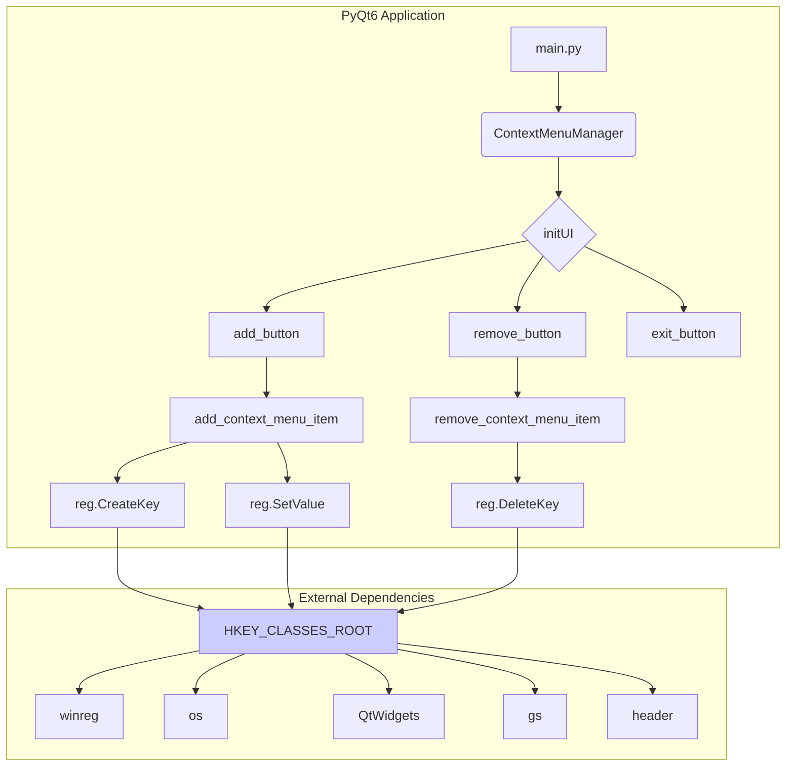

# <input code>

```python
## \file hypotez/src/gui/context_menu/qt6/main.py
# -*- coding: utf-8 -*-\
#! venv/Scripts/python.exe
#! venv/bin/python/python3.12

"""
.. module: src.gui.context_menu.qt6 
	:platform: Windows, Unix
	:synopsis:

"""
MODE = 'dev'


"""
	:platform: Windows, Unix
	:synopsis:

"""


"""
	:platform: Windows, Unix
	:synopsis:

"""


"""
  :platform: Windows, Unix

"""
"""
  :platform: Windows, Unix
  :platform: Windows, Unix
  :synopsis:
"""MODE = 'dev'
  
""" module: src.gui.context_menu.qt6 """


"""Module to add or remove context menu items for the desktop and folder background using PyQt6.

This module provides functions to add or remove a custom context menu item called 
'hypo AI assistant' for the background of directories and the desktop in Windows Explorer.
It uses the Windows Registry to achieve this, with paths and logic implemented to target
the right-click menu on empty spaces (not on files or folders).
"""

import winreg as reg  # Module for interacting with Windows Registry
import os  # Module for OS path manipulation and checks
from PyQt6 import QtWidgets  # Module for GUI creation with PyQt6

import header  # Custom import, assuming it initializes settings or constants
from src import gs  # Custom import, likely for path settings or project structure


def add_context_menu_item():
    """Adds a context menu item to the desktop and folder background.

    This function creates a registry key under 'HKEY_CLASSES_ROOT\Directory\Background\shell' 
    to add a menu item named 'hypo AI assistant' to the background context menu in Windows Explorer.
    The item runs a Python script when selected.

    Registry Path Details:
        - `key_path`: Directory\Background\shell\hypo_AI_assistant
            This path adds the context menu item to the background of folders and 
            the desktop, allowing users to trigger it when right-clicking on empty space.
        
        - `command_key`: Directory\Background\shell\hypo_AI_assistant\command
            This subkey specifies the action for the context menu item and links it to a script 
            or command (in this case, a Python script).
    
    Raises:
        Displays an error message if the script file does not exist.
    """
    
    # Registry path for adding a menu item to the background of folders and the desktop
    key_path = r"Directory\\Background\\shell\\hypo_AI_assistant"

    try:
        with reg.CreateKey(reg.HKEY_CLASSES_ROOT, key_path) as key:
            reg.SetValue(key, "", reg.REG_SZ, "hypo AI assistant")  # Display name of the context menu item
            
            command_key = rf"{key_path}\\command"
            with reg.CreateKey(reg.HKEY_CLASSES_ROOT, command_key) as command:
                command_path = gs.path.src / 'gui' / 'context_menu' / 'main.py'
                if not os.path.exists(command_path):
                    QtWidgets.QMessageBox.critical(None, "Ошибка", f"Файл {command_path} не найден.")
                    return
                reg.SetValue(command, "", reg.REG_SZ, f"python \\"{command_path}\\" \\"%1\\"")
        QtWidgets.QMessageBox.information(None, "Успех", "Пункт меню успешно добавлен!")
    except Exception as ex:
        QtWidgets.QMessageBox.critical(None, "Ошибка", f"Ошибка: {ex}")


def remove_context_menu_item():
    """Removes the 'hypo AI assistant' context menu item.

    This function deletes the registry key responsible for displaying the custom
    context menu item, effectively removing it from the background context menu.

    Registry Path Details:
        - `key_path`: Directory\Background\shell\hypo_AI_assistant
            This path targets the custom context menu item and deletes it from the 
            background context menu of the desktop and folders.
    
    Raises:
        Displays a warning if the menu item does not exist, and an error if the operation fails.
    """
    key_path = r"Directory\\Background\\shell\\hypo_AI_assistant"
    try:
        reg.DeleteKey(reg.HKEY_CLASSES_ROOT, key_path)
        QtWidgets.QMessageBox.information(None, "Успех", "Пункт меню успешно удален!")
    except FileNotFoundError:
        QtWidgets.QMessageBox.warning(None, "Предупреждение", "Пункт меню не найден.")
    except Exception as e:
        QtWidgets.QMessageBox.critical(None, "Ошибка", f"Ошибка: {e}")


class ContextMenuManager(QtWidgets.QWidget):
    """Main application window for managing the custom context menu item."""

    def __init__(self):
        super().__init__()
        self.initUI()

    def initUI(self):
        self.setWindowTitle("Управление контекстным меню")
        layout = QtWidgets.QVBoxLayout()
        add_button = QtWidgets.QPushButton("Добавить пункт меню")
        add_button.clicked.connect(add_context_menu_item)
        layout.addWidget(add_button)
        remove_button = QtWidgets.QPushButton("Удалить пункт меню")
        remove_button.clicked.connect(remove_context_menu_item)
        layout.addWidget(remove_button)
        exit_button = QtWidgets.QPushButton("Выход")
        exit_button.clicked.connect(self.close)
        layout.addWidget(exit_button)
        self.setLayout(layout)


if __name__ == "__main__":
    app = QtWidgets.QApplication([])
    window = ContextMenuManager()
    window.show()
    app.exec()
```

# <algorithm>

**Шаг 1:** Инициализация приложения PyQt6.

**Шаг 2:** Создание главного окна `ContextMenuManager`.

**Шаг 3:** Создание элементов управления (кнопок "Добавить", "Удалить", "Выход") и их размещение в окне.

**Шаг 4:** Подключение обработчиков событий для кнопок:
    * Кнопка "Добавить": Вызов функции `add_context_menu_item()`.
    * Кнопка "Удалить": Вызов функции `remove_context_menu_item()`.
    * Кнопка "Выход": Выход из приложения.

**Шаг 5:** Показ главного окна.

**Шаг 6:** Запуск цикла обработки событий приложения.

**Пример перемещения данных:**

Клик по кнопке "Добавить" вызывает функцию `add_context_menu_item()`, которая:

1. Обращается к реестру Windows.
2. Создает новые ключи в реестре для контекстного меню.
3. Записывает команду запуска python-скрипта в реестр.
4. Выводит сообщение об успехе или ошибке.

Функции `add_context_menu_item()` и `remove_context_menu_item()` взаимодействуют с реестром Windows. Данные об успехе/ошибке операции добавляются в реестр.


# <mermaid>



# <explanation>

**Импорты:**

* `winreg`: Модуль для взаимодействия с реестром Windows.  Необходим для создания и управления ключами реестра. Связь с `src` - непрямая, поскольку он встроен в Python.
* `os`: Модуль для работы с операционной системой. Используется для проверки существования файлов.  Необходим для проверки существования файлов. Связь с `src` - непрямая, поскольку он встроен в Python.
* `QtWidgets`: Модуль для создания пользовательских интерфейсов в PyQt6. Необходим для создания элементов управления (кнопок) и диалоговых окон. Связь с `src` - непрямая, поскольку он встроен в PyQt6.
* `header`:  Кастомый импорт, вероятно, содержит константы или настройки. Необходим, скорее всего, для доступа к дополнительным данным. Связь с `src` - прямая, поскольку импортируется из пакета `src`.
* `gs`: Кастомый импорт, вероятно, содержит данные о путях или структуре проекта.  Необходим для получения пути к скрипту. Связь с `src` - прямая, поскольку импортируется из пакета `src`.

**Классы:**

* `ContextMenuManager`: Класс, представляющий главное окно приложения.  Он имеет конструктор `__init__` для инициализации и метод `initUI`, отвечающий за создание интерфейса с кнопками. Взаимодействует с функциями `add_context_menu_item` и `remove_context_menu_item`.  Связь с другими частями проекта - прямая через вызовы функций.


**Функции:**

* `add_context_menu_item()`: Добавляет пункт контекстного меню в реестр. Принимает и использует данные из других частей проекта. Возвращаемого значения нет, есть обработка ошибок и сообщения.

* `remove_context_menu_item()`: Удаляет пункт контекстного меню из реестра. Аналогично, принимает и использует данные из других частей проекта. Возвращаемого значения нет, есть обработка ошибок и сообщения.

**Переменные:**

`key_path`, `command_key`, `command_path`:  Строковые переменные, содержащие пути к ключам реестра и скрипта соответственно.


**Возможные ошибки и улучшения:**

* **Обработка ошибок:**  Обработка исключений, например, `FileNotFoundError` в `remove_context_menu_item`, должна быть более полной. Следует проверять все возможные исключения, связанные с доступом к реестру, чтобы приложение не вылетало при любых проблемах.
* **Логирование:** Включение логирования (например, с помощью `logging`) для отслеживания операций и ошибок.
* **Параметризация:** Путь к скрипту (`command_path`) можно сделать параметризуемым (например, использовать константу или переменную), что сделает код более гибким.


**Цепочка взаимосвязей с другими частями проекта:**

Модуль использует `gs`, что подразумевает существование пакета `src.gs`, содержащего настройки путей. Также используется импорт `header`, который предполагает наличие модуля `src.header`, содержащего, по всей вероятности, настройки и константы, необходимые для работы приложения. Взаимодействие с другими частями проекта происходит через импорт.


**Важно:** Код рассчитан на Windows. Для других операционных систем потребуется адаптация.