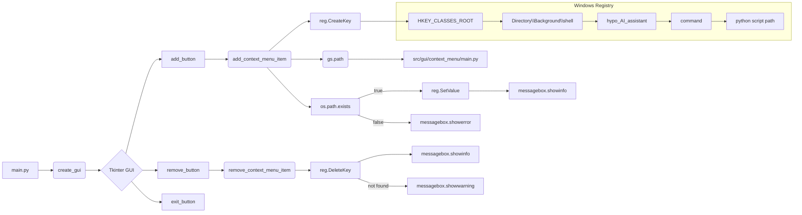

# <input code>

```python
## \file hypotez/src/gui/context_menu/tkinter/main.py
# -*- coding: utf-8 -*-\
#! venv/Scripts/python.exe
#! venv/bin/python/python3.12

"""
.. module: src.gui.context_menu.tkinter 
	:platform: Windows, Unix
	:synopsis:

"""
MODE = 'dev'


"""
	:platform: Windows, Unix
	:synopsis:

"""


"""
	:platform: Windows, Unix
	:synopsis:

"""


"""
  :platform: Windows, Unix

"""
"""
  :platform: Windows, Unix
  :platform: Windows, Unix
  :synopsis:
"""MODE = 'dev'
  
""" module: src.gui.context_menu.tkinter """


"""Module to add or remove context menu items for the desktop and folder background.

This module provides functions to add or remove a custom context menu item called 
'hypo AI assistant' for the background of directories and the desktop in Windows Explorer.
It uses the Windows Registry to achieve this, with paths and logic implemented to target
the right-click menu on empty spaces (not on files or folders).
"""

import winreg as reg  # Module for interacting with Windows Registry
import os  # Module for OS path manipulation and checks
import tkinter as tk  # Module for GUI creation
from tkinter import messagebox  # Submodule for GUI message boxes

import header  # Custom import, assuming it initializes settings or constants
from src import gs  # Custom import, likely for path settings or project structure

def add_context_menu_item():
    """Adds a context menu item to the desktop and folder background.

    This function creates a registry key under 'HKEY_CLASSES_ROOT\Directory\Background\shell' 
    to add a menu item named 'hypo AI assistant' to the background context menu in Windows Explorer.
    The item runs a Python script when selected.

    Registry Path Details:
        - `key_path`: Directory\Background\shell\hypo_AI_assistant
            This path adds the context menu item to the background of folders and 
            the desktop, allowing users to trigger it when right-clicking on empty space.
        
        - `command_key`: Directory\Background\shell\hypo_AI_assistant\command
            This subkey specifies the action for the context menu item and links it to a script 
            or command (in this case, a Python script).
    
    Raises:
        Displays an error message if the script file does not exist.
    """

    key_path = r"Directory\\Background\\shell\\hypo_AI_assistant"

    try:
        with reg.CreateKey(reg.HKEY_CLASSES_ROOT, key_path) as key:
            reg.SetValue(key, "", reg.REG_SZ, "hypo AI assistant")
            command_key = rf"{key_path}\\command"
            with reg.CreateKey(reg.HKEY_CLASSES_ROOT, command_key) as command:
                command_path = gs.path.src / 'gui' / 'context_menu' / 'main.py'
                if not os.path.exists(command_path):
                    messagebox.showerror("Ошибка", f"Файл {command_path} не найден.")
                    return
                reg.SetValue(command, "", reg.REG_SZ, f"python \\"{command_path}\\" \\"%1\\"")
        messagebox.showinfo("Успех", "Пункт меню успешно добавлен!")
    except Exception as ex:
        messagebox.showerror("Ошибка", f"Ошибка: {ex}")

def remove_context_menu_item():
    # ... (same as before)

def create_gui():
    # ... (same as before)

if __name__ == "__main__":
    create_gui()
```

# <algorithm>

**Шаг 1:** Программа импортирует необходимые модули: `winreg` для работы с реестром Windows, `os` для работы с файлами и путями, `tkinter` для создания графического интерфейса и `messagebox` для вывода сообщений. Импортируются также модули `header` и `gs`, предположительно содержащие константы и пути.

**Шаг 2:**  Функция `add_context_menu_item()`:
    * Формирует путь к записи в реестре.
    * Используя `reg.CreateKey()`, создает запись в реестре `HKEY_CLASSES_ROOT` с именем `hypo_AI_assistant` в разделе `Directory\Background\shell`.
    * Устанавливает значение для новой записи, отображающее название пункта меню.
    * Создает подзапись `command` для определения действия пункта меню.
    * Определяет путь к выполняемому скрипту `main.py` с использованием модуля `gs.path`.
    * Проверяет существование скрипта. Если он не найден, выводит ошибку и завершает выполнение.
    * Создает команду для запуска Python-скрипта и сохраняет её в реестре.
    * Выводит сообщение об успехе.
    * Обрабатывает исключения, выводит сообщения об ошибках.

**Шаг 3:** Функция `remove_context_menu_item()`:
    * Формирует путь к записи в реестре.
    * Используя `reg.DeleteKey()`, удаляет запись из реестра.
    * Обрабатывает исключения, выводит сообщения об ошибках (предупреждение, если запись не найдена, и ошибка в противном случае).

**Шаг 4:** Функция `create_gui()`:
    * Создает главное окно Tkinter с кнопками для добавления/удаления пункта контекстного меню и выхода.
    * Привязывает к кнопкам функции `add_context_menu_item()`, `remove_context_menu_item()`.
    * Запускает цикл Tkinter.


# <mermaid>



# <explanation>

**Импорты:**

* `winreg`: модуль для взаимодействия с Windows Registry. Используется для добавления и удаления пунктов контекстного меню.
* `os`: модуль для работы с операционной системой. Используется для проверки существования файла.
* `tkinter`: модуль для создания графического интерфейса пользователя (GUI).
* `messagebox`: подмодуль `tkinter` для вывода диалоговых окон.
* `header`: предполагаемый модуль, содержащий настройки или константы.
* `gs`: модуль, вероятно, предоставляющий информацию о путях или структуре проекта, используемый для получения пути к скрипту.


**Классы:**

В коде нет определенных классов, только функции.

**Функции:**

* `add_context_menu_item()`: добавляет пункт "hypo AI assistant" в контекстное меню.  Принимает на вход ничего, возвращает ничего.  Обрабатывает исключения. Ключевым этапом является создание записей в реестре.
* `remove_context_menu_item()`: удаляет пункт "hypo AI assistant" из контекстного меню. Принимает на вход ничего, возвращает ничего.  Обрабатывает исключения, включая `FileNotFoundError`.
* `create_gui()`: создает GUI с кнопками для добавления/удаления/выхода.  Принимает на вход ничего, возвращает ничего. Использует `tkinter`.


**Переменные:**

* `MODE`: строковая переменная, вероятно, хранящая режим работы (например, 'dev' или 'prod').
* `key_path`: строковая переменная, содержащая путь к записи в реестре.
* `command_key`: строковая переменная, содержащая путь к записи в реестре, содержащей команду для запуска скрипта.
* `command_path`: строковая переменная, содержащая путь к скрипту.


**Возможные ошибки и улучшения:**

* **Обработка ошибок:** Обработка исключений в `add_context_menu_item()` и `remove_context_menu_item()` достаточно полная, но можно добавить более специфическую обработку, чтобы сообщить пользователю, что именно пошло не так.
* **Локализация:**  Диалоговые окна ошибок и успеха (messagebox) могли бы быть локализованными.
* **Переменные окружения:** Возможно, использование переменных окружения для хранения пути к скрипту `main.py` повысило бы гибкость кода.
* **Отладка:**  Включить логирование (logging), чтобы отслеживать состояние выполнения функций.
* **Дополнительные проверки:** Проверить, что `gs.path.src` содержит корректный путь.
* **Объектная модель:** Вместо добавления/удаления пунктов меню непосредственно в реестре, можно было бы реализовать абстракцию через отдельный класс для работы с реестром, что улучшило бы читаемость и поддерживаемость.


**Взаимосвязи с другими частями проекта:**

Модуль `gs` явно необходим для получения пути к файлу `main.py`.  Модуль `header`, вероятно, содержит конфигурацию и настройки.  Взаимодействие с другими частями проекта происходит через импорты (`gs`, `header`).