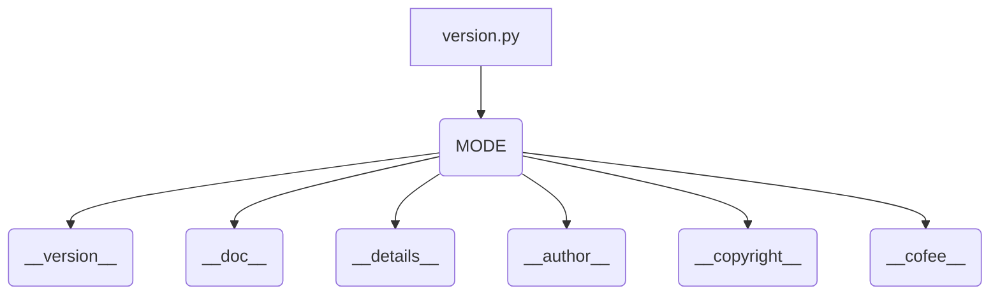

# <input code>

```python
## \file hypotez/src/gui/openai_trаigner/version.py
# -*- coding: utf-8 -*-\n#! venv/Scripts/python.exe
#! venv/bin/python/python3.12
"""
.. module: src.gui.openai_trаigner 
	:platform: Windows, Unix
	:synopsis:

"""
MODE = 'dev'

"""
	:platform: Windows, Unix
	:synopsis:

"""


"""
	:platform: Windows, Unix
	:synopsis:

"""


"""
  :platform: Windows, Unix

"""
"""
  :platform: Windows, Unix
  :platform: Windows, Unix
  :synopsis:
"""MODE = 'dev'
  
""" module: src.gui.openai_trаigner """


__version__: str = 'v1.1'
__doc__: str = ''
__details__: str = ''
__author__: str = 'hypo69'
__copyright__: str = """
## License

Copyright (c) 2024 hypo69

This project is licensed under the MIT License. See the [MIT License](https://opensource.org/licenses/MIT) for details.

Commercial use of the code is prohibited without prior permission from the authors.
"""
__cofee__: str = "Treat the developer to a cup of coffee for boosting enthusiasm in development: https://boosty.to/hypo69"
```

# <algorithm>

Этот код представляет собой файл `version.py` с константами, описывающими версию и информацию о модуле `src.gui.openai_trаigner`. Алгоритм заключается в определении и присвоении значений строковым переменным.  Нет циклов, условных операторов и вызовов функций, которые обрабатывают данные.

**Пример:**
Простое определение переменной `__version__` со значением `'v1.1'`.

# <mermaid>



**Объяснение диаграммы:**

Файл `version.py` (A) содержит несколько строковых констант (B, C, D, E, F, G, H), каждая из которых хранит различную информацию о модуле.  Зависимости в данном случае сводятся к определению констант в файле, который скорее всего импортируется в другие части проекта.


# <explanation>

**Импорты:**

В коде нет импорта внешних библиотек.  Код целиком состоит из констант.

**Классы:**

Нет классов в этом файле.

**Функции:**

Нет функций в этом файле.  Это файл, содержащий константы, необходимые для работы проекта.

**Переменные:**

`MODE`, `__version__`, `__doc__`, `__details__`, `__author__`, `__copyright__`, `__cofee__` — все это константы, хранящие строковые значения. Они определяют метаданные о версии, авторстве и лицензии модуля `src.gui.openai_trаigner`.

**Возможные ошибки или области для улучшений:**

* **Документация:** Хотя документация присутствует, она неполная и не структурирована. Документация может быть дополнена более детальным описанием функциональности, атрибутов, аргументов и возвращаемых значений.
* **Наименование переменных:** Использование `__version__`, `__doc__` и т.д. является общепринятым способом определения переменных, хранящих метаданные, но важно, чтобы эти переменные использовались согласованно и не дублировались в других частях проекта.
* **Использование констант:** Константы могли бы быть более структурированными (например, в словаре или классе).


**Цепочка взаимосвязей с другими частями проекта:**

Файл `version.py` используется другими частями проекта для получения информации о версии и других метаданных, чтобы корректно отображать информацию о версии приложения, либо использовать эти данные для других действий (например, чтобы не использовать старые версии кода). Это типичное использование файла `version.py` в Python-проектах.