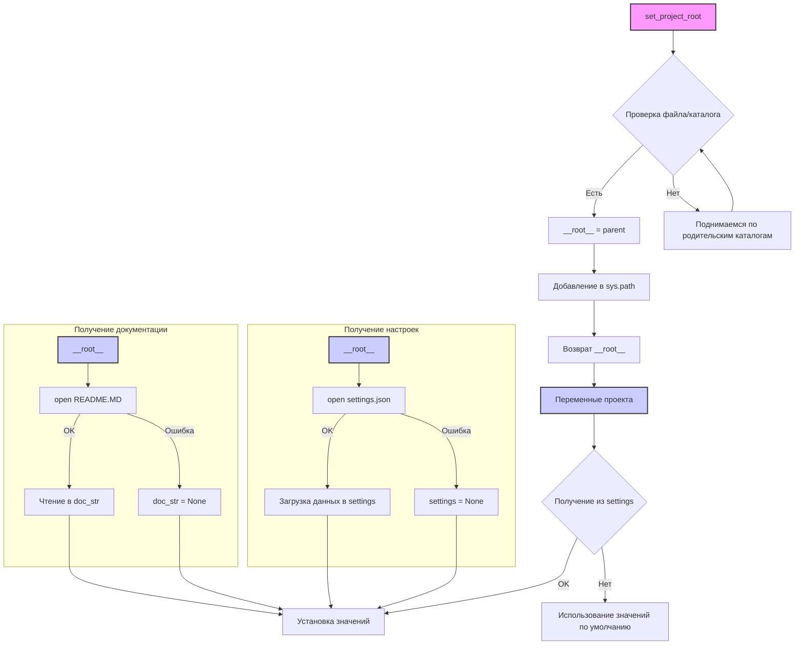

# Анализ кода из файла hypotez/src/logger/header.py

## <input code>

```python
## \file hypotez/src/logger/header.py
# -*- coding: utf-8 -*-
#! venv/Scripts/python.exe
#! venv/bin/python/python3.12

"""
.. module: src.logger 
	:platform: Windows, Unix
	:synopsis:

"""
MODE = 'dev'

"""
	:platform: Windows, Unix
	:synopsis: Модуль определяющий корневой путь к проекту. Все импорты строятся относительно этого пути.
    :TODO: В дальнейшем перенести в системную переменную"""

import sys
import json
from packaging.version import Version

from pathlib import Path
def set_project_root(marker_files=('pyproject.toml', 'requirements.txt', '.git')) -> Path:
    """
    Finds the root directory of the project starting from the current file's directory,
    searching upwards and stopping at the first directory containing any of the marker files.

    Args:
        marker_files (tuple): Filenames or directory names to identify the project root.
    
    Returns:
        Path: Path to the root directory if found, otherwise the directory where the script is located.
    """
    __root__:Path
    current_path:Path = Path(__file__).resolve().parent
    __root__ = current_path
    for parent in [current_path] + list(current_path.parents):
        if any((parent / marker).exists() for marker in marker_files):
            __root__ = parent
            break
    if __root__ not in sys.path:
        sys.path.insert(0, str(__root__))
    return __root__


# Get the root directory of the project
__root__ = set_project_root()
"""__root__ (Path): Path to the root directory of the project"""


from src import gs

settings:dict = None
try:
    with open(gs.path.root / 'src' /  'settings.json', 'r') as settings_file:
        settings = json.load(settings_file)
except (FileNotFoundError, json.JSONDecodeError):
    ...

doc_str:str = None
try:
    with open(gs.path.root / 'src' /  'README.MD', 'r') as settings_file:
        doc_str = settings_file.read()
except (FileNotFoundError, json.JSONDecodeError):
    ...


__project_name__ = settings.get("project_name", 'hypotez') if settings  else 'hypotez'
__version__: str = settings.get("version", '')  if settings  else ''
__doc__: str = doc_str if doc_str else ''
__details__: str = ''
__author__: str = settings.get("author", '')  if settings  else ''
__copyright__: str = settings.get("copyrihgnt", '')  if settings  else ''
__cofee__: str = settings.get("cofee", "Treat the developer to a cup of coffee for boosting enthusiasm in development: https://boosty.to/hypo69")  if settings  else "Treat the developer to a cup of coffee for boosting enthusiasm in development: https://boosty.to/hypo69"
```

## <algorithm>

**Алгоритм:**

1. **`set_project_root(marker_files)`:**
    * Принимает кортеж `marker_files`, содержащий имена файлов, по которым определяется корневой каталог проекта.
    * Начинает поиск с текущего каталога (`__file__`).
    * Итеративно поднимается по родительским каталогам, проверяя существование файлов/папок из `marker_files`.
    * Если найден каталог с указанными файлами, он становится корневым каталогом (`__root__`).
    * Добавляет корневой каталог в `sys.path`, если его там нет.
    * Возвращает объект `Path` корневого каталога.


2. **Получение настроек:**
   * Получает корневой каталог проекта (`__root__`).
   * Попытка открыть файл `settings.json` в корневом каталоге.
   * Если файл найден, загрузить данные из файла в переменную `settings`.  (Обработка JSON).
   * Если файл не найден или есть ошибка чтения JSON, то `settings` остается `None`.

3. **Получение документации:**
   * Попытка открыть файл `README.MD` в корневом каталоге.
   * Если файл найден, прочитать его содержимое в переменную `doc_str`.
   * Если файл не найден или есть ошибка чтения, то `doc_str` остается `None`.

4. **Установка переменных проекта:**
   * Извлекает значения из словаря настроек `settings`, используя метод `get()`, который предоставляет безопасный способ доступа к значениям (возвращает значение по умолчанию, если ключ не найден).
   * Если `settings` равен `None`, то значения по умолчанию.
   * Заполняет переменные проекта (`__project_name__`, `__version__`, `__doc__`, `__details__`, `__author__`, `__copyright__`, `__cofee__`) полученными данными.

**Примеры:**

Если `pyproject.toml` находится в каталоге выше текущего файла, то `__root__` будет указывать на него.


## <mermaid>



## <explanation>

**Импорты:**

* `sys`: Для работы с системными переменными, в частности, добавления пути к `sys.path`.
* `json`: Для работы с JSON-файлами, используется для загрузки настроек.
* `packaging.version`:  Для работы с версиями. Непосредственно используется в этом фрагменте кода нет, но это библиотека для работы с версиями пакетов Python.
* `pathlib`: Для работы с путями файлов и каталогов, удобно для работы с файловой системой.
* `src.gs`: Предполагает существование пакета `src` и модуля `gs` внутри него. Модуль `gs`  (вероятно) предоставляет функциональность, связанную с определением путей внутри проекта, например, `gs.path.root`.


**Классы:**

Нет явных определений классов в данном коде.

**Функции:**

* `set_project_root(marker_files)`:  Находит корневой каталог проекта.
    * `marker_files`: Кортеж имен файлов/каталогов, по которым определяется корень.  
    * Возвращает объект `Path` корневого каталога.


**Переменные:**

* `__root__`: Путь к корневому каталогу проекта, типы `Path`.
* `MODE`: Строковая константа, представляющая режим работы (в данном случае, 'dev').
* `settings`: Словарь настроек из `settings.json`.  Тип `dict`.
* `doc_str`:  Строка, содержащая содержимое файла `README.MD`. Тип `str`.
* `__project_name__`, `__version__`, `__doc__`, `__details__`, `__author__`, `__copyright__`, `__cofee__`: Строковые переменные, хранящие информацию о проекте, полученные из `settings.json`.


**Возможные ошибки и улучшения:**

* **Обработка ошибок:**  Использование `try...except` для `json.load()` и чтения `README.MD` — хорошее решение, но можно расширить обработку ошибок, например, выводить более подробные сообщения об ошибках.


**Взаимосвязь с другими частями проекта:**

Код в `header.py` предназначен для инициализации проекта.  Он вызывается другими модулями проекта, и все последующие импорты будут относиться к найденному `__root__`.  Модуль `gs` используется для работы с путями к ресурсам проекта, обеспечивая возможность импорта элементов проекта из различных директорий.