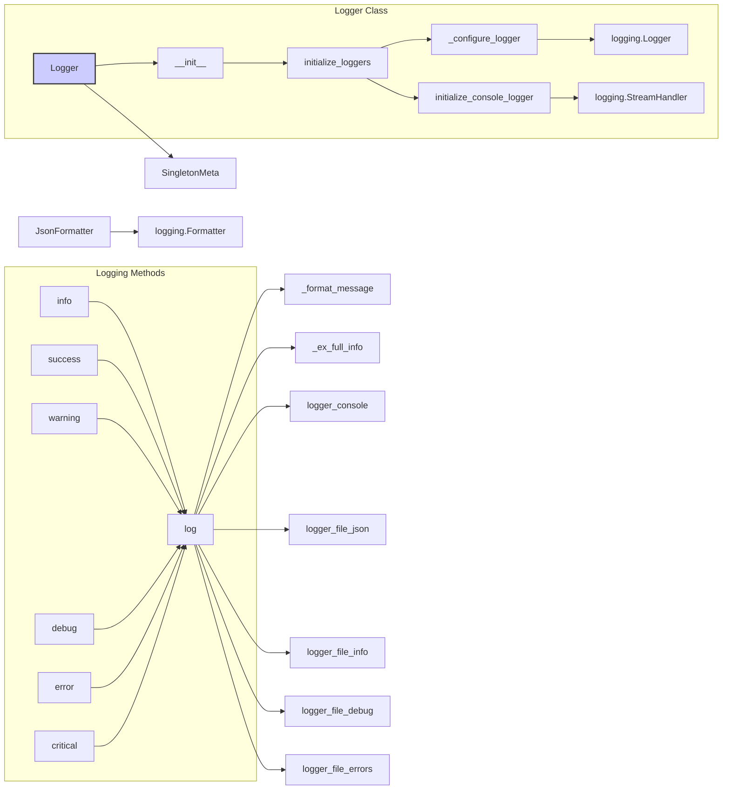

# <input code>

```python
# -*- coding: utf-8 -*-\
#! venv/Scripts/python.exe
#! venv/bin/python/python3.12

"""
.. module: src.logger 
	:platform: Windows, Unix
	:synopsis: Logger Module
"""
MODE = 'dev'

"""This module provides a singleton logging utility with various logging levels and formats, including console, file, and JSON logging. It utilizes the Singleton design pattern to ensure a single instance of the logger is used throughout the application. The logger supports different log levels and output formats, and it can colorize console messages based on log severity.

Classes:
- SingletonMeta: Metaclass for Singleton pattern implementation.
- JsonFormatter: Custom formatter for logging in JSON format.
- Logger: Singleton logger class with methods for logging at different levels.

Classes:
    SingletonMeta
    ----------
    Metaclass for Singleton pattern implementation.
    
    JsonFormatter
    ------------
    Custom formatter for logging in JSON format.
    
    Logger
    ------
    Singleton logger class with methods for console, file, and JSON logging.

Functions:
- __init__: Initializes the Logger instance.
- _configure_logger: Configures and returns a logger with the specified parameters.
- initialize_loggers: Initializes loggers for console, file, and JSON output.
- _format_message: Formats a message with optional color and exception information.
- _ex_full_info: Provides detailed exception information, including the file, function, and line number where the log was called.
- log: Logs messages at a specified level with optional color and exception information.
- info: Logs an info message.
- success: Logs a success message.
- warning: Logs a warning message.
- debug: Logs a debug message.
- error: Logs an error message.
- critical: Logs a critical message.
- info_red: Logs an info message in red.
- info_black: Logs an info message in black with a white background.

Examples:
    # Initialize the logger
    logger: Logger = Logger()
    logger.initialize_loggers(info_log_path='info.log', debug_log_path='debug.log', errors_log_path='errors.log', json_log_path='log.json')

    # Log messages at different levels
    logger.info('This is an info message')
    logger.success('This is a success message')
    logger.warning('This is a warning message',None,True)
    logger.debug('This is a debug message',None,exc_info=True)
    logger.error('This is an error message',ex)
    logger.critical('This is a critical message',ex)
"""

# -*- coding: utf-8 -*-\
#! venv/Scripts/python.exe
#! venv/bin/python/python3.12

"""
.. module: src.logger
    :platform: Windows, Unix
    :synopsis: Logger Module
"""

import threading
import traceback
import logging
from typing import Optional
import colorama
import datetime
import json
import inspect

# ... (rest of the code)
```

# <algorithm>

**Algorithm:**

The `Logger` class implements a singleton pattern, ensuring only one instance exists throughout the application.  It uses different logging handlers (console, file, JSON) and levels.

1. **Initialization (`__init__`)**: The constructor initializes internal logger variables to `None` and sets `_initialized` to `False`.  This object is a singleton, so it only creates logger instances if they don't exist.

2. **Configuration (`_configure_logger`)**: This method takes parameters to create a configured `logging.Logger` object for file logging. It sets the logging level, creates a `FileHandler`, configures a formatter (defaults to a simple format), and adds the handler to the logger.

3. **Initialization (`initialize_loggers`)**: This method is crucial for creating and configuring the necessary loggers for console, file (for info, debug, errors), and JSON output. It checks for initialization and creates loggers for each specified output. The timestamp is appended to the logger name for better identification of different instances of the logger.  It uses `_configure_logger` for file handling.

4. **Logging (`log`, `info`, etc.)**: These methods are the entry points for logging events at different levels. The `log` method accepts a logging level, message, optional exception info (`exc_info`), and color (for console). The method formats the message, potentially adding exception details, then logs to the appropriate handlers (console, file, JSON).


**Data Flow Example:**

A user calls `logger.info("My info message")`.

- The `info` method calls `logger.log(logging.INFO, ...)`
- `logger.log` formats the message using `_format_message` (adds color if specified), and checks if `exc_info` is set.
- If `exc_info` is true, it calls `_ex_full_info` to get detailed exception information.
- The formatted message is passed to the `logger_console`, `logger_file_json` etc. loggers for logging to the specified destination(s).


# <mermaid>



**Dependencies:**

- `threading`: For thread safety (Singleton pattern).
- `traceback`: For exception handling.
- `logging`: For basic logging functionality.
- `typing`: For type hints.
- `colorama`: For console colorization.
- `datetime`: For timestamping logs.
- `json`: For JSON formatting.
- `inspect`: For retrieving information about the calling location of log messages (`_ex_full_info`).


# <explanation>

**Imports:**

- `threading`: Used to implement thread safety for the singleton logger (`SingletonMeta`).
- `traceback`:  Allows access to detailed exception information during logging.
- `logging`: The core Python logging module.
- `typing`: Provides type hints for better code readability and maintainability.
- `colorama`: Provides color formatting for the console output.
- `datetime`: For generating timestamp for log files.
- `json`: Handles JSON serialization.
- `inspect`: Retrieves details on the stack frame for exception information (`_ex_full_info`).


**Classes:**

- `SingletonMeta`: A metaclass that implements the Singleton pattern, ensuring only one instance of the `Logger` class can exist. It uses a dictionary (`_instances`) and a lock (`_lock`) to manage the creation and retrieval of instances, making sure that multiple threads do not simultaneously create the logger.
- `JsonFormatter`: A custom formatter that formats log records as JSON. It overrides the `format` method to serialize the log record into a JSON string.
- `Logger`: This is the main singleton logger class. It maintains several `logging.Logger` objects for different logging destinations (console, file with different levels, JSON).  The use of `Optional[logging.Logger]` is a good defensive practice; it prevents errors if the corresponding log file is not created.  The `_initialized` attribute helps prevent repeated initializations.


**Functions:**

- `__init__`: Initializes the logger instance by setting internal variables to `None` and `_initialized` to `False`.  Critically, this prevents the `Logger` object from doing more than required, and it's a crucial aspect of the Singleton pattern.
- `_configure_logger`: Configures and returns a `logging.Logger` instance for file logging. This method sets up the file handler, formatter, and logging level.  It's a reusable helper function, which is a key part of good design.  The `Optional[int]` type hint makes sure that if a level isn't provided, the default value is used.
- `initialize_loggers`:  Initializes the loggers for different output streams (console, info file, debug file, error file, JSON file).  It uses a timestamp for the logger names to differentiate instances. Importantly, it checks if the logger was already initialized.
- `_format_message`: Formats the log message, potentially adding color and exception information.  This function is responsible for handling the styling of log messages.  Using `colorama` is a smart way to handle console styling for different logging levels.
- `_ex_full_info`: Returns a detailed string representation of the exception, including the file, function, and line number where the exception occurred. This is very helpful for debugging.
- `log`: The general logging method. It handles logging to both console and the appropriate file-based loggers. Checks if the logger is initialized and adds a timestamp for clarity.
- `info`, `success`, `warning`, `debug`, `error`, `critical`: These are convenience methods for logging at different levels (INFO, SUCCESS, WARNING, DEBUG, ERROR, CRITICAL) and provide pre-defined color formatting.   Defining these methods is very useful for making the code easy to read and maintain.

**Variables:**

- `MODE`: A variable that likely defines a mode (e.g., 'dev', 'prod'), but no actual use within the code is currently visible.
- The logger attributes (e.g., `logger_console`, `logger_file_info`, etc.) are used to hold the configured logging handlers.

**Possible Errors or Improvements:**

- **Error Handling:**  While exception handling is present in some methods, more robust error handling (e.g., using `try...except` blocks when dealing with file paths) would be helpful to make sure that the code doesn't crash when the log file can't be created or if there's a problem with formatting the message.
- **Flexibility in Logging Levels:**  The convenience methods (`info`, `warning`, etc.) could be more flexible by accepting `color` as a named argument, instead of only checking whether a tuple is provided.
- **Timestamping:** While the timestamp is used in the logger name, consider including a timestamp in the log messages themselves to improve searchability in log files.


**Relationships with Other Parts of the Project:**

This logger module is likely used by other parts of the application to log events.  The initialization, logging methods, and output format are designed to be used by other modules in the `src` package.  There is likely a clear dependency on logging, and the usage of this logger will be vital to the application's logging functionality.