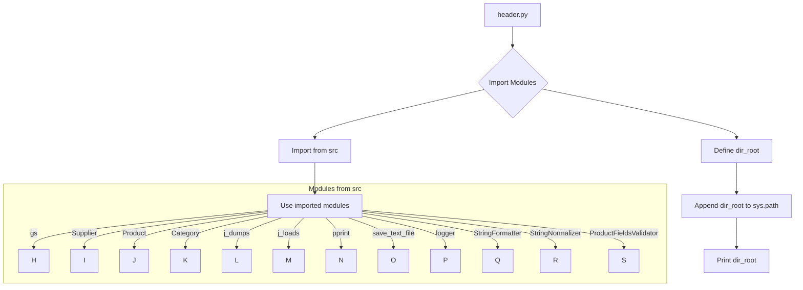

```MD
# <input code>

```python
## \file hypotez/src/product/_examples/header.py
# -*- coding: utf-8 -*-
#! venv/Scripts/python.exe
#! venv/bin/python/python3.12

"""
.. module: src.product._examples 
	:platform: Windows, Unix
	:synopsis:

"""
MODE = 'dev'

"""
	:platform: Windows, Unix
	:synopsis:

"""


"""
	:platform: Windows, Unix
	:synopsis:

"""


"""
  :platform: Windows, Unix

"""
"""
  :platform: Windows, Unix
  :platform: Windows, Unix
  :synopsis:
"""MODE = 'dev'
  
""" module: src.product._examples """


import sys
import os
from pathlib import Path

dir_root : Path = Path (os.getcwd()[:os.getcwd().rfind('hypotez')+11])
sys.path.append (str (dir_root) )  # Добавляю корневую папку в sys.path
dir_src = Path (dir_root, 'src')
sys.path.append (str (dir_root) ) 
...

print(dir_root)
# ----------------
from pathlib import Path
import json
import re
# ----------------

from src import gs
from src.suppliers import Supplier
from src.product import Product, ProductFields, ProductFieldsLocators
from src.category import Category
from src.utils import j_dumps, j_loads,   pprint, save_text_file
from src.logger import logger
from src.utils.string import StringFormatter, StringNormalizer, ProductFieldsValidator
...
```

# <algorithm>

Алгоритм работы кода, представленного в файле `header.py`, можно описать следующим образом:

1. **Импорт необходимых библиотек**: Код импортирует `sys`, `os`, `Path` из `pathlib`, `json`, `re`, а также множество модулей из пакета `src` (в том числе `gs`, `Supplier`, `Product`, `Category`, `j_dumps`, `j_loads`, `pprint`, `save_text_file`, `logger`, `StringFormatter`, `StringNormalizer`, `ProductFieldsValidator`).

2. **Определение корневой директории**: С помощью `os.getcwd()` и `Path` определяется абсолютный путь к корневой директории проекта (`hypotez`).

3. **Добавление корневой директории в `sys.path`**: Важная часть! Этот шаг позволяет Python находить модули в папке `src` проекта.

4. **Печать корневой директории**: Выводится текущая корневая директория на консоль.

5. **Импорт других необходимых библиотек**: После обработки `sys.path` происходят обычные импорты.


**Пример:**  Если `os.getcwd()` возвращает `/home/user/project/hypotez`, то `dir_root` получит значение `/home/user/project/`.


# <mermaid>



**Объяснение диаграммы:**

Модуль `header.py` импортирует различные модули из `src` и его подпапок, определяя `dir_root` и добавляя его в `sys.path` для правильного импорта.  Связи иллюстрируют, как `header.py` взаимодействует с модулями `src`,  используя их функции, классы и переменные.

# <explanation>

**Импорты:**

Код импортирует необходимые модули из стандартной библиотеки Python (`sys`, `os`, `pathlib`, `json`, `re`) и из собственного проекта (`src`, `src.suppliers`, `src.product`, `src.category`, `src.utils`, `src.logger`, `src.utils.string`).  Это указывает на структурированное проектирование проекта, где код разделен на логические компоненты (модули и пакеты). Добавление корневой папки в `sys.path` критично для работы импорта, так как она обеспечивает путь к пакетам `src`.

**Классы:**

Из примера не видны определения самих классов `Supplier`, `Product`, `ProductFields`, `ProductFieldsLocators`, `Category`, `StringFormatter`, `StringNormalizer`, `ProductFieldsValidator` и  `logger`.  Взаимодействие между классами неявно, но предполагается, что классы взаимодействуют через методы и атрибуты для выполнения конкретных задач. (например, получение и обработка данных).


**Функции:**

Код демонстрирует импорты функций `j_dumps`, `j_loads`, `pprint`, `save_text_file` из `src.utils`.  Функции, вероятно, выполняют операции сериализации/десериализации JSON, вывод в удобочитаемый вид и сохранение данных в файлы соответственно.  Функция `print(dir_root)` выводит корневой путь на консоль.


**Переменные:**

`dir_root` и `dir_src` являются переменными типа `Path`, хранящими пути к корневым папкам проекта и папки `src`.  `MODE` представляет собой строковую переменную, вероятно, для настройки режимов работы приложения (например, `dev`, `prod`).

**Возможные ошибки и улучшения:**

- **Жестко заданные пути:** Путь `venv/Scripts/python.exe` и аналогичные строки могут не работать на других системах или при изменении структуры проекта.  Использование относительных путей или `importlib.resources` для поиска ресурсов проекта вместо жестко закодированных путей сделает код более переносимым.
- **Усложненный импорт:** Неясно, зачем `sys.path.append (str (dir_root))` используется дважды.
- **Недостаток комментариев**: Комментарии должны пояснять *как* код делает то, что он делает.  Отсутствие ясности в логике кода.
- **Отсутствие обработки ошибок**: Нет обработки ошибок при работе с файлами или внешними ресурсами.
- **Проверка существования папок:** Перед использованием папок, возможно, стоит добавить проверку, что они существуют.

**Цепочка взаимосвязей:**

Код `header.py` служит "входом" для остальных модулей и классов в проекте.  После инициализации и нахождения необходимых путей, импортируются и используются классы и функции, из различных папок. Предполагается, что последующий код в `hypotez/src/product/_examples` будет использовать импортированные модули для выполнения операций с продуктами, поставщиками, категориями и т.д.