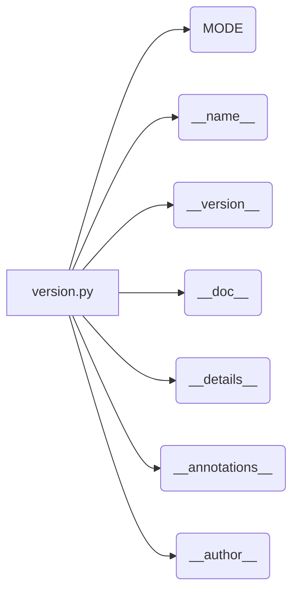

# <input code>

```python
## \file hypotez/src/product/_examples/version.py
# -*- coding: utf-8 -*-\
#! venv/Scripts/python.exe
#! venv/bin/python/python3.12

"""
.. module: src.product._examples 
	:platform: Windows, Unix
	:synopsis:

"""
MODE = 'dev'

"""
	:platform: Windows, Unix
	:synopsis:

"""


"""
	:platform: Windows, Unix
	:synopsis:

"""


"""
  :platform: Windows, Unix

"""
"""
  :platform: Windows, Unix
  :platform: Windows, Unix
  :synopsis:
"""MODE = 'dev'
  
""" module: src.product._examples """


"""
- `__version__`: This variable holds the version of the module or package.
- `__name__`: Contains the name of the module. If the script is being run directly, the value will be `"__main__"`.
- `__doc__`: The module's documentation string.
- `__details__`: This variable likely contains additional details about the module, but the exact purpose depends on the specific module or package.
- `__annotations__`: Contains type annotations for variables and functions in the module.
- `__author__`: The name(s) of the author(s) of the module.
"""
__name__:str
__version__="3.12.0.0.0.4"
__doc__:str
__details__:str="Details about version for module or class"
__annotations__

__author__='hypotez '
```

# <algorithm>

Этот код не содержит алгоритма в традиционном смысле.  Это скорее определения констант, строк документации и метаданных для модуля `version.py`.  Нет циклов, ветвлений или вызовов функций, которые можно представить в виде блок-схемы.  Данные не перемещаются между функциями.  Все данные представляют собой строковые константы, имена и комментарии.


# <mermaid>



# <explanation>

Этот код определяет метаданные Python-модуля, который является частью проекта `hypotez`.  Давайте разберем его по частям:

* **Комментарии:**  Большинство строк - это docstrings (строки документации) и комментарии. Они описывают назначение, платформы и другие аспекты модуля.  В частности, это метаданные, полезные для инструментов автоматической генерации документации (например, Sphinx).


* **Константы:**
    * `MODE = 'dev'`: Определяет константу, которая, вероятно, используется для определения режима работы модуля (разработка, производство).


* **`__name__`, `__version__`, `__doc__`, `__details__`, `__annotations__`, `__author__`:** Это специальные атрибуты Python-модулей. Они содержат информацию о модуле: его имя, версию, документацию, дополнительные детали, аннотации типов (которые могут быть пустыми) и имя автора. Эти данные обычно считываются метаданными проекта и системами управления версиями.


**Связи с другими частями проекта:**

Этот файл, `version.py`, определяет метаданные для модуля, входящего в проект `hypotez`.  Эти метаданные используются для идентификации и управления версией модуля в рамках проекта.  Без доступа к остальному коду проекта трудно определить, как именно `version.py` используется в других частях проекта.  Скорее всего, значения `__version__` и подобных переменных используются другими частями проекта для управления версией.


**Возможные ошибки/улучшения:**

* **Документация:**  Документация (docstrings) могла бы быть более детальной и структурированной.
* **Типы:** Объявление типов (`__annotations__`) - хороший шаг, но значения остаются пустыми. В контексте проекта было бы полезно иметь более полные аннотации типов для переменных и функций.
* **Использование:** Без контекста остального проекта сложно оценить, насколько этот файл используется эффективно.


**В целом:**

Этот файл служит для определения метаданных для модуля `_examples/version.py` в рамках проекта `hypotez`.  Важно для понимания версии и структуры проекта, но не содержит кода, выполняющего какие-либо действия.