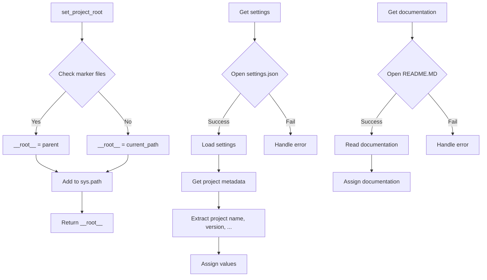

# <input code>

```python
## \file hypotez/src/product/product_fields/header.py
# -*- coding: utf-8 -*-
#! venv/Scripts/python.exe
#! venv/bin/python/python3.12

"""
.. module: src.product.product_fields 
	:platform: Windows, Unix
	:synopsis:

"""
MODE = 'dev'

"""
	:platform: Windows, Unix
	:synopsis:

"""

"""
	:platform: Windows, Unix
	:synopsis:

"""


"""
  :platform: Windows, Unix

"""
"""
  :platform: Windows, Unix
  :platform: Windows, Unix
  :synopsis:
"""MODE = 'dev'
  
""" module: src.product.product_fields """

import sys
import json
from packaging.version import Version

from pathlib import Path
def set_project_root(marker_files=('pyproject.toml', 'requirements.txt', '.git')) -> Path:
    """
    Finds the root directory of the project starting from the current file's directory,
    searching upwards and stopping at the first directory containing any of the marker files.

    Args:
        marker_files (tuple): Filenames or directory names to identify the project root.
    
    Returns:
        Path: Path to the root directory if found, otherwise the directory where the script is located.
    """
    __root__:Path
    current_path:Path = Path(__file__).resolve().parent
    __root__ = current_path
    for parent in [current_path] + list(current_path.parents):
        if any((parent / marker).exists() for marker in marker_files):
            __root__ = parent
            break
    if __root__ not in sys.path:
        sys.path.insert(0, str(__root__))
    return __root__


# Get the root directory of the project
__root__ = set_project_root()
"""__root__ (Path): Path to the root directory of the project"""

from src import gs

settings:dict = None
try:
    with open(gs.path.root / 'src' / 'settings.json', 'r') as settings_file:
        settings = json.load(settings_file)
except (FileNotFoundError, json.JSONDecodeError):
    ...

doc_str:str = None
try:
    with open(gs.path.root / 'src' / 'README.MD', 'r') as settings_file:
        doc_str = settings_file.read()
except (FileNotFoundError, json.JSONDecodeError):
    ...


__project_name__ = settings.get("project_name", 'hypotez') if settings  else 'hypotez'
__version__: str = settings.get("version", '')  if settings  else ''
__doc__: str = doc_str if doc_str else ''
__details__: str = ''
__author__: str = settings.get("author", '')  if settings  else ''
__copyright__: str = settings.get("copyrihgnt", '')  if settings  else ''
__cofee__: str = settings.get("cofee", "Treat the developer to a cup of coffee for boosting enthusiasm in development: https://boosty.to/hypo69")  if settings  else "Treat the developer to a cup of coffee for boosting enthusiasm in development: https://boosty.to/hypo69"
```

# <algorithm>

1. **`set_project_root` function:**
   - Takes a tuple of `marker_files` as input.
   - Starts from the current file's directory (`__file__`).
   - Iterates upwards through parent directories.
   - Checks if any of the `marker_files` exist within the current parent directory.
   - If found, sets `__root__` to the parent directory and breaks the loop.
   - If not found after checking all parents, `__root__` remains as the starting directory.
   - Adds the root directory to `sys.path` if it's not already present.
   - Returns the `__root__` Path object.

   *Example:*  If `__file__` is in `/project/hypotez/src/product/product_fields/header.py`, and `pyproject.toml` exists in `/project/hypotez`, the function will return `/project/hypotez`.


2. **Getting project root:**
   - Calls `set_project_root()` to obtain the project root directory.


3. **Loading settings:**
   - Attempts to open `gs.path.root / 'src' / 'settings.json'`.
   - Loads the JSON content into the `settings` dictionary.
   - If there's an error (e.g., file not found or invalid JSON), it handles it gracefully (using `try...except`).

4. **Loading documentation:**
   - Attempts to open `gs.path.root / 'src' / 'README.MD'`.
   - Reads the content into the `doc_str` variable.
   - Handles potential errors.

5. **Extracting project metadata:**
   - Extracts `project_name`, `version`, `doc`, `author`, `copyright`, and `cofee` from the `settings` dictionary using `get()` method with default values.


# <mermaid>


*Explanation:*  The diagram shows `set_project_root` function finding the project root, loading `settings.json` and handling potential errors. It then extracts metadata and assigns it to variables, and finally gets documentation. The `gs.path.root` likely refers to a module or class responsible for getting the project's root path. The `src` folder might contain utility modules for this.

# <explanation>

**Imports:**

- `sys`: Used to modify the `sys.path` variable, allowing the script to import modules from the project root directory.
- `json`: Used for loading JSON data from the `settings.json` file.
- `packaging.version`: This package is used for handling different versions as strings. In this case, `Version` is not being used.
- `pathlib`: Provides object-oriented way of working with paths.
- `src.gs`: This is a crucial dependency, implying that there exists an `src/gs.py` module that provides functions related to the project root directory or potentially other utilities. The `gs.path.root` attribute of this module is referenced.


**Classes:**

- None. This script primarily works with functions.

**Functions:**

- `set_project_root(marker_files)`: This is a crucial function responsible for determining the absolute project root path. It traverses parent directories to locate directories containing marker files (`pyproject.toml`, `requirements.txt`, `.git`).  It's very useful because it dynamically locates the project's root.

**Variables:**

- `__root__`: Stores the absolute path to the project root, crucial for relative imports.
- `settings`: A dictionary containing project settings loaded from `settings.json`.
- `doc_str`: Stores the contents of the `README.MD` file.
- `__project_name__`, `__version__`, `__doc__`, `__details__`, `__author__`, `__copyright__`, `__cofee__`: Strings containing metadata from `settings.json` or default values.

**Possible Errors and Improvements:**

- **Error Handling:** The code uses `try...except` blocks to handle potential `FileNotFoundError` and `json.JSONDecodeError` exceptions, which is good practice.  Consider adding more specific error handling based on the expected structure of `settings.json`, for example, checking for the presence of specific keys within `settings`.
- **`gs` module:** The `gs` module is assumed to contain a module (`gs.path`) that provides access to the project root.  Explicit documentation of this module within the code itself would make it significantly easier to understand its behavior, especially if it utilizes more complex logic or external resources.


**Relationships with Other Parts of the Project:**

- `gs` module likely contains functions related to the project's structure, interacting with file systems, or managing project resources.
- The `settings.json` file is vital for configuration values.
- The `README.MD` file is used for documentation.
- `hypotez` will depend on other modules (not included here) for its functionality.  The `src` directory likely contains a package structure, making it modular, which contributes to more maintainable and well-structured code.


This script effectively finds the project root and loads configuration and documentation to set up the environment for the rest of the project.