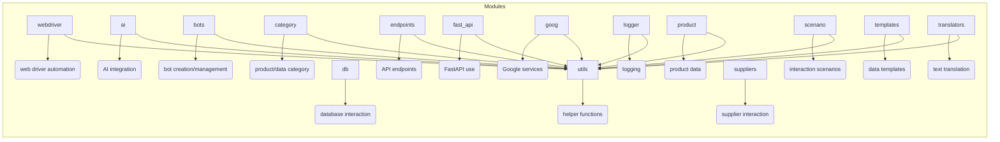

```MD
# <input code>

```[Русский](https://github.com/hypo69/hypo/blob/master/README.RU.MD)
# Table of Contents

1. [webdriver](#webdriver)
2. [ai](#ai)
3. [bots](#bots)
4. [category](#category)
5. [db](#db)
6. [endpoints](#endpoints)
7. [fast_api](#fast_api)
8. [goog](#goog)
9. [logger](#logger)
10. [product](#product)
11. [scenario](#scenario)
12. [suppliers](#suppliers)
13. [templates](#templates)
14. [translators](#translators)
15. [utils](#utils)

# Modules

## webdriver
Module for working with web drivers and automating browser actions.

## ai
Module for integrating artificial intelligence, including interaction with various AI models.

## bots
Module for creating and managing bots that interact with users.

## category
Module for working with product or data categories.

## db
Module for interacting with databases, including creating, reading, and updating data.

## endpoints
Module for creating and handling API endpoints that interact with clients.

## fast_api
Module for using FastAPI within the project, including request routing and configuration.

## goog
Module for working with Google services, such as Google Cloud or APIs.

## logger
Module for logging, providing functionality for recording logs and errors.

## product
Module for working with products, including processing product and service data.

## scenario
Module for modeling and executing interaction scenarios.

## suppliers
Module for interacting with suppliers, including integration with external systems.

## templates
Module for working with data templates and generating them.

## translators
Module for text translation using various tools and APIs.

## utils
Utility module that includes various helper functions for the project.
```

# <algorithm>

The provided code is a list of modules and their descriptions, not executable code.  Therefore, there's no algorithm to visualize in a flowchart.  It's a table of contents and module documentation.

# <mermaid>



# <explanation>

The code provided is a *README.md* file, not a Python script.  It serves as documentation for the `hypo` project, listing the various modules and briefly describing their functionalities. This is typical for a project's structure to give developers and other users an understanding of the different code components within the project's source code.

* **No imports, classes, functions, or variables:** There's no actual code to analyze for imports, classes, or functions. The file only contains the project's module list, which can be used as part of a larger project's documentation and to find specific code to work with, once you know what module you're after.

* **Relationship to other parts of the project:**  The file serves as an important reference guide for project organization.  The listing of `webdriver`, `ai`, `endpoints`, etc., implies that each of these is a module or package within the `hypo` project (probably contained in the `src` directory).

* **Potential Errors/Improvements:**

    * **Ambiguity:** The brief descriptions could be more detailed for better understanding of the specific tasks.

* **Overall:** This `README.md` file helps in understanding the structure and scope of different modules in the `hypo` project.


**Note:**  To analyze the actual code, the Python files containing the implementations of the listed modules would be required.