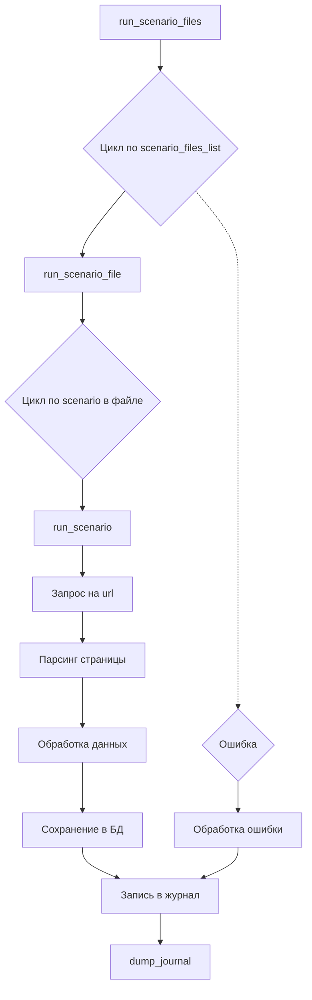

# Анализ кода модуля `src.scenario`

## <input code>

Модуль `src.scenario` предназначен для автоматизации взаимодействия с поставщиками, используя сценарии, описанные в JSON-файлах. Основная задача модуля — адаптировать процесс извлечения и обработки данных о продуктах с веб-сайтов поставщиков и синхронизировать эту информацию с базой данных вашей системы.

(Здесь приведен текст документации, описывающий функции, компоненты и пример сценария. Кода как такового в этом фрагменте нет)

## <algorithm>

Ввиду отсутствия кода, пошаговая блок-схема не может быть построена. Алгоритм работы модуля описывается в тексте документации, но без конкретного кода невозможно визуализировать его в виде блок-схемы.  Примерная схема работы предполагает:

1. **Чтение сценариев:** Программа считывает JSON-файлы.
2. **Обработка сценариев:** Для каждого сценария программа выполняет следующие действия:
    * **Получение URL:** Извлекает URL страницы продукта.
    * **Запрос веб-страницы:** Отправляет запрос на веб-страницу.
    * **Извлечение данных:** Парсит страницу для извлечения данных о продуктах.
    * **Обработка данных:** Преобразует полученные данные в нужный формат.
    * **Сохранение данных:** Сохраняет данные в базу данных (PrestaShop).
3. **Журналирование:** Запись в журнал выполнения.
4. **Обработка ошибок:** Обработка возможных ошибок при чтении, запросе, парсинге, и сохранении данных.

## <mermaid>

**Описание диаграммы:**

Диаграмма показывает основную логику выполнения модуля. `run_scenario_files` обрабатывает список файлов сценариев, `run_scenario_file` - отдельный файл, а `run_scenario` - отдельный сценарий.  Критическим этапом является `Запрос на url`, `Парсинг страницы` и `Сохранение в БД`. Каждый шаг может вызывать ошибку (`Ошибка`), обрабатываемая функцией `Обработка ошибки`.  Отсутствует детальное отображение взаимодействия с БД.

**Зависимости:**

* `scenario_files_list` - список файлов сценариев, подразумевающий существование файла сценариев.
* `scenario_file` -  JSON-файл со сценарием.
* `scenario` - один сценарий из JSON-файла.
* `URL` - адрес страницы поставщика.
* `presta_categories` - структура данных для записи в Престашоп.

## <explanation>

**Импорты:**

Текст документации не содержит импортов.  В реальном коде, вероятно, будут импорты для работы с файлами (например, `json`),  веб-запросами (`requests`) и базой данных (если используется PrestaShop API).

**Классы:**

Документация не описывает классы.  Возможны классы для представления сценариев, продуктов, или для управления базой данных.

**Функции:**

* **`run_scenario_files(s, scenario_files_list)`:**  Обрабатывает список файлов сценариев.
* **`run_scenario_file(s, scenario_file)`:** Обрабатывает один JSON-файл сценария.
* **`run_scenario(s, scenario)`:** Обрабатывает один сценарий.
* **`dump_journal(s, journal)`:** Сохраняет журнал выполнения.

**Переменные:**

Переменные (`s`, `scenario_files_list`, `scenario_file`, `scenario`, `journal`) должны содержать соответствующие данные.  `s` – вероятно,  контекст или параметры выполнения.

**Возможные ошибки и улучшения:**

* **Отсутствие обработки ошибок:**  Документация не описывает, как обрабатываются ошибки при загрузке файлов, чтении JSON,  веб-запросах или взаимодействии с базой данных.  Необходимо включить обработку исключений для повышения отказоустойчивости.
* **Недостаточная детализация:** Документация не описывает формат данных в JSON-файлах (например, какие поля присутствуют, какие типы данных).  Более подробное описание улучшит понимание и позволит автоматически парсить сценарии.
* **Детализация взаимодействия с БД:** Необходимо описать, как происходит сохранение данных в базу данных PrestaShop.
* **Тестирование:** Важно наличие тестов для проверки корректности работы модуля.

**Взаимосвязь с другими частями проекта:**

Модуль `src.scenario` взаимодействует с системами сохранения данных (база данных PrestaShop),  веб-сервисами (поставщики) и вероятно другими модулями, отвечающими за управление заданиями (если таковые существуют в проекте).