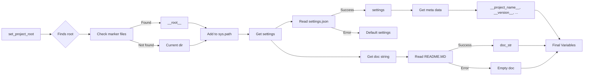

# <input code>

```python
## \file hypotez/src/scenario/header.py
# -*- coding: utf-8 -*-\
#! venv/Scripts/python.exe
#! venv/bin/python/python3.12

"""
.. module: src.scenario 
	:platform: Windows, Unix
	:synopsis:

"""
MODE = 'dev'

import sys
import json
from packaging.version import Version

from pathlib import Path
def set_project_root(marker_files=('pyproject.toml', 'requirements.txt', '.git')) -> Path:
    """
    Finds the root directory of the project starting from the current file's directory,
    searching upwards and stopping at the first directory containing any of the marker files.

    Args:
        marker_files (tuple): Filenames or directory names to identify the project root.
    
    Returns:
        Path: Path to the root directory if found, otherwise the directory where the script is located.
    """
    __root__:Path
    current_path:Path = Path(__file__).resolve().parent
    __root__ = current_path
    for parent in [current_path] + list(current_path.parents):
        if any((parent / marker).exists() for marker in marker_files):
            __root__ = parent
            break
    if __root__ not in sys.path:
        sys.path.insert(0, str(__root__))
    return __root__


# Get the root directory of the project
__root__ = set_project_root()
"""__root__ (Path): Path to the root directory of the project"""

from src import gs

settings:dict = None
try:
    with open(gs.path.root / 'src' /  'settings.json', 'r') as settings_file:
        settings = json.load(settings_file)
except (FileNotFoundError, json.JSONDecodeError):
    ...

doc_str:str = None
try:
    with open(gs.path.root / 'src' /  'README.MD', 'r') as settings_file:
        doc_str = settings_file.read()
except (FileNotFoundError, json.JSONDecodeError):
    ...


__project_name__ = settings.get("project_name", 'hypotez') if settings  else 'hypotez'
__version__: str = settings.get("version", '')  if settings  else ''
__doc__: str = doc_str if doc_str else ''
__details__: str = ''
__author__: str = settings.get("author", '')  if settings else ''
__copyright__: str = settings.get("copyrihgnt", '')  if settings else ''
__cofee__: str = settings.get("cofee", "Treat the developer to a cup of coffee for boosting enthusiasm in development: https://boosty.to/hypo69")  if settings else "Treat the developer to a cup of coffee for boosting enthusiasm in development: https://boosty.to/hypo69"
```

# <algorithm>

**Алгоритм работы кода:**

1. **Настройка корневой директории проекта (`set_project_root`):**
   - Начинает поиск корневой директории с текущего файла.
   - Перебирает родительские директории, проверяя наличие в них файлов/директорий `marker_files` (по умолчанию: `pyproject.toml`, `requirements.txt`, `.git`).
   - Если найден указанный файл/директория, то текущая директория устанавливается как `__root__` и цикл прерывается.
   - Если корневая директория не найдена, то возвращает директорию, в которой находится текущий файл.
   - Добавляет корневую директорию в `sys.path`, если она еще там не содержится. Это позволяет импортировать модули из корневой директории проекта.

2. **Чтение настроек (`settings.json`) и документации (`README.MD`):**
   - Получает путь к файлу `settings.json` относительно корневой директории проекта.
   - Использует `try...except` блок для обработки потенциальных ошибок `FileNotFoundError` или `json.JSONDecodeError`.
   - Если файл найден и успешно распарсен, то `settings` получает содержимое файла.
   - Аналогично, пытается получить `doc_str` из `README.MD`.

3. **Получение метаданных проекта:**
   - Вытаскивает значения из `settings`, используя метод `get()`. Если ключа нет, то используется значение по умолчанию.
   - Задает значения переменным `__project_name__`, `__version__`, `__doc__`, `__author__`, `__copyright__`, `__cofee__`.

**Пример:**

Если файл `settings.json` содержит:
```json
{
  "project_name": "MyProject",
  "version": "1.0.0",
  "author": "John Doe"
}
```
то переменные будут иметь значения:
`__project_name__ = "MyProject"`, `__version__ = "1.0.0"`, `__author__ = "John Doe"`

# <mermaid>



# <explanation>

**Импорты:**

- `sys`:  Предоставляет доступ к системным переменным, включая `sys.path`, что важно для импорта модулей из других частей проекта.
- `json`: Используется для работы с файлами JSON, содержащими настройки проекта.
- `packaging.version`: Позволяет работать с версиями пакетов.
- `pathlib`: Используется для работы с путями к файлам (более современный и удобный подход, чем `os.path`).

**Классы:**

- Нет явно определённых классов.

**Функции:**

- `set_project_root(marker_files)`: Находит корневую директорию проекта.
    - Аргументы: `marker_files` (кортеж строк, представляющих имена файлов/папок для поиска).
    - Возвращает: `Path` объект, представляющий корневую директорию проекта.

**Переменные:**

- `MODE`: Строковая переменная, вероятно, хранит режим работы.
- `__root__`:  `Path` объект, содержащий корневую директорию проекта.
- `settings`: Словарь, содержащий настройки проекта, загруженный из файла `settings.json`.
- `doc_str`: Строка, содержащая содержимое файла `README.MD`.
- `__project_name__`, `__version__`, `__doc__`, `__details__`, `__author__`, `__copyright__`, `__cofee__`: Переменные, содержащие метаданные проекта.

**Возможные ошибки или области для улучшений:**

- **Обработка ошибок:** Обработка ошибок (try-except блоки) для файлов `settings.json` и `README.MD` является хорошей практикой. Но можно дополнить проверку на корректность данных в загруженных настройках.
- **Типизация:** Указание типов переменных (например, используя подсказки типов) делает код более читаемым и позволяет статическим анализаторам обнаруживать потенциальные проблемы.
- **Универсальность:** Если необходимо поддерживать различные типы проектов, можно сделать параметры `marker_files` конфигурируемыми.
- **Документация:** Можно добавить более подробную документацию к функциям и классам.
- **Использование `Path`:**  Используется `Path`, что положительно влияет на читаемость и корректную работу с путями, особенно на разных платформах.

**Связь с другими частями проекта:**

Функция `set_project_root` и чтение файлов конфигурации (`settings.json`, `README.MD`) являются критическими для инициализации проекта. Файл `gs` (вероятно, `global_settings`) содержит необходимые переменные и функции для работы с файловой системой проекта. Поэтому `gs` необходим для поиска и доступа к ресурсам проекта.


```