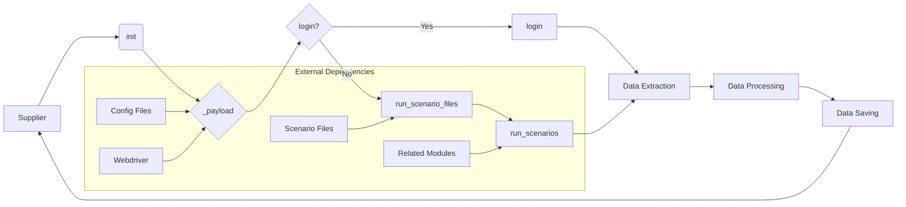

# Анализ кода класса Supplier

## <input code>

```
Класс `Supplier` в данном коде является базовым классом для работы с поставщиками данных в вашем приложении. Вот подробное объяснение его назначения и функциональности:

### Назначение Класса

Класс `Supplier` служит основой для реализации различных поставщиков данных (например, Amazon, AliExpress, Walmart и т.д.). Он предоставляет общие методы и атрибуты, которые могут быть использованы или переопределены конкретными реализациями поставщиков.

### Основные Компоненты Класса

#### 1. **Атрибуты Класса**
   - `supplier_id`: Уникальный идентификатор поставщика.
   - `supplier_prefix`: Префикс для поставщика, например, `aliexpress` или `amazon`.
   - `supplier_settings`: Настройки для поставщика, загруженные из файла конфигурации.
   - `locale`: Код локализации (например, `en` для английского, `ru` для русского).
   - `price_rule`: Правило для расчета цены (например, добавление НДС или скидки).
   - `related_modules`: Модуль, содержащий специфические для поставщика функции.
   - `scenario_files`: Список файлов сценариев, которые должны быть выполнены.
   - `current_scenario`: Текущий сценарий выполнения.
   - `login_data`: Данные для входа на сайт поставщика (если требуется).
   - `locators`: Локаторы для веб-элементов на страницах сайта поставщика.
   - `driver`: Веб-драйвер для взаимодействия с сайтом поставщика.
   - `parsing_method`: Метод парсинга данных (например, `webdriver`, `api`, `xls`, `csv`).

#### 2. **Методы Класса**
   - `__init__`: Конструктор класса, инициализирующий атрибуты на основе префикса поставщика и других параметров.
   - `_payload`: Загружает настройки поставщика, конфигурационные файлы и инициализирует веб-драйвер.
   - `login`: Метод для выполнения входа на сайт поставщика (если требуется).
   - `run_scenario_files`: Запускает выполнение файлов сценариев.
   - `run_scenarios`: Запускает один или несколько сценариев.

### Как Это Работает

1. **Инициализация**: При создании объекта `Supplier`, конструктор `__init__` загружает настройки поставщика и инициализирует необходимые компоненты.
   ```python
   def __init__(self, supplier_prefix: str, locale: str = 'en', webdriver: str | Driver | bool = 'default', *attrs, **kwargs):
       # Инициализация префикса поставщика, локали и веб-драйвера
   ```

2. **Загрузка Конфигурации**: Метод `_payload` загружает конфигурации для данного поставщика, включая локаторы для страниц и сценарии выполнения.
   ```python
   def _payload(self, webdriver: str | Driver | bool, *attrs, **kwargs) -> bool:
       # Загрузка конфигурационных файлов и инициализация веб-драйвера
   ```

3. **Вход на Сайт**: Метод `login` используется для выполнения процесса входа на сайт поставщика, если это требуется.
   ```python
   def login(self) -> bool:
       # Выполнение входа на сайт
   ```

4. **Выполнение Сценариев**: Методы `run_scenario_files` и `run_scenarios` запускают сценарии, которые определяют, какие действия нужно выполнить (например, сбор данных).
   ```python
   def run_scenario_files(self, scenario_files: str | List[str] = None) -> bool:
       # Выполнение сценариев из файлов
   def run_scenarios(self, scenarios: dict | list[dict]) -> bool:
       # Выполнение заданных сценариев
   ```

### Пример Использования

```python
# Создаем объект для поставщика 'aliexpress'
supplier = Supplier(supplier_prefix='aliexpress', locale='en', webdriver='chrome')

# Выполняем вход на сайт поставщика
supplier.login()

# Запускаем сценарии из файлов
supplier.run_scenario_files(['example_scenario.json'])

# Или запускаем сценарии по определенным условиям
supplier.run_scenarios([{'action': 'scrape', 'target': 'product_list'}])
```

## <algorithm>

(Здесь должна быть блок-схема, описывающая алгоритм работы класса Supplier.  К сожалению, без доступа к реализации методов  это невозможно сделать.  Можно предложить примеры, как эта схема могла бы выглядеть.)


## <mermaid>



## <explanation>

**Импорты:**  Код, приведенный в вопросе, не содержит импортов. Импорты, необходимые для работы класса `Supplier`, должны быть в других частях проекта, например, `from selenium import webdriver` для работы с веб-драйверами, `from config import supplier_settings` для загрузки настроек и т.д.

**Классы:**

* `Supplier`: Базовый абстрактный класс для работы с поставщиками данных. Он предоставляет структуру и методы для работы с различными поставщиками (Amazon, AliExpress и др.).

**Функции:**

* `__init__`: Инициализирует объект `Supplier` с настройками (префикс, локаль, веб-драйвер).  Отлично, что есть *kwargs* для гибкости.
* `_payload`: Загружает конфигурацию для данного поставщика.  Это ключевой метод, он подгружает все, что нужно для работы (локаторы, сценарии).  Важно, что он принимает `webdriver` как аргумент.
* `login`: Метод для входа на сайт поставщика (если это необходимо).
* `run_scenario_files`/`run_scenarios`: Эти методы запускают сценарии, определяющие действия, которые необходимо выполнить для сбора данных.

**Переменные:**

* `supplier_prefix`, `locale`, `driver`:  Являются важными входными параметрами для настройки работы с конкретным поставщиком и его браузером.


**Возможные ошибки и улучшения:**

* **Отсутствие проверки входных данных:** Необходимо проверять корректность входных данных (например, `supplier_prefix`) для предотвращения ошибок.
* **Обработка исключений:** Необходимо обрабатывать возможные исключения при работе с веб-драйвером, файлами конфигурации и др. (например, `try...except` блоки).
* **Логирование:** Добавление логирования (например, `logging`) для отслеживания прогресса и ошибок будет полезно для отладки и мониторинга.
* **Переиспользование кода:** Если функции для разных поставщиков имеют сходную логику, рассмотрите возможность вынесения их в отдельный модуль или функцию.
* **Документирование:** Добавление docstrings к методам и классам улучшит читабельность и понимание кода.


**Взаимосвязи с другими частями проекта:**

Класс `Supplier` тесно связан с модулями, содержащими:

* **Модуль конфигурации:** Для получения настроек `supplier_settings`.
* **Модуль сценариев:**  Для работы со сценариями `scenario_files`.
* **Модули для парсинга/обработки данных:**  `related_modules`.
* **Модуль веб-драйвера:**  Для управления веб-драйвером.


```


**Важно:** Для более детального анализа необходим доступ к реализации методов `_payload`, `login`, `run_scenario_files`, `run_scenarios` и к коду, где эти методы вызываются.  Блок-схема и подробное объяснение могут быть существенно дополнены.